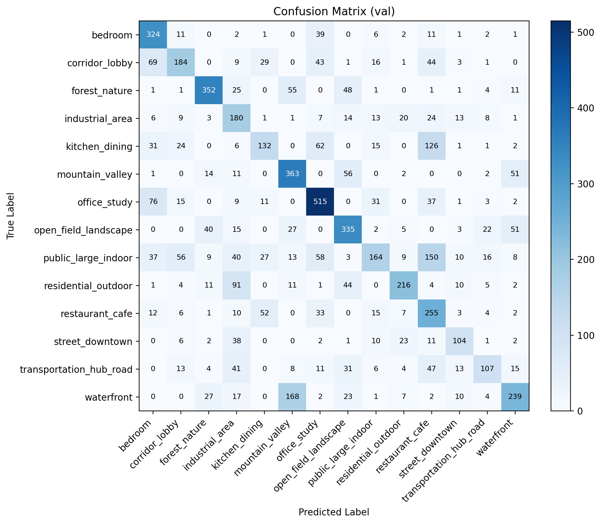
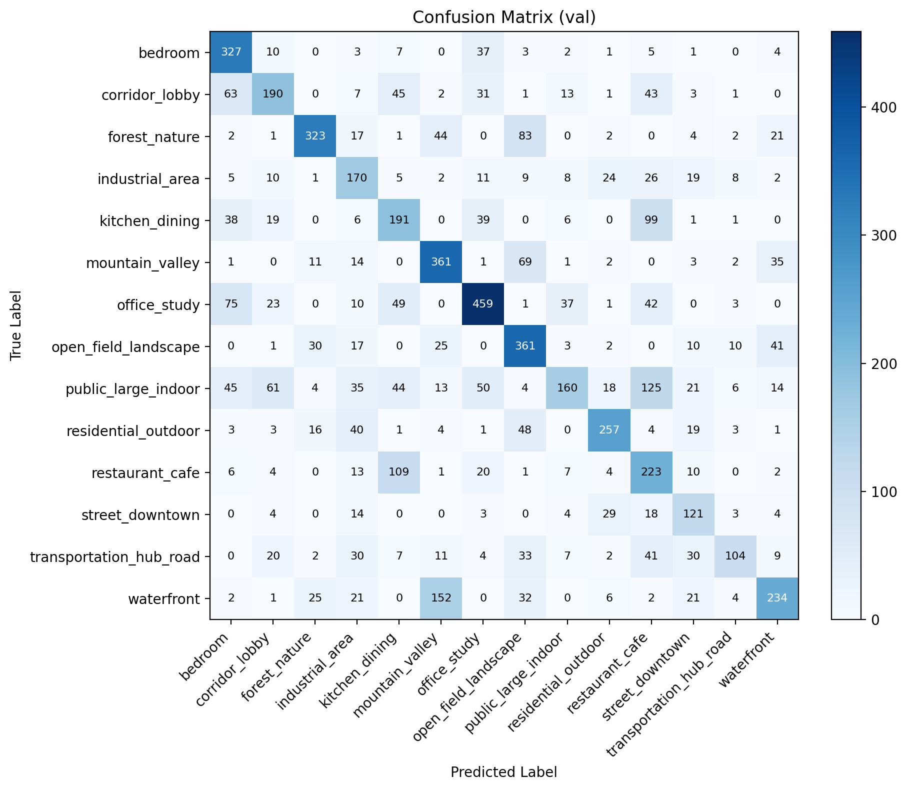
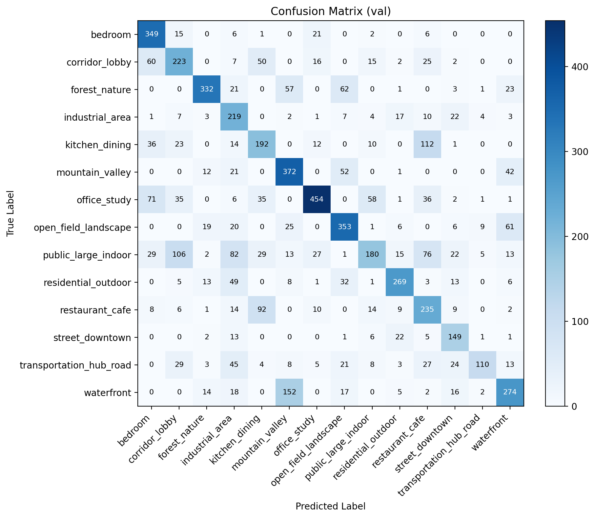

# VisionCraft

VisionCraft는 입력 이미지를 분석하고, 장면(scene)과 객체(object)를 함께 이해한 뒤, 이미지 품질 문제를 진단하고 더 보기 좋은 결과로 개선하는 scene-aware image intelligence system입니다.

## 1. 프로젝트 개요

### 프로젝트 이름

VisionCraft: Scene Understanding 기반 이미지 분석·개선 시스템

### 프로젝트 소개

본 프로젝트의 목표는 단순히 이미지를 분류하는 데서 끝나지 않고, 이미지의 저수준 시각 특성, 장면 의미, 객체 정보, 구도 문제를 함께 해석하여 자동 보정 또는 생성까지 연결하는 것입니다.

예를 들어 입력 이미지가 들어오면 시스템은 다음과 같은 질문에 답하도록 설계됩니다.

- 이 이미지는 어떤 장면인가?
- 이미지가 어둡거나 흐릿한가?
- 주요 객체는 무엇이며 어디에 위치하는가?
- 현재 구도와 품질에는 어떤 문제가 있는가?
- 어떤 방식으로 보정하는 것이 가장 적절한가?

최종적으로는 `Before / After` 결과와 함께 수치적 분석 결과, 장면 해석, 품질 피드백을 제공하는 것을 목표로 합니다.

## 2. 문제 정의와 동기

### 문제 정의

기존의 단순 이미지 분류 또는 단순 필터 기반 보정은 다음과 같은 한계를 가집니다.

- 장면의 의미를 반영하지 못한다.
- 객체 위치나 구도 정보를 충분히 사용하지 못한다.
- 이미지가 왜 품질이 낮은지 설명하지 못한다.
- 모든 이미지에 동일한 보정 규칙을 적용해 장면별 최적화가 어렵다.

본 프로젝트는 이러한 한계를 줄이기 위해 다음의 문제를 다룹니다.

1. 장면(scene)을 자동으로 분류한다.
2. 이미지 품질 저하 요인(밝기, 대비, blur, edge density 등)을 정량화한다.
3. 객체 검출 결과를 활용해 장면 해석과 구도 분석을 보강한다.
4. 장면 및 품질 분석 결과에 따라 이미지 개선 전략을 다르게 적용한다.

### 연구 동기

사람은 이미지를 볼 때 단순히 픽셀만 보지 않고, 장면의 종류와 객체의 의미를 함께 해석합니다. 예를 들어 침실 사진과 사무실 사진은 비슷한 실내 장면일 수 있지만, `bed`, `desk`, `monitor`, `lamp` 같은 객체의 존재에 따라 완전히 다른 의미를 갖습니다. 따라서 이미지 개선 역시 장면과 객체의 의미를 반영할수록 더 자연스럽고 설득력 있는 결과를 만들 수 있다고 판단했습니다.

## 3. 시스템 목표

VisionCraft의 시스템 목표는 다음과 같습니다.

1. 저수준 이미지 분석과 고수준 장면 이해를 하나의 파이프라인으로 통합한다.
2. scene classifier와 object detector를 함께 사용해 장면 해석 정확도를 높인다.
3. 분석 결과를 바탕으로 자동 보정 결과를 생성한다.
4. 실험적으로 어떤 학습 전략과 정규화 기법이 scene classification 성능 향상에 유리한지 검증한다.
5. 최종적으로는 object-aware, text-aware 멀티모달 확장 가능성을 탐색한다.

## 4. 전체 시스템 파이프라인

```text
Input Image
   ↓
Low-level Image Analysis
   ↓
Scene Classification
   ↓
Object Detection (YOLO)
   ↓
Quality / Composition Evaluation
   ↓
Enhancement Recommendation
   ↓
Traditional Enhancement / Future Generative Enhancement
   ↓
Before / After + Explanation
```

## 5. 사용 모델 및 모듈

### 5.1 Low-level Image Analysis

OpenCV 기반으로 다음 요소를 분석합니다.

- Brightness
- Contrast
- Blur
- Edge Density
- RGB Histogram

### 5.2 Scene Classification

장면 분류기는 Places365 small를 재구성한 VisionCraft subset을 사용하여 학습합니다.

현재 주요 실험 backbone:

- ResNet18
- ResNet50

향후 비교 후보:

- EfficientNet-B0

### 5.3 Object Detection

객체 검출은 YOLO를 사용합니다.

- 모델: YOLOv8n
- 목적:
  - 장면 해석 보조
  - composition score 계산
  - 향후 object-aware scene classification 실험에 활용

### 5.4 향후 Text Semantic Module

향후 확장으로 CLIP text embedding을 활용할 계획입니다.

- 장면 클래스에 대한 semantic prior 제공
- object-aware scene classification 이후 text-aware cross attention으로 확장

## 6. 데이터셋 구성

### 원본 데이터셋

- Places365 small

선정 이유:

- scene recognition 목적에 특화되어 있음
- 클래스 수와 장면 다양성이 충분함
- 장면 분류 실험에 적합함

### 재구성 데이터셋

원본 Places365를 바로 사용하지 않고, VisionCraft 목적에 맞게 상위 클래스 subset으로 재구성합니다.

현재 주요 실험에서 사용한 taxonomy는 `14-class v1.1`입니다.

예시 클래스:

- bedroom
- corridor_lobby
- forest_nature
- industrial_area
- kitchen_dining
- mountain_valley
- office_study
- open_field_landscape
- public_large_indoor
- residential_outdoor
- restaurant_cafe
- street_downtown
- transportation_hub_road
- waterfront

## 7. 학습 세팅

현재 best 계열 실험은 아래 설정을 기반으로 수행되었습니다.

### 공통 하이퍼파라미터

- Backbone: ResNet18 또는 ResNet50
- Optimizer: AdamW
- Initial Learning Rate: `1e-4`
- Weight Decay: `1e-5`
- Batch Size: `16`
- Epoch: `5`, `10` 또는 `15`
- Scheduler: `ReduceLROnPlateau`
- Image Size: `224`

### 데이터 증강

현재 기본 augmentation:

- `Resize(224, 224)`
- `RandomHorizontalFlip`
- `ColorJitter(brightness=0.2, contrast=0.2, saturation=0.2)`

실험적으로 사용한 기법:

- Label Smoothing
- Mixup
- Backbone Freeze / Unfreeze

### Loss Function

기본 loss는 multi-class classification을 위한 Cross Entropy Loss를 사용합니다.

수식:

```math
\mathcal{L}_{CE} = - \sum_{c=1}^{C} y_c \log p_c
```

여기서

- `C`: 클래스 수
- `y_c`: 정답 라벨
- `p_c`: softmax 확률

Label Smoothing을 적용하면 one-hot target을 완화하여 과도한 confidence를 줄입니다.

```math
y^{LS}_c =
\begin{cases}
1 - \epsilon & \text{if } c = y \\
\frac{\epsilon}{C-1} & \text{otherwise}
\end{cases}
```

여기서 `\epsilon`은 smoothing 계수이며, 본 프로젝트에서는 `0.05`, `0.1` 등을 비교했습니다.

### Mixup

Mixup 실험에서는 다음과 같은 interpolation을 사용합니다.

```math
\tilde{x} = \lambda x_i + (1-\lambda)x_j
```

```math
\tilde{y} = \lambda y_i + (1-\lambda)y_j
```

여기서 `\lambda ~ Beta(\alpha, \alpha)`이며, 본 프로젝트에서는 `alpha = 0.1`을 실험했습니다.

## 8. 모델 최적화 및 실험 방향

VisionCraft는 단순히 하나의 분류기를 학습하는 데서 끝나지 않고, **서비스 환경에서 더 안정적으로 동작할 수 있는 optimization / regularization / augmentation 전략을 찾는 과정**을 포함합니다.

지금까지 주로 비교한 전략은 다음과 같습니다.

### 8.1 Taxonomy 실험

- 14-class baseline
- 10-class 축소 taxonomy
- 16-class 확장 taxonomy

실험 결과, 단순히 클래스 수를 줄이거나 늘리는 것만으로는 성능이 개선되지 않았고, class count보다 **semantic overlap**과 **intra-class variance**가 더 중요한 요소임을 확인했습니다.

### 8.2 Optimizer / Scheduler 실험

- Adam
- AdamW
- ReduceLROnPlateau
- Early Stopping

### 8.3 Regularization 실험

- Label Smoothing `0.05`, `0.1`
- Mixup `alpha=0.1`
- Backbone freeze/unfreeze

## 9. 현재까지 관찰한 현상

학습 과정에서 다음과 같은 중요한 관찰을 얻었습니다.

1. Train accuracy는 빠르게 상승하지만 validation loss가 증가하는 경향이 있었다.
2. 이는 단순 성능 부족보다 overfitting, class ambiguity, confidence overfitting 문제와 더 관련이 있었다.
3. Label smoothing은 validation loss를 안정화하는 데 도움이 되었다.
4. Mixup은 최고 accuracy는 낮췄지만 generalization stability를 높이는 경향을 보였다.
5. ResNet50 + delayed unfreeze는 ResNet18보다 더 좋은 표현력을 보였고, validation accuracy `0.60` 근처까지 향상될 가능성을 보였다.

## 10. 실험 추적 및 confusion matrix 기반 선택 과정

VisionCraft의 scene classifier는 한 번의 학습으로 바로 확정한 것이 아니라, `클래스 수`, `optimizer`, `scheduler`, `regularization`, `augmentation`, `backbone`을 단계적으로 바꿔가며 성능과 일반화 양상을 비교한 뒤 선택했습니다. 특히 단순 accuracy만 보지 않고, **confusion matrix를 통해 어떤 클래스들이 실제로 헷갈리는지**를 함께 분석했습니다.

아래에 정리한 실험들은 **최적의 세팅을 빠르게 탐색하기 위한 비교 실험**으로, 대부분 `5~10 epoch` 수준의 짧은 학습으로 수행되었습니다. 따라서 현재 기록된 결과는 최종 대규모 학습 결과라기보다, backbone, optimizer, scheduler, regularization, augmentation 조합의 상대적 경향을 파악하기 위한 중간 단계의 결과입니다. 최종 운영 모델 또는 본 학습 단계에서는 더 긴 epoch와 추가 검증을 사용하여 성능을 다시 확인할 계획입니다.

아래 4개의 confusion matrix는 현재 모델 선택 과정에서 가장 중요한 분기점이 된 결과들입니다.

### 10.1 Stage 1: 14-class baseline + scheduler

- taxonomy: `14-class v1.1`
- backbone: `ResNet18`
- optimizer: `Adam`
- scheduler: `ReduceLROnPlateau`
- 목적:
  - 14개 상위 클래스 taxonomy가 최소한 동작하는지 확인
  - validation set에서 어떤 클래스 혼동이 가장 심한지 파악



관련 파일:

- confusion matrix: [eval_v11_sched_confusion.png](logs/eval_v11_sched_confusion.png)
- text report: [eval_v11_sched_report.txt](logs/eval_v11_sched_report.txt)

핵심 관찰:

- `kitchen_dining`, `restaurant_cafe`, `public_large_indoor`가 매우 강하게 섞였다.
- `waterfront`, `mountain_valley`, `open_field_landscape`, `forest_nature`도 자연 장면 내부에서 혼동이 컸다.
- `corridor_lobby`의 purity가 낮았다.

이 단계에서 얻은 결론:

- 단순히 14개 taxonomy를 만드는 것만으로는 충분하지 않았고,
- scene classifier는 optimizer/scheduler 조정과 정규화 전략이 반드시 필요했다.

### 10.2 Stage 2: AdamW 도입

- taxonomy: `14-class v1.1`
- backbone: `ResNet18`
- optimizer: `AdamW`
- weight decay: `1e-5`
- scheduler: `ReduceLROnPlateau`
- 목적:
  - Adam 대비 AdamW가 confidence overfitting을 줄이는지 확인



관련 파일:

- confusion matrix: [eval_v11_adamw_confusion.png](logs/eval_v11_adamw_confusion.png)
- text report: [eval_v11_adamw_report.txt](logs/eval_v11_adamw_report.txt)

핵심 관찰:

- `bedroom`, `residential_outdoor`, `open_field_landscape`, `street_downtown`의 정답 비중이 개선되었다.
- 다만 `kitchen_dining`과 `restaurant_cafe`, `public_large_indoor` 사이의 혼동은 여전히 컸다.
- optimizer 교체만으로는 semantic overlap 문제를 해결할 수 없다는 점이 확인되었다.

이 단계에서 얻은 결론:

- AdamW는 기본 optimizer로 채택할 가치가 있었고,
- 이후 실험은 class count보다 **regularization과 feature representation** 쪽에 더 집중해야 한다고 판단했다.

### 10.3 Stage 3: Label Smoothing 0.1 도입

- taxonomy: `14-class v1.1`
- backbone: `ResNet18`
- optimizer: `AdamW`
- scheduler: `ReduceLROnPlateau`
- label smoothing: `0.1`
- 목적:
  - validation loss 상승 원인인 overconfidence를 완화
  - calibration과 generalization을 함께 개선


관련 파일:

- confusion matrix: [eval_v11_adamw_ls01_confusion.png](logs/eval_v11_adamw_ls01_confusion.png)
- text report: [eval_v11_adamw_ls01_report.txt](logs/eval_v11_adamw_ls01_report.txt)

핵심 관찰:

- `restaurant_cafe`, `waterfront`, `bedroom`, `street_downtown`가 전반적으로 개선되었다.
- `forest_nature -> open_field_landscape` 혼동이 줄어드는 경향을 보였다.
- 전체적으로 validation loss가 이전보다 안정적으로 움직였다.

이 단계에서 얻은 결론:

- `label_smoothing = 0.1`은 accuracy와 validation loss 안정성 사이에서 가장 설득력 있는 trade-off를 제공했다.
- 이후 mixup, freeze 전략도 시험했지만, 기본 regularization으로는 `label_smoothing=0.1`이 가장 유효했다.

### 10.4 Stage 4: ResNet50 + freeze 2 epochs

- taxonomy: `14-class v1.1`
- backbone: `ResNet50`
- optimizer: `AdamW`
- scheduler: `ReduceLROnPlateau`
- label smoothing: `0.1`
- freeze backbone epochs: `2`
- 목적:
  - backbone 표현력 강화
  - 초반 과적응을 줄이기 위해 classifier head를 먼저 안정화



관련 파일:

- confusion matrix: [eval_resnet50_v11_confusion.png](logs/eval_resnet50_v11_confusion.png)
- text report: [eval_resnet50_v11_report.txt](logs/eval_resnet50_v11_report.txt)

핵심 관찰:

- `corridor_lobby`, `industrial_area`, `kitchen_dining`, `street_downtown`, `waterfront`의 diagonal이 더 강해졌다.
- validation accuracy가 `0.60`을 넘기며 이전 ResNet18 기반 조합보다 확실히 좋아졌다.
- `kitchen_dining ↔ restaurant_cafe`, `public_large_indoor ↔ corridor_lobby / restaurant_cafe`, `waterfront ↔ mountain_valley` 같은 semantic overlap은 여전히 남았지만, 전체적인 separability는 가장 좋았다.

이 단계에서 얻은 결론:

- 현재 최적 backbone은 `ResNet50`이다.
- backbone freeze를 초반 2 epoch 유지한 뒤 unfreeze하는 전략은 단순 full fine-tuning보다 안정적인 성능 향상에 도움을 주었다.
- 현재까지의 best baseline은 다음 조합이다.

```text
14-class v1.1
+ ResNet50
+ AdamW
+ weight_decay = 1e-5
+ ReduceLROnPlateau
+ label_smoothing = 0.1
+ freeze_backbone_epochs = 2
```

### 10.5 클래스 수 및 augmentation 조합 비교에서 얻은 요약

추가로 아래 실험들도 함께 비교했다.

- `10-class` 축소 taxonomy
- `16-class` 확장 taxonomy
- `mixup(alpha=0.1)`
- `label_smoothing = 0.05`
- `freeze_backbone_epochs = 1`

주요 결론:

1. 클래스 수를 단순히 줄이거나 늘리는 것만으로는 성능이 개선되지 않았다.
2. 문제의 핵심은 class count보다 `semantic overlap`과 `intra-class variance`에 더 가까웠다.
3. mixup은 최고 accuracy는 낮췄지만 validation loss를 더 안정화하는 방향으로 작동했다.
4. `label_smoothing = 0.1`이 최고 accuracy 측면에서는 가장 좋은 선택이었다.
5. backbone을 `ResNet18`에서 `ResNet50`으로 바꾸는 것이 가장 큰 개선 폭을 만들었다.

## 11. 멀티모달 시스템 확장 계획

본 프로젝트의 핵심 확장 방향은 scene, object, text semantics를 함께 사용하는 멀티모달 실험입니다.

### 단계 1. YOLO late fusion

- Scene classifier의 visual feature 또는 logits에 YOLO 객체 정보를 후처리 방식으로 결합
- 목적:
  - `bedroom vs office_study`
  - `kitchen_dining vs restaurant_cafe`
  같은 혼동 감소

### 단계 2. YOLO object-aware cross attention

- ResNet latent representation을 query로
- YOLO object embeddings를 key/value로
- single-directional cross attention 수행

목적:

- object-level cue를 scene representation에 직접 주입
- 단순 late fusion보다 더 정교한 scene understanding 구현

### 단계 3. CLIP text embedding까지 확장

YOLO object-aware cross attention이 효과적일 경우, CLIP text embedding을 추가로 주입할 계획입니다.

예상 구조:

```text
Visual Tokens
   ↓ cross-attend to object tokens
Object-aware Visual Tokens
   ↓ cross-attend to text tokens
Semantic-aware Visual Tokens
   ↓
Scene Classifier
```

이 구조는 다음 목적을 가집니다.

- visual ambiguity 완화
- object prior 반영
- scene label의 semantic meaning 반영

## 12. Ablation 및 비교 실험 계획

시스템 고도화를 위해 수행할 주요 비교 실험은 다음과 같습니다.

1. Backbone 비교
   - ResNet18 vs ResNet50

2. Optimizer 비교
   - Adam vs AdamW

3. Scheduler 비교
   - no scheduler vs ReduceLROnPlateau

4. Regularization 비교
   - no smoothing
   - label smoothing `0.05`
   - label smoothing `0.1`
   - mixup

5. Freeze 전략 비교
   - no freeze
   - freeze 1 epoch
   - freeze 2 epoch

6. Taxonomy 비교
   - 10-class
   - 14-class
   - 16-class

7. 멀티모달 fusion 비교
   - visual only
   - visual + YOLO late fusion
   - visual + YOLO cross attention
   - visual + YOLO + CLIP cross attention

## 13. 시스템 설계 관점

VisionCraft는 단일 모델 기반 서비스가 아니라, 저수준 시각 분석과 고수준 장면 이해를 결합한 계층형 비전 시스템으로 설계됩니다.

### Image Processing

- Brightness / Contrast 분석
- Histogram 분석
- Sharpening
- Denoising
- Contrast enhancement

### Computer Vision

- Scene classification
- Object detection
- Feature representation
- Confusion matrix 기반 error analysis

### Deep Learning

- Transfer learning
- Fine-tuning
- Regularization
- Ablation study
- Multimodal fusion

### Geometry / Composition

- Rule of thirds 기반 composition score
- 객체 위치 기반 구도 평가

이러한 구성은 향후 다음과 같은 제품형 시나리오로 확장될 수 있습니다.

- 사진 자동 품질 점검 및 보정 서비스
- 장면 이해 기반 이미지 리터칭 도구
- 촬영 후처리 추천 시스템
- multimodal image understanding API

## 14. 현재 구현된 기능

- 밝기, 대비, blur, edge density 분석
- RGB histogram 시각화
- YOLO 기반 object detection
- composition score 계산
- Gradio 기반 UI
- OpenCV 기반 traditional enhancement
- Places365 subset 생성 스크립트
- scene classifier 학습/평가 스크립트
- confusion matrix 및 class-wise precision/recall 분석

## 15. 저장소 구조

```text
visioncraft/
├── app.py
├── README.md
├── requirements.txt
├── checkpoint/
├── data/
├── logs/
├── src/
│   ├── analyzer/
│   ├── enhancer/
│   ├── models/
│   │   ├── download_places365.py
│   │   ├── list_places365_categories.py
│   │   ├── visioncraft_scene_mapping.py
│   │   ├── build_visioncraft_subset.py
│   │   ├── train_scene_classifier.py
│   │   ├── evaluate_scene_classifier.py
│   │   ├── object_detector.py
│   │   └── scene_classifier.py
│   └── utils/
└── examples/
```

## 16. 실행 방법

### 환경 설정

```bash
python -m venv .venv
source .venv/bin/activate
pip install -r requirements.txt
```

### 앱 실행

```bash
python app.py
```

### Places365 small 다운로드

```bash
./.venv/bin/python src/models/download_places365.py \
  --root ./data/places365 \
  --small \
  --include-val
```

### subset 생성

```bash
./.venv/bin/python src/models/build_visioncraft_subset.py \
  --places-root ./data/places365 \
  --output-root ./data/visioncraft_subset_small_v11 \
  --small \
  --max-per-class 3000 \
  --clear-output
```

### scene classifier 학습 예시

```bash
./.venv/bin/python src/models/train_scene_classifier.py \
  --data-root ./data/visioncraft_subset_small_v11 \
  --epochs 10 \
  --batch-size 16 \
  --backbone resnet50 \
  --optimizer adamw \
  --weight-decay 1e-5 \
  --label-smoothing 0.1 \
  --freeze-backbone-epochs 2 \
  --output checkpoint/scene_classifier_resnet50_v11_adamw_ls01_freeze2_e10.pt
```

### confusion matrix 평가

```bash
./.venv/bin/python src/models/evaluate_scene_classifier.py \
  --data-root ./data/visioncraft_subset_small_v11 \
  --checkpoint checkpoint/scene_classifier_resnet50_v11_adamw_ls01_freeze2_e10.pt \
  --split val \
  --report-path logs/eval_report.txt \
  --figure-path logs/eval_confusion.png
```

## 17. 기대되는 시스템 가치

VisionCraft를 통해 기대하는 시스템 수준의 가치는 다음과 같습니다.

- 단순 scene classification을 넘어 scene-aware image enhancement workflow 구현
- low-level vision과 high-level scene understanding의 통합
- object-aware, text-aware multimodal vision system으로의 확장 기반 확보
- 실제 운영 환경을 가정했을 때 어떤 학습 전략이 일반화에 유리한지 분석

## 18. 제품화 및 향후 로드맵

- ResNet50 기반 성능 안정화
- YOLO late fusion 구현
- YOLO cross-attention fusion 구현
- CLIP text embedding 기반 semantic prior 실험
- diffusion 기반 image enhancement 모듈 확장
- API 또는 웹 서비스 형태의 데모 배포
