# VisionCraft: Scene-Aware Image Understanding & Enhancement
VisionCraft는 픽셀 수준의 단순 보정을 넘어, 장면의 시각적·의미적 맥락(Semantic Context)을 이해하고 최적의 개선 방향을 도출하는 Computer Vision 파이프라인이다.

기존의 일반적인 이미지 보정 시스템은 주로 밝기, 대비, 선명도 등 Low-level feature에 집중해 왔다. 하지만 동일하게 어두운 이미지라도, 그 공간이 '조명이 부족한 실내(Bedroom)'인지 '흐린 날의 해변(Waterfront)'인지에 따라 보정의 기준과 접근 방식은 완전히 달라져야 한다. VisionCraft는 이러한 문제의식에서 출발하여, 이미지의 품질 진단(Quality Analysis)과 High-level 장면 이해(Scene Understanding)를 결합한 능동적인 pipeline을 propose한다.

본 프로젝트는 practical한 application 구현과 Representation Learning 연구를 아우르는 두 가지 핵심 흐름으로 구성된다.

1. Application Pipeline: Scene-aware Enhancement
User의 image를 입력받아 Low-level 품질 지표 분석 ➔ 객체 및 의미 영역 검출(Detection & Segmentation) ➔ 장면 기반 보정 및 crop suggestion으로 이어지는 End-to-end System이다. 각 vision module이 유기적으로 연결되어, 단순히 보기 좋은 filter를 입히는 것을 넘어 "왜 이러한 보정이 필요한가?"에 대한 시각적 근거와 분석 report를 함께 제공한다.

2. Research Pipeline: Text-Guided Cross-Attention in Latent Space
시각적으로 유사한 클래스(예: kitchen_dining과 restaurant_cafe) 환경에서 모델이 겪는 한계를 극복하기 위한 연구용 파이프라인이다. 단순한 Visual Feature에 의존하는 대신, Text embedding vector를 모델의 Latent space에 주입(Cross-Attention)하는 Multimodal 접근법을 실험했다. 이를 통해 Text Prior가 모델의 Representation을 어떻게 더 유의미한 방향으로 realign하고, 결정 경계(Decision Boundary)를 개선하는지 심층적으로 분석한다.

Research Pipeline 중 text가 주입되는 과정을 visualization해보면 다음과 같다. vision(image) only, text cross attention without infoNCE, text cross attention with infoNCE를 비교하여 심층분석할 예정이다.

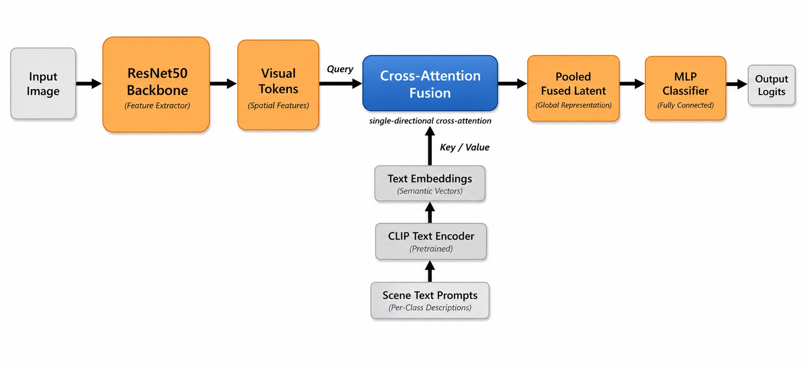

---

## 1. Introduction

기존의 image processing pipeline은 대부분 pixel level의 통계적 수치(Pixel-level statistics)에 의존해 왔다. 밝기, 대비, 선명도와 같은 Low-level feature는 이미지 quality를 결정하는 기본적인 요소지만, 실제 사람이 눈으로 인지하는 '장면(Scene)'의 complexity를 완벽히 설명하지는 못한다. 

가령 조명이 부족한 실내 공간과 구름이 낀 해변의 풍경은 둘 다 '노출 보정'이 필요하지만, 동일한 수식의 필터를 일괄 적용하는 것은 optimal한 해답이 아니다. 실내 사진에서는 조명의 분포와 가구의 구조적 윤곽선이 중요하며, 자연 풍경에서는 하늘과 지형의 색채 대비, 질감(Texture)이 우선적으로 고려되어야 한다. 즉, 진정한 의미의 이미지 보정은 이미지의 '의미론적 맥락(Semantic Context)'을 파악하는 데서 시작되어야 한다.

더 나아가, Computer Vision model이 직면하는 주요 난제 중 하나는 시각적 유사성(Visual Similarity)과 의미적 차이(Semantic Difference) 간의 간극이다. 테이블과 의자가 배치된 `restaurant_cafe`와 `kitchen_dining`, 혹은 넓은 하늘과 지형을 공유하는 `waterfront`와 `mountain_valley`는 단순한 Visual Feature만으로는 명확한 분류 경계를 형성하기 어렵다. 이처럼 외형이 유사한 공간들을 안정적으로 구분하고 처리하기 위해서는 형태 인식을 넘어선 High-level의 의미 정보가 필수적이다.

VisionCraft는 이러한 한계를 완화하고자 Low-level 이미지 분석과 High-level 장면 이해를 하나의 유기적인 파이프라인으로 결합했다. 본 시스템은 입력 이미지에 대해 물리적 지표(밝기, Blur, Edge density, Dynamic range 등)를 진단함과 동시에, Scene Classification, Object Detection, Semantic Segmentation을 통해 이미지의 구조를 해체하고 분석한다.

VisionCraft의 파이프라인은 단일 이미지를 마주했을 때 다음의 핵심 질문(Research Questions)들에 대한 답을 능동적으로 추론한다.

* **장면 인식(Scene Identity):** 이 이미지는 어떤 공간적, 상황적 맥락을 가지는가?
* **품질 진단(Quality Diagnosis):** 시각적 품질이 저하되었다면, 그 물리적 원인(노출 부족, Blur 등)은 무엇인가?
* **영역 분석(Semantic ROI):** 프레임 내에서 보존되거나 강조되어야 할 핵심 객체(Object)와 영역은 어디인가?
* **문맥 기반 보정(Context-aware Enhancement):** 식별된 장면에 가장 적합한 보정 전략과 크롭(Crop) 기준은 무엇인가?
* **모델 해석(Explainability):** 분류 모델은 이미지의 어떤 영역(Attention)을 근거로 해당 장면을 추론했는가?

결론적으로 VisionCraft는 단순한 1차원적 filter application이 아니다. 이미지 quality 진단부터 장면의 의미론적 해석, 이에 기반한 맞춤형 보정 strategy 도출, 그리고 모델의 판단 근거 시각화(XAI)까지 컴퓨터 비전의 다양한 Sub-task들을 엮어낸 통합적인 파이프라인이다.

---

## 2. Project Overview

VisionCraft는 실환경 적용을 위한 **Application 파이프라인**과 모델의 표현 학습 능력을 검증하는 **Research 파이프라인**의 투트랙(Two-track) architecture로 설계되었다.

* **Application Pipeline (End-to-End Enhancement System):** Gradio 인터페이스 기반으로 구현된 실시간 추론(Inference) 파이프라인이다. 단일 이미지가 입력되면 내장된 다수의 Computer Vision 모듈이 순차적으로 작동한다. 이 시스템은 최종 보정본만을 출력하는 blackbox가 아니며, quality 진단 지표, 객체 검출(Detection) 및 분할(Segmentation) map, 크롭(Crop) 제안, 보정 전후의 변화를 시각화한 Heatmap 등 파이프라인 내부의 판단 근거를 투명하게 제공한다.

* **Research Pipeline (Latent Space & Representation Analysis):** Scene Classification model의 Feature Space을 심층적으로 분석하기 위한 연구용 파이프라인이다. Visual-only baseline model과 Text-guided Cross-attention without infoNCE model, Text-guided Cross-attention with infoNCE model을 대조 실험한다. 단순한 정답률(Accuracy) 비교를 넘어, Confusion Matrix, t-SNE, UMAP, Centroid Cosine Distance, Intra/Inter-class Similarity, Attention Map 등을 통해 텍스트 프롬프트 주입이 모델의 Latent Representation을 어떻게 의미론적으로 restructuring하는지 정량적·정성적으로 검증한다.

전체 시스템의 데이터 흐름은 다음과 같다.

```text
Input Image
   ↓
Low-level Image Quality Analysis
   ↓
Object Detection
   ↓
Scene Classification + Semantic Segmentation
   ↓
Composition / Exposure / Region Reasoning
   ↓
Scene-aware Enhancement
   ↓
Visualization + Explanation
```

---

## 3. How to Use VisionCraft

VisionCraft의 pipeline은 상당히 복잡하다고 생각될 수 있지만, 사용 방식 자체는 비교적 단순하다. 사용자는 이미지를 한 장 업로드하고 `Analyze and Enhance` 버튼만 실행하면, 품질 분석부터 장면 해석, 보정 결과, 시각화 리포트까지 한 흐름으로 확인할 수 있다. 즉 이 장에서는 “무엇을 구현했는가”보다 먼저 “실제로 어떻게 써보면 되는가”를 보여주는 데 초점을 둔다.

기본 사용 흐름은 다음과 같다.

1. 프로젝트 루트에서 애플리케이션을 실행한다.

```bash
.venv/bin/python app.py
```

2. 브라우저에서 Gradio UI를 연 뒤 (local에서 실행할 경우 http://127.0.0.1:7860), 분석할 이미지를 업로드한다.
3. `Analyze and Enhance` 버튼을 눌러 전체 파이프라인을 실행한다.
4. 우측의 `Enhanced Image`와 아래 탭들을 통해 각 분석 결과를 확인한다.

- `Auto Straighten`: 기울기 추정과 straighten preview 확인
- `Detection`: YOLO 기반 객체 검출 결과 확인
- `Segmentation Overlay`: semantic segmentation overlay 확인
- `Segmentation Components`: sky / person / background 등 영역별 분해 확인
- `Auto Crop Preview`: 노란색 박스를 통해 recommendation된 crop visualization확인
- `Difference Heatmap`: `Analyze and Enhance`를 실행한 뒤 원본 대비 보정 변화 영역 확인
- `ORB Matching`: `Analyze and Enhance`를 실행한 뒤 보정 전후 구조 보존 여부 확인
- `Manual 4-Point Rectification`: 문서형 이미지 수동 보정 및 번역

주의할 점은 다음과 같다.

- `Difference Heatmap`과 `ORB Matching` 탭은 이미지를 업로드한 직후에는 비어 있을 수 있으며, 반드시 `Analyze and Enhance` 버튼을 눌러야 결과가 생성된다.
- Application을 실행시 전체화면으로 하지 않으면 탭 일부가 화면 너비에 따라 접혀 보일 수도 있다. 전체화면으로 사용을 추천한다. 
- OCR 결과를 보려면 `Enable Text Processing (OCR)`를 켜고, `Manual 4-Point Rectification` 탭에서 4개 점을 지정한 뒤 다시 `Analyze and Enhance`를 실행해야 하며 OpenAI API key를 등록하였다면 OpenAI multi modal을 사용하여 번역을 실행할 수 있으며 없다면 PaddleOCR, EasyOCR, Tesseract fallback이 순차적으로 실행된다.

대표적인 메인 UI 예시는 다음과 같다. (Readme.md파일에 사용한 사진은 프로젝트 개발자가 직접 개인적으로 촬영한 소장 사진임!)

| Example 1 | Example 2 | Example 3 |
|---|---|---|
|  |  |  |


각 세부 탭에서 제공되는 시각화 예시는 다음과 같다.

| Function | Example |
|---|---|
| Auto Straighten / Tilt Correction |  |
| Object Detection |  |
| Segmentation Overlay |  |
| Segmentation Components |  |
| Auto Crop Preview |  |
| Difference Heatmap |  |
| ORB Matching |  |
| Manual 4-Point Input |  |
| Manual Rectification Result |  |

여기서 중요한 점은 VisionCraft가 result image만 내보내는 도구가 아니라는 점이다. 사용자는 최종 보정본과 함께, 그 보정이 어떤 분석 단계를 거쳐 도출되었는지까지 단계별로 따라가며 확인할 수 있다.

또한 VisionCraft는 단순히 탭별 시각화만 제공하는 것이 아니라, 분석 결과를 하나의 해석 가능한 리포트 형태로도 정리해 준다. 아래 예시는 실제로 사용자에게 어떤 종류의 분석 정보가 제공되는지를 보여준다.

| Analysis 1 | Analysis 2 |
|---|---|
|  |  |

| Analysis 3 | Analysis 4 |
|---|---|
|  |  |

이 분석 결과에는 일반적으로 다음 정보가 포함된다.

- brightness, contrast, blur, edge density 같은 low level quality 지표
- scene classification 결과와 confidence
- 주요 object detection 결과와 main subject 정보
- segmentation 기반 region summary
- crop recommendation 결과
- auto straighten / tilt correction 상태
- enhancement에 실제로 적용된 단계와 그 이유
- ORB matching, difference heatmap 등 보정 전후 비교 요약

결국 user는 단순히 “더 enhance된 이미지”만 받는 것이 아니라, 왜 그 방향의 보정이 선택되었는지, 그리고 그 판단을 뒷받침하는 시각적·정량적 근거가 무엇인지를 함께 확인하게 된다.

---

## 4. Core Computer Vision Modules (Application pipelines)

VisionCraft의 핵심은 여러 컴퓨터 비전 모듈을 단순히 parallel하게 나열한 것이 아니라, 서로 다른 종류의 단서를 하나의 해석 체계 안에서 묶어낸 데 있다. 어떤 모듈은 pixel level의 quality를 진단하고, 어떤 모듈은 object나 scene의 의미를 읽어내며, 또 어떤 모듈은 실제 보정이나 visualization으로 이어지는 practical한 출력을 담당한다.

예를 들어 밝기나 대비 분석은 이미지가 물리적으로 어떤 상태에 있는지를 보여주고, scene classification과 segmentation은 그 이미지가 어떤 context에서 이해되어야 하는지를 설명한다. 이 둘이 결합되어야 비로소 “어둡다”는 사실이 단순한 숫자가 아니라, “어두운 실내이므로 과한 sharpening보다 exposure 보정과 색 균형 복원이 우선된다”는 식의 판단으로 이어질 수 있다. 아래 항목들은 그러한 판단을 구성하는 핵심 모듈들이다.

---

### 4.1 Brightness Analysis

밝기 분석은 grayscale intensity를 기반으로 수행된다.

```math
I_{gray}(x, y) = 0.299R(x, y) + 0.587G(x, y) + 0.114B(x, y)
```

평균 밝기 점수는 다음과 같이 계산된다.

```math
S_{brightness} = \frac{1}{255HW} \sum_{x=1}^{W}\sum_{y=1}^{H} I_{gray}(x, y) \times 100
```

이 score는 이미지가 전반적으로 어두운지, 너무 밝은지, 또는 적절한 밝기 범위에 있는지를 판단하는 데 사용된다. 이후 brightness correction, gamma correction, exposure adjustment의 기준으로 활용된다.

---

### 4.2 Contrast Analysis

대비는 grayscale 이미지의 standard deviation을 통해 추정한다.

```math
\mu = \frac{1}{HW}\sum_{x,y} I_{gray}(x,y)
```

```math
\sigma = \sqrt{\frac{1}{HW}\sum_{x,y}(I_{gray}(x,y)-\mu)^2}
```

이를 바탕으로 대비 점수는 다음처럼 정규화한다.

```math
S_{contrast} = \min\left(\frac{\sigma}{64} \times 100,\ 100\right)
```

낮은 대비는 foreground와 background의 구분이 약하거나, 전체 이미지가 평평하게 보인다는 의미일 수 있다. VisionCraft는 이 값을 contrast enhancement나 CLAHE 적용 여부를 판단하는 데 사용한다.

---

### 4.3 Blur Analysis

Blur는 Laplacian variance를 기반으로 측정한다. Laplacian은 이미지의 edge와 급격한 intensity 변화를 강조하기 때문에, 흐릿한 이미지에서는 Laplacian variance가 낮게 나타난다.

```math
\mathcal{L}(x,y)=\nabla^2 I_{gray}(x,y)
```

```math
Var(\mathcal{L}) = \frac{1}{HW}\sum_{x,y}(\mathcal{L}(x,y)-\overline{\mathcal{L}})^2
```

이를 blur score로 정규화하면 다음과 같다.

```math
S_{blur} = \min\left(\frac{Var(\mathcal{L})}{500} \times 100,\ 100\right)
```

blur score가 낮을수록 edge sharpness가 약하다는 뜻이며, adaptive sharpening을 적용할 근거가 된다.

---

### 4.4 Edge Density Analysis

Edge density는 Canny edge detection 결과를 기반으로 계산한다.

```math
S_{edge} = \frac{\#\{(x,y)\ |\ E(x,y)=1\}}{HW} \times 100
```

이 score은 이미지 안에 구조적 정보가 얼마나 많은지를 간단히 추정하는 지표다. edge density가 너무 낮으면 이미지가 흐릿하거나, 평평하거나, 구조적 단서가 부족한 장면일 수 있다. 반대로 너무 높으면 노이즈가 많거나 복잡한 질감이 과도하게 포함된 이미지일 수도 있다.

---

### 4.5 Color Balance and White Balance Shift

색 균형은 RGB 채널별 평균값을 사용해 분석한다.

```math
\mu_R,\ \mu_G,\ \mu_B
```

Gray-world assumption 하에서 전체 목표 평균은 다음과 같다.

```math
\mu_{all} = \frac{\mu_R + \mu_G + \mu_B}{3}
```

White-balance scaling factor는 다음처럼 계산된다.

```math
\alpha_R = \frac{\mu_{all}}{\mu_R},\quad
\alpha_G = \frac{\mu_{all}}{\mu_G},\quad
\alpha_B = \frac{\mu_{all}}{\mu_B}
```

이 score은 특정 색상이 과하게 bias된 이미지를 보정하는 데 사용된다. 예를 들어 실내 조명 때문에 노란색이 강하게 들어간 사진이나, 흐린 날씨 때문에 전체적으로 푸르게 보이는 사진에서 색 균형을 복원하는 데 도움이 된다.

---

### 4.6 Exposure and Dynamic Range Analysis

VisionCraft는 grayscale intensity의 percentile 값을 이용해 노출과 dynamic range를 분석한다. 대표적으로 `p5`, `p95`, shadow ratio, highlight ratio 등을 계산한다.

이를 바탕으로 이미지를 다음과 같은 상태로 분류한다.

- `underexposed`
- `overexposed`
- `low_dynamic_range`
- `balanced`

이 분석 결과는 brightness scaling, gamma correction, contrast adjustment를 적용할지 결정하는 데 사용된다. 단순히 전체 밝기를 올리는 것이 아니라, 이미지가 실제로 어두운지, 밝은 영역이 이미 포화되었는지, dynamic range가 부족한지를 함께 고려한다.

---

### 4.7 Scene Classification

Scene classification은 VisionCraft의 여러 기능 중 하나이지만, 전체 파이프라인에서 중요한 semantic context provider 역할을 한다. 현재 모델은 입력 이미지를 다음 14개의 장면 카테고리 중 하나로 분류한다.

- `bedroom`
- `corridor_lobby`
- `forest_nature`
- `industrial_area`
- `kitchen_dining`
- `mountain_valley`
- `office_study`
- `open_field_landscape`
- `public_large_indoor`
- `residential_outdoor`
- `restaurant_cafe`
- `street_downtown`
- `transportation_hub_road`
- `waterfront`

이 결과는 단순히 “이 이미지는 bedroom이다”라고 출력하는 데서 끝나지 않는다. 장면 정보는 분석 요약에 포함되며, 일부 보정 단계에서 보조적인 context 정보로 활용된다. 또한 연구 파이프라인에서는 attention 및 latent representation 분석의 해석 단서로 사용된다.

예를 들어 `waterfront`나 `mountain_valley` 같은 자연 장면과 `office_study`나 `bedroom` 같은 실내 장면은 서로 다른 시각적 단서를 가진다. 따라서 scene classifier는 VisionCraft가 이미지를 scene 수준에서 해석하고, 후속 분석 결과를 더 의미 있게 정리하는 데 도움을 주는 semantic cue로써의 역할을 한다.

현재 애플리케이션 기본 체크포인트는 text-guided model이다.

```text
checkpoint/scene_classifier_resnet50_v11_text_crossattn_e20.pt
```

---

### 4.8 Object Detection

VisionCraft는 `YOLOv8n`을 사용하여 이미지 내 주요 객체를 검출한다. 각 객체에 대해 다음 정보를 저장한다.

- class label
- confidence
- bounding box
- area ratio
- rule-of-thirds anchor point까지의 거리

이미지 크기가 `W x H`이고 bounding box 중심이 `(c_x, c_y)`일 때, 가장 가까운 thirds point까지의 거리는 다음과 같이 계산한다.

```math
d_{thirds} = \min_{k \in \mathcal{T}} \frac{\sqrt{(c_x - t_{x,k})^2 + (c_y - t_{y,k})^2}}{\max(W,H)}
```

여기서 `T`는 네 개의 rule-of-thirds 지점 집합을 의미한다.

Object detection 결과는 다음에 활용된다.

- 주요 피사체 파악
- composition reasoning
- crop recommendation
- scene interpretation
- 분석 요약 보조

---

### 4.9 Semantic Segmentation

VisionCraft는 `ADE20K`에 학습된 `SegFormer-B0`를 사용하여 이미지의 주요 semantic region을 추정한다. 코드에서는 Hugging Face의 `nvidia/segformer-b0-finetuned-ade-512-512` pretrained model과 image processor를 외부에서 불러와 사용한다. 따라서 segmentation 모듈은 사전학습된 외부 파라미터에 의존하며, 실행 환경에서는 `transformers` 라이브러리와 해당 weight를 읽을 수 있는 캐시 또는 네트워크 접근이 필요할 수 있다.

예를 들어 sky, person, road, plant, building, wall, floor 같은 영역을 pixel-level로 분리할 수 있다.

Segmentation 결과는 다음 용도로 사용된다.

- segmentation overlay 생성
- 주요 장면 성분 시각화
- sky / background / person 영역 구분
- region-aware enhancement
- crop suggestion 보조
- 분석 요약 보조

이 모듈은 단순히 이미지 전체를 하나의 덩어리로 보는 대신, 이미지 안의 영역별 의미를 따로 다룰 수 있게 해준다.

또한 현재 구현에서는 segmentation model이 정상적으로 로드되거나 추론되지 못할 경우 fallback 경로가 존재한다. 이 경우 전체 segmentation class map은 비활성화될 수 있지만, `person` 영역은 YOLO detection bounding box를 이용해 대체 마스크를 생성하여 downstream enhancement와 visualization이 완전히 끊기지 않도록 설계되어 있다. 즉 현재 파이프라인은 `SegFormer semantic parsing`을 우선 사용하고, 필요할 때 `YOLO person fallback`으로 최소한의 영역 정보를 복구하는 구조다.

### 4.10 Auto Straighten and Tilt Correction

VisionCraft는 입력 이미지의 전체 구도가 기울어져 있는 경우, 직선 구조를 기반으로 자동 수평 보정(auto straighten)을 수행한다. 이 기능은 풍경 사진의 수평선, 실내 공간의 천장/바닥선, 건물 사진의 수직선처럼 이미지 전체의 기하학적 기준이 비교적 뚜렷한 경우에 특히 유용하다.

현재 구현은 grayscale 변환 후 Canny edge detection과 probabilistic Hough transform을 이용해 주요 직선을 검출하고, 이들 중 수평 또는 수직 기준으로 해석 가능한 선분만 선택하여 지배적인 기울기 각도를 추정한다.

```math
\theta_i = \operatorname{atan2}(y_2 - y_1,\ x_2 - x_1)
```

선분 길이를 가중치로 사용하여 대표 기울기를 추정하며, 전체 보정 각도는 weighted median으로 결정한다.

```math
\theta^{*} = \operatorname{WeightedMedian}(\{\theta_i\}, \{w_i\})
```

이후 이미지 전체를 회전시켜 straighten preview를 생성한다.

```math
I'(x,y) = \mathcal{R}(I,\theta^{*})
```

현재 애플리케이션에서는 이 분석 결과를 이용해 다음 정보를 함께 제공한다.

- 추정 기울기 각도
- 기울기 상태 (`stable`, `slight`, `noticeable`)
- 보정 방향 (`clockwise`, `counterclockwise`, `none`)
- 검출된 guide line overlay
- Auto Straighten 시각화 탭

보정은 항상 강제로 수행되는 것이 아니라, `status = ok` 이고 기울기 각도가 일정 threshold 이상일 때만 downstream 분석 파이프라인에 반영된다.

---

### 4.11 Crop Suggestion

Crop suggestion은 object detection과 semantic segmentation 결과를 함께 사용한다. 이미지 안에 주요 객체가 있으면 해당 객체를 중심으로 crop을 제안하고, 객체가 뚜렷하지 않은 경우에는 segmentation 결과와 장면 구조를 기반으로 fallback crop을 제안한다.

이 모듈은 단순히 중앙을 자르는 방식이 아니라, 다음 정보를 함께 고려한다.

- dominant object 위치
- object size
- rule-of-thirds distance
- scene region distribution
- sky / road / person / building 등의 semantic mask
- 이미지의 전체 composition

따라서 VisionCraft의 crop suggestion은 기하학적 crop이 아니라 semantic-aware crop module에 가깝다.

---

### 4.12 OCR and Perspective Rectification

VisionCraft에는 텍스트가 포함된 이미지나 문서형 이미지를 다루기 위한 기능도 포함되어 있다.

지원하는 기능은 다음과 같다.

- 수동 4-point rectification
- 수동 rectification 기반 perspective warp preview
- OCR text extraction
- 검출된 텍스트의 한국어 해석

이 기능은 문서 사진, 간판, 매장 외부, 포스터, 안내문처럼 이미지 안의 텍스트가 중요한 경우에 유용하다. 현재 OCR은 사용자가 수동으로 4개 점을 지정해 rectification을 완료한 뒤 수행되며, `OPENAI_API_KEY`가 설정된 경우 OpenAI Vision API를 우선 사용해 텍스트 추출과 한국어 해석을 진행한다. OpenAI 키가 없을 때는 `PaddleOCR -> EasyOCR -> Tesseract` 순서의 로컬 fallback 경로를 사용한다.

---

### 4.13 Traditional Enhancement

현재 VisionCraft의 enhancement stack은 OpenCV 기반의 전통적 이미지 처리 기법으로 구성되어 있다.

포함된 기능은 다음과 같다.

- gray-world white balance
- brightness / contrast scaling
- gamma correction
- CLAHE
- adaptive sharpening
- denoising
- sky / background / person region-aware adjustment

Brightness / contrast scaling은 다음 affine transform을 따른다.

```math
I'(x,y) = \alpha I(x,y) + \beta
```

Gamma correction은 다음과 같이 적용된다.

```math
I'(x,y) = 255 \left(\frac{I(x,y)}{255}\right)^\gamma
```

CLAHE는 전체 대비를 과도하게 늘리지 않으면서 local contrast를 복원하는 데 유용하다. 특히 저조도 실내 장면이나 contrast가 약한 이미지에서 효과적이다.

VisionCraft의 보정 방식은 단순히 모든 이미지에 같은 필터를 적용하는 것이 아니라, 앞 단계에서 계산한 품질 분석 결과와 장면 정보를 함께 참고한다.

---

## 5. Research Pipeline for Scene Classification 

### 5.1 Motivation

Scene classification은 겉보기에는 비교적 직관적인 task처럼 보이지만, 실제로는 높은 intra-class variation과 강한 inter-class similarity 때문에 stable한 classification boundary를 형성하기 어렵다. 동일한 scene label을 가지는 이미지들이 항상 동일한 visual pattern을 공유하는 것은 아니며, 반대로 서로 다른 class들이 매우 유사한 시각적 단서를 공유하는 경우도 빈번하다.

예를 들어 `waterfront` 장면이라고 하더라도 모든 이미지에서 물 영역이 지배적으로 나타나는 것은 아니다. 어떤 샘플은 shoreline, rock, sky, vegetation이 더 큰 비중을 차지하고 물은 프레임의 일부분에만 제한적으로 등장할 수 있다. 이러한 경우 해당 이미지는 전형적인 `waterfront`처럼 보이지 않을 수 있으며, 모델 입장에서는 `mountain_valley`, `open_field_landscape`, 혹은 기타 outdoor scene과의 경계가 ambiguous해진다. 다시 말해, scene classification의 핵심 난제 중 하나는 class label이 공유하는 semantic identity와 실제 image-level appearance 사이의 간극이라고 할 수 있다.

VisionCraft을 개발할 당시에 바로 이 지점을 research pipeline으로 잡기로 다짐했다. 단순히 visual feature만으로 class를 구분하려는 접근은 이러한 ambiguity를 충분히 해소하지 못할 수 있다고 보았고, 이를 완화하기 위한 방법으로 text representation을 scene classifier의 latent space에 주입하는 방식을 고려했다. 구체적으로는 각 장면 클래스에 대응하는 text embedding을 semantic prior로 사용하고, visual latent token과 text representation 사이의 cross-attention을 통해 모델이 단순한 외형 유사성 너머의 장면 의미를 더 안정적으로 반영하도록 설계하였다.

이 아이디어의 핵심 가정은 다음과 같다. 이미지가 갖는 raw visual evidence만으로는 모호한 샘플이라 하더라도, class-level text prior를 함께 주입하면 latent representation이 보다 semantically organized된 방향으로 정렬될 수 있으며, 그 결과 visually confusing한 sample들에 대해서도 decision boundary를 더 안정적으로 형성할 가능성이 있다는 것이다. 본 연구 파이프라인은 이러한 가설을 바탕으로 visual-only baseline과 text-guided cross-attention model을 비교하고, 나아가 InfoNCE 기반 제약이 latent space를 어떻게 재구성하는지까지 분석한다.
이 classifier의 역할은 다음과 같다.


1. 장면의 high-level identity 추정
2. 분석 리포트와 feedback 생성에 semantic context 제공
3. object-level cue만으로는 충분하지 않은 경우 scene level 해석 보조
4. 시각적으로 유사하지만 의미적으로 상이한 장면들 사이의 구분 cue 제공
5. 일부 heuristic-based enhancement 단계에서 auxiliary signal 제공

---

### 5.2 Dataset Design

데이터셋 설계에서 가장 먼저 고민한 점은 “얼마나 세밀하게 분류할 것인가”보다 “본 시스템이 실제로 어떤 수준의 장면 정보를 필요로 하는가”였다. Places365는 매우 세분화된 장면 라벨을 제공하지만, VisionCraft의 목적은 모든 장소를 가능한 한 잘게 나누는 데 있지 않다. 오히려 보정, 해석, 세그멘테이션, 객체 단서와 자연스럽게 연결될 수 있는 의미 단위의 taxonomy를 구성하는 것이 더 중요했다.

이러한 이유로 본인은 Places365의 원본 클래스를 그대로 사용하지 않고, VisionCraft의 목적에 맞게 14개의 상위 장면 클래스로 재구성했다. 이 재구성은 단순한 클래스 축소가 아니라, scene-aware enhancement와 representation analysis에 더 적합한 의미 체계를 설계한 과정이라고 볼 수 있다.

현재 사용한 장면 클래스는 다음과 같다.

```text
bedroom
corridor_lobby
forest_nature
industrial_area
kitchen_dining
mountain_valley
office_study
open_field_landscape
public_large_indoor
residential_outdoor
restaurant_cafe
street_downtown
transportation_hub_road
waterfront
```

---

### 5.3 Backbone Choice: Why ResNet50

백본 선택은 단순히 더 큰 모델을 고르는 문제가 아니라, 현재 실험 환경에서 감당 가능한 계산량과 필요한 표현력 사이의 균형을 찾는 과정이었다. 본인이 `ResNet18`과 `ResNet50`을 비교한 결과, 최종적으로는 ResNet50이 VisionCraft의 장면 분류 문제를 다루기에 가장 현실적이면서도 충분한 표현력을 제공한다고 판단했다.

ResNet50을 사용한 이유는 다음과 같다.

첫째, ResNet50은 residual learning을 통해 깊은 네트워크 학습을 안정화한다.

Residual block은 다음을 학습한다.

```math
\mathbf{y} = \mathcal{F}(\mathbf{x}, W) + \mathbf{x}
```

즉, 네트워크는 전체 함수 `H(x)`를 직접 학습하는 대신 residual function을 학습한다.

```math
\mathcal{F}(\mathbf{x}) = \mathcal{H}(\mathbf{x}) - \mathbf{x}
```

이러한 재parameterization이 중요한 이유는, 어떤 block에서 최적 변환이 입력을 거의 그대로 유지하는 경우 plain network는 identity mapping 자체를 여러 층의 비선형 변환으로 직접 근사해야 하지만, residual block에서는 단순히

```math
\mathcal{F}(\mathbf{x}, W) \approx 0
```

만 만족하면 되기 때문이다. 즉 residual branch는 전체 함수를 새로 학습하는 대신, 입력 표현 위에 필요한 보정만 추가적으로 학습하면 된다.

또한 초기 학습 단계에서 가중치 $W$는 일반적으로 작은 값들로 초기화되므로 residual branch의 출력도 상대적으로 작게 시작하는 경향이 있다. 이때

```math
\mathcal{F}(\mathbf{x}, W) \approx 0
\quad \Rightarrow \quad
\mathbf{y} \approx \mathbf{x}
```

가 되어, residual block은 자연스럽게 identity mapping 근처에서 출발하게 된다. 이 특성은 깊은 네트워크에서 각 층이 처음부터 복잡한 변환 전체를 새로 학습해야 하는 부담을 줄여주며, optimization을 더 안정적으로 만든다.

Gradient flow 측면에서도 residual connection은 유리하다. 어떤 loss $\mathcal{L}$에 대해 출력 $\mathbf{y}$를 입력 $\mathbf{x}$로 미분하면,

```math
\frac{\partial \mathcal{L}}{\partial \mathbf{x}}
=
\frac{\partial \mathcal{L}}{\partial \mathbf{y}}
\left(
\frac{\partial \mathcal{F}(\mathbf{x}, W)}{\partial \mathbf{x}} + I
\right)
```

가 된다. 여기서 $I$는 identity matrix이다. 중요한 점은 gradient가 residual branch를 통과하는 경로 외에도, $+\mathbf{x}$에 해당하는 shortcut 경로를 통해 직접 전달될 수 있다는 것이다. 따라서 residual branch의 Jacobian이 작아지거나 불안정해지는 경우에도 shortcut이 gradient 전달의 기준 경로를 제공하므로, 깊이가 증가할 때 나타나는 optimization difficulty와 vanishing gradient 문제를 완화하는 데 기여한다.

둘째, ResNet50은 ResNet18보다 더 높은 representational capacity를 제공하며, 이는 VisionCraft가 다루는 scene classification 문제의 semantic ambiguity를 해소하는 데 중요하다. 본 연구의 주요 혼동쌍은 단순한 color distribution이나 edge pattern만으로는 안정적으로 분리되기 어렵고, 보다 깊은 계층에서 형성되는 장면 수준의 조합적 표현이 필요하다.

예를 들어 다음 class pair들은 모두 낮은 수준의 국소 특징만으로는 구분이 불충분하며, 더 강한 semantic abstraction이 요구된다.

- `kitchen_dining` vs `restaurant_cafe`
- `public_large_indoor` vs `corridor_lobby`
- `waterfront` vs `mountain_valley`
- `bedroom` vs `office_study`

이러한 쌍들은 object co-occurrence, spatial layout, indoor/outdoor context, 그리고 scene-level composition이 함께 고려되어야 비로소 안정적으로 분리될 수 있다. 따라서 backbone은 단순히 얕은 texture detector를 넘어, higher-level semantic representation을 충분히 형성할 수 있어야 한다는 요구를 가진다. ResNet50은 ResNet18보다 더 깊고 넓은 feature hierarchy를 제공함으로써 이러한 요구를 보다 잘 만족시키는 backbone으로 판단되었다.

셋째, ResNet50은 충분한 표현력을 제공하면서도 현재 로컬 실험 환경에서 반복 가능한 학습과 비교 실험을 수행할 수 있는 현실적인 backbone이었다. VisionCraft의 목표는 단일 최고 성능 모델을 일회적으로 얻는 데 있지 않고, visual-only baseline, text-guided cross-attention, InfoNCE extension을 포함한 여러 설정을 비교하며 latent representation 변화를 추적하는 데 있었기 때문에, 계산 비용과 실험 반복 가능성 사이의 균형이 중요했다. 본인의 주요 로컬 학습 환경은 다음과 같다.

- MacBook Pro
- Apple M4 Pro
- 14-core CPU
- 20-core GPU

결국 ResNet50은 단순히 “더 큰 모델”이 아니라, 현재 로컬 실험 환경 안에서 반복 학습과 비교 실험을 안정적으로 수행할 수 있으면서도, scene-level semantic abstraction을 충분히 담아낼 수 있는 표현력과 계산 효율 사이의 균형점에 해당했다.

---

### 5.4 Training Strategy

VisionCraft의 학습 파이프라인은 하나의 고정 recipe만을 가정하지 않고, 여러 실험 설정을 비교할 수 있도록 설계되어 있다. 다만 아래에서 설명하는 내용은 그중에서도 최종 보고와 비교 실험에 실제로 사용한 ResNet50 계열 대표 설정을 중심으로 정리한 것이다. 다시 말해 “코드가 무엇을 지원하는가”와 “본인이 최종적으로 어떤 구성을 채택했는가”를 함께 읽는 섹션이라고 보면 된다.

- optimizer: `AdamW` 기반 대표 실험
- scheduler: `ReduceLROnPlateau`
- weight decay: `1e-5`
- label smoothing: `0.1`
- backbone freezing for first 2 epochs
- controlled augmentation

학습 스크립트 자체는 `Adam`, `AdamW`, `mixup`, `text contrastive loss`, 그리고 object/segmentation/text 기반 fusion mode 등을 유연하게 켜고 끌 수 있도록 만들어져 있다. 따라서 여기 제시하는 값들은 코드의 유일한 기본값이라기보다, 최종 비교 실험에서 선택한 대표 조합을 정리한 것으로 이해하는 것이 맞다.

기본 multi-class loss는 cross entropy이다.

```math
\mathcal{L}_{CE} = - \sum_{c=1}^{C} y_c \log p_c
```

여기서:

- `C`: 클래스 수
- `y_c`: target distribution
- `p_c`: predicted softmax probability

Label smoothing은 one-hot target을 다음과 같이 완화한다.

```math
y^{LS}_c =
\begin{cases}
1 - \epsilon & \text{if } c = y \\
\frac{\epsilon}{C-1} & \text{otherwise}
\end{cases}
```

Label smoothing은 overconfidence를 줄이고, semantic ambiguity가 있는 장면 분류 문제에서 generalization을 개선하는 데 도움을 줄 수 있다.

---

### 5.5 Hyperparameters

하이퍼파라미터는 성능 자체만큼이나 실험의 안정성과 재현성을 좌우한다. VisionCraft에서는 무작정 큰 배치나 긴 학습을 추구하기보다, 현재 로컬 환경에서 반복 가능한 실험이 가능하면서도 모델 간 비교가 공정하게 이루어질 수 있는 설정을 우선했다. 대표 설정은 다음과 같다.

- image size: `224`
- batch size: `16`
- optimizer: `AdamW`
- baseline learning rate: `1e-4`
- text cross-attention learning rate: `1e-5`
- weight decay: `1e-5`
- scheduler: `ReduceLROnPlateau`
- freeze backbone epochs: `2`
- training length: final ResNet50 model up to `20` epochs

특히 text cross-attention 계열 실험에서는 multimodal fusion이 초기에 불안정해질 수 있기 때문에, visual-only baseline보다 조금 더 보수적인 learning rate를 사용해 학습을 안정화했다.

---

### 5.6 Augmentation

Augmentation은 이 프로젝트에서 단순한 데이터 뻥튀기 수단이 아니라, 장면 분류기가 조명 변화, 색감 차이, 좌우 구도 변화에 조금 더 둔감해지도록 만드는 장치로 사용되었다. 다만 과도한 기하학적 변형은 scene identity 자체를 흐릴 수 있기 때문에, 비교적 절제된 범위의 augmentation을 채택했다. 현재 사용한 augmentation은 다음과 같다.

- `Resize(224, 224)`
- `RandomHorizontalFlip`
- `ColorJitter(brightness=0.2, contrast=0.2, saturation=0.2)`

추가적으로 실험한 기법은 다음과 같다.

- label smoothing
- mixup
- freeze / unfreeze schedule

Mixup은 다음 수식을 따른다.

```math
\tilde{x} = \lambda x_i + (1-\lambda)x_j
```

```math
\tilde{y} = \lambda y_i + (1-\lambda)y_j
```

여기서:

```math
\lambda \sim \mathrm{Beta}(\alpha, \alpha)
```

Mixup은 결정 경계를 매끄럽게 만드는 데 유용하지만, 장면 분류처럼 semantic boundary가 이미 애매한 문제에서는 항상 즉각적인 accuracy 상승으로 이어지지는 않는다. 실제로 본인 실험에서도 최고 성능을 극적으로 끌어올리기보다는, validation curve를 더 안정적으로 만드는 쪽에서 의미 있는 효과를 보이는 경우가 많았다.

---

### 5.7 Limitations of the Visual-Only Baseline

Visual-only baseline은 출발점으로서 충분히 강한 모델이었다. 실제로 단순한 장면 구분에서는 꽤 안정적인 성능을 보였고, 전체 accuracy만 놓고 보면 경쟁력 있는 기준선 역할을 했다. 그럼에도 불구하고, 본인이 해결하고자 했던 문제는 “전반적으로 맞추는가”보다 “헷갈리기 쉬운 장면을 얼마나 의미 있게 구분하는가”에 더 가까웠다. 아래의 세 가지 한계는 바로 그 지점에서 드러난다.

#### 5.7.1 같은 클래스 내부의 큰 변화

같은 클래스 안에서도 이미지는 매우 다양할 수 있다.

예를 들어 같은 `restaurant_cafe`라도 다음처럼 형태가 달라질 수 있다.

- 실내 카페
- 야외 식당
- 간판 중심의 매장 사진
- 사람이 많은 레스토랑
- 어두운 조명의 카페

Visual-only model은 이런 variation을 모두 같은 semantic class로 안정적으로 묶는 데 어려움을 겪을 수 있다.

#### 5.7.2 클래스 간 시각적 유사성

서로 다른 class가 비슷한 texture, object, layout을 공유할 때도 혼동이 발생한다.

대표적인 혼동쌍은 다음과 같다.

- `kitchen_dining` ↔ `restaurant_cafe`
- `public_large_indoor` ↔ `corridor_lobby`
- `waterfront` ↔ `mountain_valley`
- `bedroom` ↔ `office_study`

이 문제는 단순히 backbone을 키운다고 완전히 해결되지는 않는다. visual feature만으로는 의미적 차이를 충분히 반영하기 어려운 경우가 있기 때문이다.

#### 5.7.3 Latent Space에서의 불안정성

Baseline confusion matrix와 latent plot을 보면 다음 현상이 나타났다.

- semantic하게 가까운 category 사이의 overlap
- 같은 라벨 내부에서 완전하지 않은 compactness
- 시각적으로 유사한 class pair의 불안정한 decision boundary
- train accuracy는 증가하지만 difficult class의 validation separation은 제한적

이것이 latent space 내부에 semantic structure를 주입하려는 직접적인 동기가 되었다.

---

### 5.8 Text-Guided Cross-Attention

VisionCraft의 research pipeline에서 가장 fundemental한 experiment는 text-guided cross-attention이다. 이 방법은 단순히 이미지 feature에 text를 덧붙이는 수준이 아니라, scene label이 담고 있는 의미적 prior를 feature space 내부로 끌어와 visual representation을 다시 align하려는 시도라고 볼 수 있다.

기존의 classifcatin model에서는 대개 최종 output layer에서만 라벨 정보를 사용한다. 반면 여기서는 class-level semantics가 중간 표현 단계 (latent space)에서부터 anchor처럼 작동하도록 설계했다. 즉 모델이 이미지를 볼 때, “이 패턴이 어떤 라벨과 연결되어야 하는가”를 조금 더 일찍, 그리고 조금 더 구조적으로 반영하도록 만든 것이다.

---

#### 5.8.1 Class Text Prompt

각 scene label에 대해 Natural Language class description을 준비한다. 현재 구현에서는 이 prompt들이 코드 내부에 미리 정의되어 있으며 다음 파일에 저장되어 있다.

```text
src/models/scene_text_prompts.py
```

예시는 다음과 같다.

```text
bedroom:
a bedroom scene with bed, pillow, blanket, wall, floor, lamp, and indoor resting space

waterfront:
a waterfront outdoor scene with sky, sea, water, rocks, shoreline, waves, and coastal landscape
```

이 prompt들은 `CLIP` text encoder를 통해 text embedding vector로 변환된다.

```math
\mathbf{t}_1, \mathbf{t}_2, \dots, \mathbf{t}_C \in \mathbb{R}^{d_t}
```

---

#### 5.8.2 Visual Token and Text Token Fusion

ResNet50 backbone은 visual token을 생성한다.

```math
\mathbf{V} = [\mathbf{v}_1, \mathbf{v}_2, \dots, \mathbf{v}_N] \in \mathbb{R}^{N \times d_v}
```

이후 single-directional cross-attention을 수행한다.

- visual token: query
- text token: key, value

Projection 이후:

```math
\mathbf{Q} = \mathbf{V}W_Q,\quad
\mathbf{K} = \mathbf{T}W_K,\quad
\mathbf{V}_{text} = \mathbf{T}W_V
```

Cross-attention output은 다음과 같다.

```math
\mathrm{Attention}(\mathbf{Q}, \mathbf{K}, \mathbf{V}_{text}) =
\mathrm{softmax}\left(\frac{\mathbf{Q}\mathbf{K}^\top}{\sqrt{d}}\right)\mathbf{V}_{text}
```

그리고 fused visual representation은 다음처럼 구성된다.

```math
\mathbf{Z} = \mathbf{Q} + \mathrm{Attention}(\mathbf{Q}, \mathbf{K}, \mathbf{V}_{text})
```

이후 spatially pooled latent vector를 최종 분류에 사용한다.

---

#### 5.8.3 InfoNCE Contrastive Extension

본인은 text-guided cross-attention을 한 단계 더 발전시켜보기 위해, fused latent와 class text prototype 사이의 align을 직접적으로 강화하는 `InfoNCE-style contrastive objective`도 함께 실험했다.

기본 cross-attention model은 text를 semantic anchor로 사용하지만, 반드시 fused latent가 정답 class text embedding에 강하게 가까워지도록 직접 강제하지는 않는다. 그래서 추가 실험에서는 visual-text alignment를 더 명시적으로 주입하기 위해 다음 contrastive term을 분류 loss와 함께 사용했다.

우선 fused latent와 text prototype을 정규화한다.

```math
\mathbf{z}_i = \frac{\mathbf{h}_i}{\|\mathbf{h}_i\|},\quad
\mathbf{u}_c = \frac{\mathbf{t}_c}{\|\mathbf{t}_c\|}
```

여기서

- `h_i`: i번째 이미지의 fused latent
- `t_c`: c번째 class의 text prototype
- `z_i`, `u_c`: cosine similarity 계산을 위한 정규화 벡터

그 다음 각 이미지 latent와 모든 class text prototype 사이의 similarity를 계산한다.

```math
s_{ic} = \frac{\mathbf{z}_i^\top \mathbf{u}_c}{\tau}
```

여기서 `tau`는 temperature이며, similarity 분포의 sharpness를 조절한다.

InfoNCE-style text contrastive loss는 다음과 같다.

```math
\mathcal{L}_{InfoNCE}
=
- \log
\frac{\exp(s_{iy})}
{\sum_{c=1}^{C}\exp(s_{ic})}
```

여기서 `y`는 정답 class index이다. 즉 정답 class text prototype과의 similarity는 크게 만들고, 나머지 class prototype과의 similarity는 상대적으로 작게 만들도록 학습한다.

최종 학습 목표는 classification loss와 contrastive loss의 가중합이다.

```math
\mathcal{L}_{total}
=
\mathcal{L}_{cls}
\;+\;
\lambda_{con}\mathcal{L}_{InfoNCE}
```

본인 실험에서는 다음 세팅값을 사용했다.

- `text_contrastive_weight = 0.1`
- `text_contrastive_temperature = 0.07`

이 extension의 목적은 accuracy를 무조건 더 높이는 것이라기보다, fused latent가 class-level text semantics에 더 직접적으로 정렬되도록 만들어 latent space의 구조를 더 뚜렷하게 만드는 데 있다.

---

#### 5.8.4 Why Text Helps

Text embedding은 visual feature를 대체하기 위해 들어간 것이 아니다. 오히려 시각 특징이 texture, color, local object cue에 과도하게 끌려가는 것을 막고, 그 위에 조금 더 안정적인 semantic anchor를 얹기 위한 장치에 가깝다.

Text-guided cross-attention의 기대 효과는 다음과 같다.

- 같은 class sample을 더 coherent하게 묶음
- class 내부 variation을 줄임
- visual noise에 덜 민감한 representation 형성
- scene label의 의미를 latent space에 반영
- difficult class pair에 대해 더 안정적인 semantic structure 제공

따라서 이 접근은 “텍스트를 하나 더 넣어본 실험”이라기보다, latent representation 자체를 더 semantic-aware한 방향으로 재구성하려는 전략이라고 보는 편이 맞다.

---

#### 5.8.5 Semantic Smoothing and Its Trade-off

실험 결과를 보면, text-guided model은 전반적으로 latent space를 더 smooth하게 만들었다. 여기서 말하는 smoothness는 단순히 점들이 모인다는 뜻이 아니라, 같은 클래스 내부의 샘플들이 더 일관된 방향으로 정렬되고, 의미적으로 가까운 클래스들끼리도 일정한 구조를 갖기 시작한다는 의미에 가깝다.

좋은 점은 same-class sample들이 더 비슷한 방향으로 정렬된다는 것이다. 즉 intra-class compactness가 증가한다. 이 덕분에 visual-only baseline에서 발생하던 texture, lighting, viewpoint 변화에 대한 불안정성이 줄어들 수 있다.

다만 text가 항상 좋은 방향으로만 작동하는 것은 아니다. 의미적으로 가까운 class들은 서로 더 가까워질 수 있다.

예를 들어 다음 class pair는 text에 의해 같은 semantic neighborhood로 끌릴 수 있다.

- `kitchen_dining` and `restaurant_cafe`
- `waterfront` and `mountain_valley`
- `public_large_indoor` and `corridor_lobby`

따라서 text-guided cross-attention은 다음과 같은 trade-off를 가진다.

```text
intra-class consistency 증가
vs
semantically similar class 간 smoothing 증가
```

본인 실험에서는 이 두 효과 중에서도 intra-class compactness가 커지는 이득이 더 크게 작용했다. 그래서 텍스트 주입이 일부 클래스에서는 새로운 혼동을 만들었음에도, 전체적으로는 validation accuracy와 latent stability를 함께 끌어올리는 방향으로 작동했다고 해석할 수 있다.

---

#### 5.8.6 Why the Contrastive Extension Matters

기본 text cross-attention이 `semantic anchor`를 주입하는 방식이라면, InfoNCE extension은 그 anchor에 실제로 latent가 더 붙도록 학습 목표를 강화하는 방식이다.

따라서 두 방법의 차이는 다음처럼 정리할 수 있다.

```text
Text cross-attention:
text prior를 feature fusion 단계에 주입

Text cross-attention + InfoNCE:
text prior를 feature fusion 단계에 주입
+ fused latent와 class prototype alignment를 loss 차원에서도 직접 강제
```

이 contrastive extension은 다음 상황에서 특히 의미가 있다.

- 같은 class 내부 variation이 매우 큰 경우
- semantic하게 가까운 class pair가 많은 경우
- fused latent가 class text prototype과 더 직접적으로 정렬되길 원하는 경우
- explanation 측면에서 prototype alignment를 더 강하게 보고 싶은 경우

---

### 5.9 Results

이제부터는 VisionCraft 연구 파이프라인에서 얻은 핵심 실험 결과를 정리한다. 단순히 accuracy 숫자만 나열하는 대신, confusion matrix, latent space visualization, prototype alignment를 함께 놓고 보면서 세 가지 모델이 어떤 방식으로 서로 다른 표현 구조를 형성했는지를 읽어내는 데 초점을 둔다. 비교 대상은 `visual-only baseline`, `text cross-attention`, `text cross-attention + InfoNCE`의 세 모델이다.

#### 5.9.1 Classification Accuracy

핵심 비교 결과는 다음과 같다.

| Model | Validation Accuracy |
|---|---:|
| Visual-only baseline | 59.79% |
| Text cross-attention | 60.56% |
| Text cross-attention + InfoNCE | 60.43% |

세 모델은 모두 큰 차이 없이 경쟁적인 성능을 보였지만, 중요한 점은 text를 주입한 두 모델이 모두 visual-only baseline을 넘어섰다는 사실이다. 가장 높은 accuracy는 vanilla text cross-attention이 기록했지만, InfoNCE extension 역시 `60.43%`로 매우 근접한 결과를 유지했다.

이 결과는 다음과 같이 해석할 수 있다.

- `Text cross-attention`: 최종 분류 accuracy 기준 best model
- `Text cross-attention + InfoNCE`: accuracy는 약간 낮지만, latent alignment를 더 강하게 유도하는 variant

즉 InfoNCE는 최고 accuracy를 약간 희생하는 대신, representation quality와 prototype alignment를 더 개선하는 방향으로 작동한 것으로 볼 수 있다.

---

#### 5.9.2 Confusion Matrix

Confusion matrix 비교 결과, 개선은 모든 클래스에서 균일하게 일어나지 않았다. 어떤 클래스는 좋아졌고, 어떤 클래스는 약간 감소했다.

Visual-only baseline confusion matrix:


Text cross-attention confusion matrix:


Text cross-attention + InfoNCE confusion matrix:

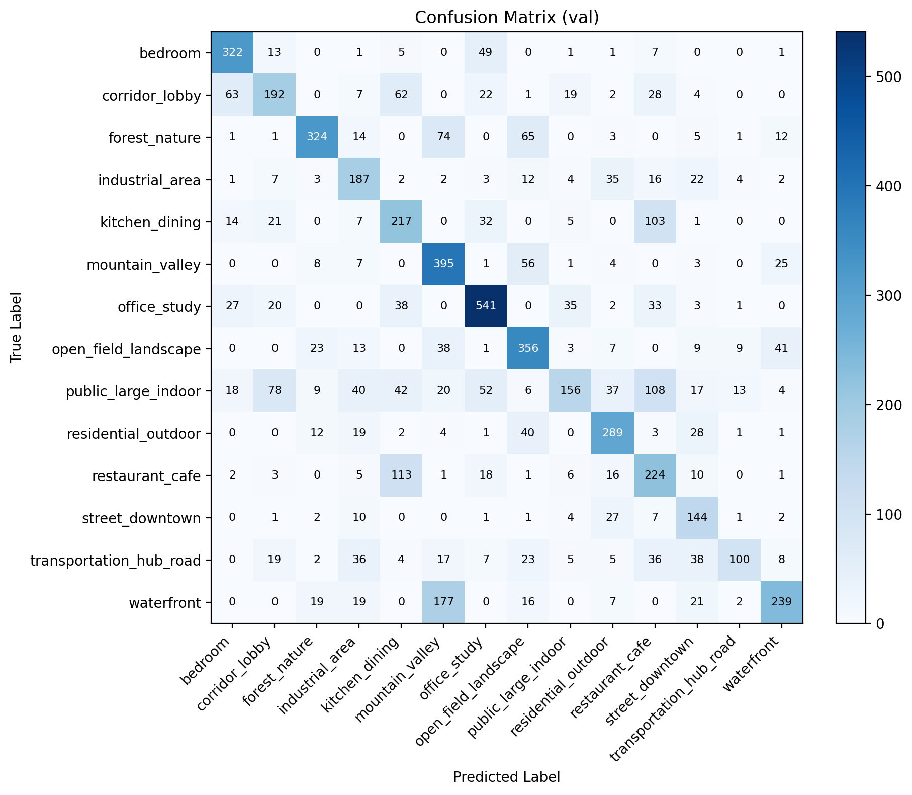

세 confusion matrix를 함께 보면, text 기반 모델의 변화는 모든 클래스를 일괄적으로 개선하는 형태라기보다, 특정 `semantic neighborhood` 내부에서 혼동 구조를 다시 재배치하는 형태에 더 가깝다. 여기서 semantic neighborhood란 단순히 시각적으로 비슷한 쌍만이 아니라, 상위 장면 의미를 일정 부분 공유하는 클래스 쌍을 의미한다. 본 실험에서는 특히 다음과 같은 쌍이 그 예로 해석될 수 있다.

- `kitchen_dining` ↔ `restaurant_cafe`: 음식/식사 공간이라는 공통 semantic group
- `waterfront` ↔ `mountain_valley`: 자연 풍경 scene이라는 공통 semantic group
- `public_large_indoor` ↔ `corridor_lobby`: 대형 실내 공공 공간이라는 공통 semantic group

실제 수치를 보면, visual-only baseline 대비 vanilla text cross-attention에서 일부 혼동은 오히려 증가한다.

- `restaurant_cafe -> kitchen_dining`: `89 -> 139`
- `public_large_indoor -> corridor_lobby`: `85 -> 112`
- `waterfront -> mountain_valley`: `165 -> 171`

이 증가는 text 주입이 의미적으로 가까운 클래스들을 완전히 멀리 밀어내기보다는, 같은 상위 semantic region 안에서 더 가깝게 재배치했을 가능성을 시사한다. 반면 반대 방향이나 정분류 수를 함께 보면, 변화는 단순한 성능 저하라기보다 decision boundary의 재조정에 더 가깝다.

- `kitchen_dining -> restaurant_cafe`: `117 -> 77`로 감소
- `kitchen_dining` 정분류 수: `174 -> 232`로 증가
- `mountain_valley` 정분류 수: `362 -> 400`으로 증가
- `office_study` 정분류 수: `482 -> 509`로 증가

즉 text 주입은 특정 semantic neighborhood 내부에서 일부 방향의 confusion을 증가시키는 대신, 다른 방향에서는 정분류 수를 높이거나 반대 방향 혼동을 줄이는 방식으로 작동한다. 이 관점에서 보면 text prior는 모든 클래스를 균일하게 분리하는 신호라기보다, 장면 의미를 반영해 decision boundary를 다시 정렬하는 보조 축으로 해석할 수 있다.

클래스별로 보면 그 효과는 비대칭적이다. 예를 들어 `kitchen_dining`은 `restaurant_cafe` 방향 혼동이 줄어들면서 정분류 수가 크게 증가했고, `mountain_valley` 역시 자연 장면 semantic cue의 도움을 받아 정분류 수가 개선되었다. 반면 `restaurant_cafe`처럼 의미적으로 가까운 이웃 클래스를 가진 경우에는 `kitchen_dining` 쪽으로 더 끌리는 trade-off가 남아 있다. `public_large_indoor` 역시 text 기반 모델에서 여전히 어려운 클래스로 남으며, 오히려 `corridor_lobby`나 `restaurant_cafe`와의 semantic overlap이 confusion matrix에 반영된다.

InfoNCE confusion matrix는 이러한 경향을 한 단계 더 분명하게 보여준다. 이 모델의 최고 accuracy는 vanilla text cross-attention보다 약간 낮은 `60.43%`였지만, 일부 클래스는 상대적으로 강한 정렬을 유지한다.

- `office_study`: 정분류 수 `541`
- `mountain_valley`: 정분류 수 `395`
- `street_downtown`: 정분류 수 `144`
- `residential_outdoor`: 정분류 수 `289`

반면 다음 클래스들은 여전히 어려운 영역으로 남는다.

- `public_large_indoor`: 정분류 수 `156`
- `waterfront`: 정분류 수 `239`
- `transportation_hub_road`: 정분류 수 `100`

따라서 confusion matrix 관점에서 보면, InfoNCE는 diagonal 전체를 일괄적으로 키우는 방식이라기보다, text prototype과의 정렬이 비교적 잘 작동하는 클래스에서는 경계를 더 또렷하게 만들고, semantic overlap이 큰 클래스에서는 여전히 trade-off를 남기는 방향으로 작동한 것으로 해석할 수 있다. 이러한 해석은 뒤에서 다룰 prototype alignment 결과, 특히 `prototype_retrieval_accuracy`의 큰 상승과도 일관된다.

---

#### 5.9.3 Latent Space Visualization Setting

Latent space 시각화는 full setting을 중심으로 수행했다. 또한 text 기반 실험은 `vanilla text cross-attention`과 `text cross-attention + InfoNCE` 두 variant에 대해 각각 분석했다.

Full setting은 다음과 같다.

- class당 sample count: `180`
- 총 validation sample 수: `2520`
- report file: `logs/latent_comparison_v11_full180/latent_comparison_report.json`
- InfoNCE report file: `logs/latent_comparison_v11_infonce_rerun_full180/latent_comparison_report.json`

이후의 시각화는 위 `full180` 설정을 중심으로 해석한다.

---

#### 5.9.4 UMAP and t-SNE Interpretation

Visual-only와 text cross-attention의 UMAP 비교:

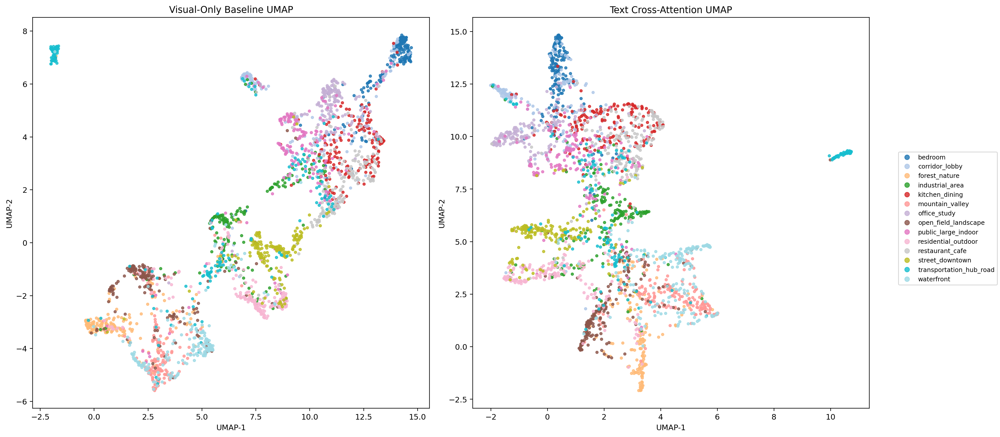

Text cross-attention + InfoNCE UMAP:

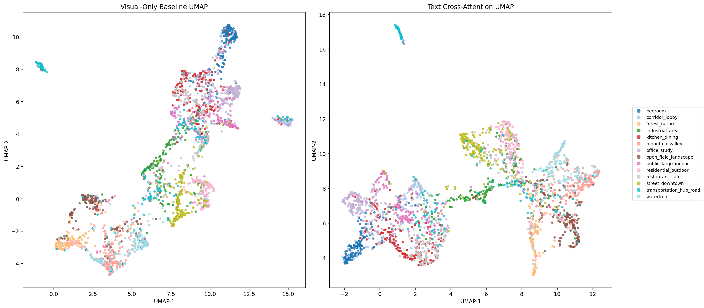

Visual-only baseline와 text cross-attention의 t-SNE 비교:

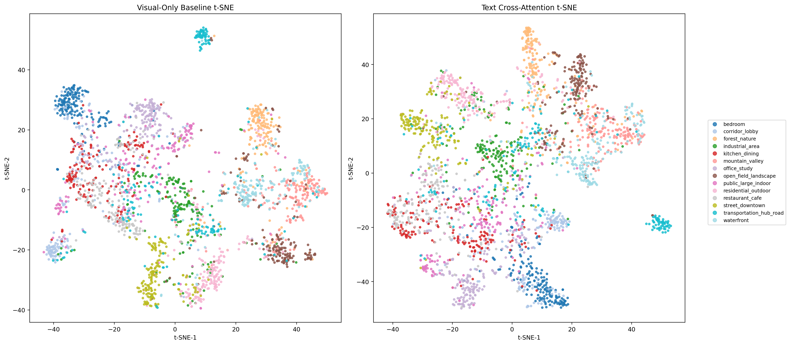

Text cross-attention + InfoNCE t-SNE:

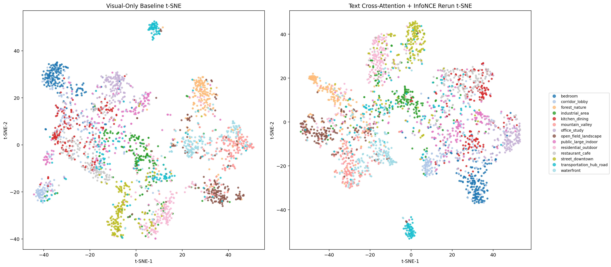

UMAP과 t-SNE를 함께 보면, visual-only baseline과 text-guided 모델은 latent space의 조직 방식 자체가 다르게 나타난다. Baseline에서는 일부 클래스가 국소적으로 잘 모여 있는 구간이 존재하더라도, 전체적으로는 중앙 영역에 여러 클래스가 넓게 섞여 있으며 class boundary가 불규칙하게 얽혀 있다. 특히 UMAP의 중심부와 t-SNE의 중간 대역에서는 `kitchen_dining`, `restaurant_cafe`, `public_large_indoor`, `residential_outdoor`, `transportation_hub_road`가 서로 인접하거나 부분적으로 겹치며, visual cue 중심의 혼합 구조를 보인다.

반면 vanilla text cross-attention을 적용하면 latent가 단순한 점 구름(cloud)보다는 더 길게 이어진 semantic manifold 형태로 재배치된다. t-SNE에서는 `bedroom`, `office_study`, `waterfront`, `industrial_area`처럼 일부 클래스가 baseline보다 더 길고 일관된 방향성을 가진 띠 형태 또는 곡선형 군집으로 나타나며, UMAP에서도 같은 클래스 샘플들이 더 coherent한 작은 덩어리로 모이는 경향이 보인다. 이는 text prior가 단순히 클래스를 멀리 밀어내는 역할만 하는 것이 아니라, 같은 클래스 내부의 표현을 더 안정적인 semantic axis 위에 정렬하도록 작동했음을 시사한다.

또한 vanilla text cross-attention에서는 모든 semantic neighbor를 강제로 분리하기보다, 상위 의미 공간 안에서 더 부드럽게 재배치하는 패턴이 관찰된다. 예를 들어 `kitchen_dining ↔ restaurant_cafe`, `waterfront ↔ mountain_valley`, `public_large_indoor ↔ corridor_lobby`는 완전히 독립된 섬처럼 끊어지기보다는, 서로 가까운 영역에 머물면서도 각 클래스 내부 응집도가 조금 더 정돈되는 방식으로 변한다. 이러한 양상은 confusion matrix에서 `restaurant_cafe -> kitchen_dining`이 `89 -> 139`, `public_large_indoor -> corridor_lobby`가 `85 -> 112`, `waterfront -> mountain_valley`가 `165 -> 171`로 증가한 현상과도 연결되며, text prior가 semantic neighborhood 내부의 geometry를 재조정한다는 해석과 일관된다.

InfoNCE extension을 추가한 경우에는 이 경향이 한 단계 더 강해진다. UMAP에서는 중심부의 혼합 영역이 줄어들고, 여러 클래스가 더 좁은 폭의 띠나 조각난 군집으로 분해되며, t-SNE에서는 클래스별 곡선형 또는 선형 구조가 더 길고 분명하게 드러난다. 특히 `bedroom`, `office_study`, `street_downtown`, `transportation_hub_road`처럼 일부 클래스는 baseline 대비 더 멀리 분리된 자체 manifold를 형성하고, `public_large_indoor`와 `residential_outdoor` 역시 넓게 퍼진 cloud보다는 더 응집된 방향성을 가진 구조로 바뀐다. 이는 InfoNCE가 class prototype alignment를 loss 차원에서 직접 강화함으로써, latent를 단순 smoothing이 아니라 더 명시적인 semantic arrangement 쪽으로 밀어주는 효과를 가졌음을 보여준다.

이것은 다음과 같이 정리할 수 있다.

```text
Visual-only baseline:
locally separated clusters exist, but the global structure is still heavily mixed
and dominated by visual texture/layout similarity

Text cross-attention:
class-internal coherence increases, while semantically related classes are
rearranged into smoother semantic manifolds rather than uniformly pushed apart

Text cross-attention + InfoNCE:
semantic manifold structure is preserved, but class prototype alignment makes
several class boundaries sharper and the overall latent geometry more structured
```

---

#### 5.9.5 Quantitative Latent Metrics

Full `2520`-sample latent comparison 결과는 다음과 같다.

| Metric | Baseline | Text Cross-Attention | Text Cross-Attention + InfoNCE |
|---|---:|---:|---:|
| same-vs-different cosine margin | 0.1833 | 0.1886 | 0.2281 |
| silhouette score | 0.07863 | 0.07892 | 0.08345 |

이 수치들은 앞선 UMAP과 t-SNE에서 관찰한 시각적 인상을 정량적으로 뒷받침한다. text-guided model은 latent-space separation을 전반적으로 개선했으며, 특히 InfoNCE extension은 같은 class와 다른 class 사이의 margin을 더 크게 벌리고 silhouette score도 더 높이는 방향으로 작동했다. 즉 InfoNCE는 최고 accuracy를 약간 양보하는 대신, latent geometry를 더 class-aware하고 prototype-aware한 방향으로 정렬하는 경향을 수치적으로도 보여준다.

본인은 이를 다음과 같이 해석한다.

- text model은 더 semantic하게 구조화된 latent space를 형성함
- same-class compactness가 증가함
- difficult class pair의 분리가 일부 개선됨
- vanilla text prior는 direct nearest-prototype classifier라기보다 smoothing anchor에 가까움
- InfoNCE extension은 그 anchor 방향 정렬을 loss 차원에서 더 직접 강화함

---

#### 5.9.6 Intra-Class and Inter-Class Similarity

Intra/inter-class cosine similarity 분석에서는 text cross-attention model이 전체적으로 cosine similarity를 증가시키는 경향을 보였다.

Intra/inter-class cosine similarity boxplot:

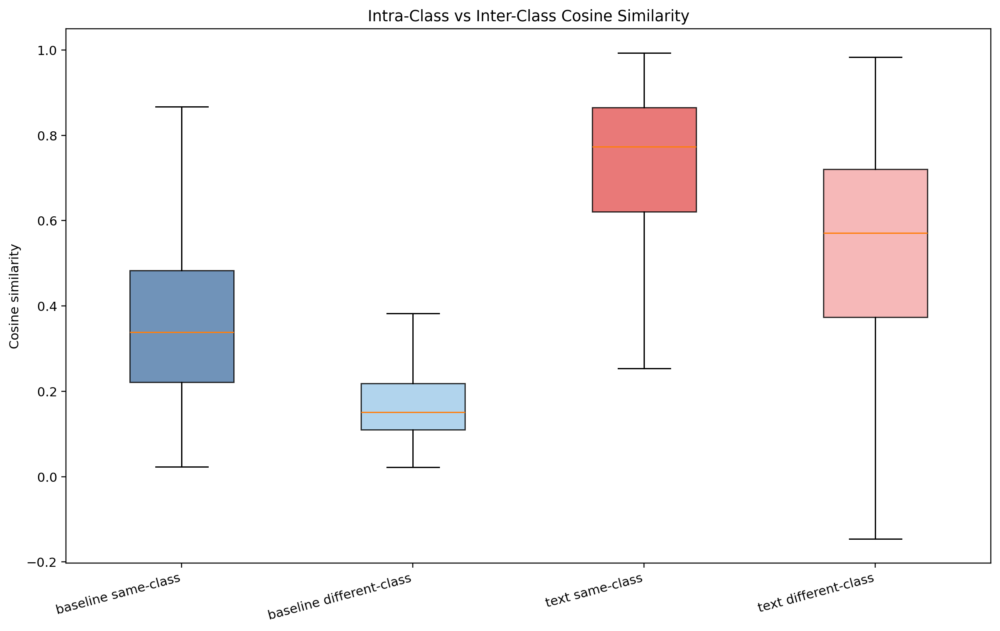

Class centroid cosine distance heatmap:

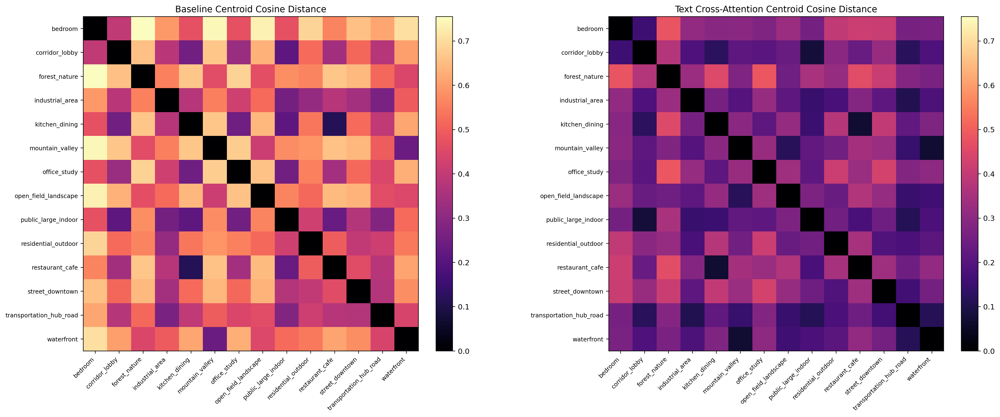

Boxplot을 보면 baseline에서는 same-class cosine의 중앙값이 약 `0.34`, different-class cosine의 중앙값이 약 `0.15` 부근에 놓여 있어 두 분포가 비교적 낮은 유사도 영역에 머문다. 반면 vanilla text cross-attention에서는 same-class cosine의 중앙값이 약 `0.77`까지 크게 상승하고, different-class cosine 역시 약 `0.57`까지 함께 올라간다. 즉 text 주입은 같은 class sample만 더 가깝게 만든 것이 아니라, 전체 latent space 자체를 더 높은 cosine similarity 영역으로 이동시키는 효과를 만든다.

하지만 이 변화는 단순한 collapse와는 다르다. 먼저 same-class 분포가 different-class 분포보다 여전히 위쪽에 위치하고, full180 정량 지표에서도 `same_minus_diff_margin`이 `0.1833 -> 0.1886`으로 소폭 증가한다. 다시 말해 text 주입은 모든 샘플을 무작위로 압축하는 것이 아니라, class 내부 응집도를 더 크게 높이면서 semantic neighborhood 단위의 smoothing을 유도하는 방식에 가깝다.

Heatmap은 이 해석을 더 구체적으로 뒷받침한다. Baseline centroid cosine distance heatmap에서는 많은 class pair가 전반적으로 밝은 톤을 띠며, 특히 `bedroom`, `forest_nature`, `mountain_valley`, `open_field_landscape`, `waterfront` 같은 클래스들이 여러 다른 클래스와도 비교적 큰 centroid distance를 가진다. 반면 text cross-attention heatmap에서는 전체적으로 더 어두운 색조가 넓게 퍼지며, class centroid 사이 거리가 전반적으로 줄어든다. 이는 text semantic prior가 latent centroid를 더 가까운 공통 의미 공간 안으로 끌어당긴다는 뜻이다.

중요한 점은 이 centroid 수축이 모든 class pair에서 균일하게 동일하지 않다는 것이다. 실내 계열(`public_large_indoor`, `corridor_lobby`, `bedroom`, `office_study`)과 자연 계열(`waterfront`, `mountain_valley`, `forest_nature`)처럼 상위 semantic group을 공유하는 클래스들 사이에서 상대적으로 더 강한 재배치가 보인다. 따라서 이 단계의 text cross-attention은 fine-grained separator라기보다, latent space를 coarse semantic structure에 맞춰 재정렬하는 semantic smoother로 해석하는 것이 더 정확하다.

---

#### 5.9.7 Text Prototype Alignment

Text prototype cosine histogram:

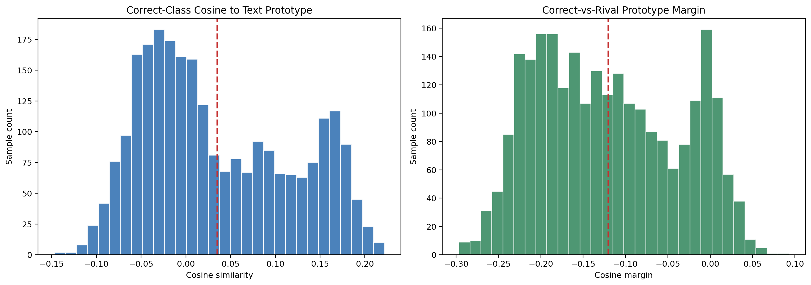

Text prototype cosine histogram with InfoNCE:

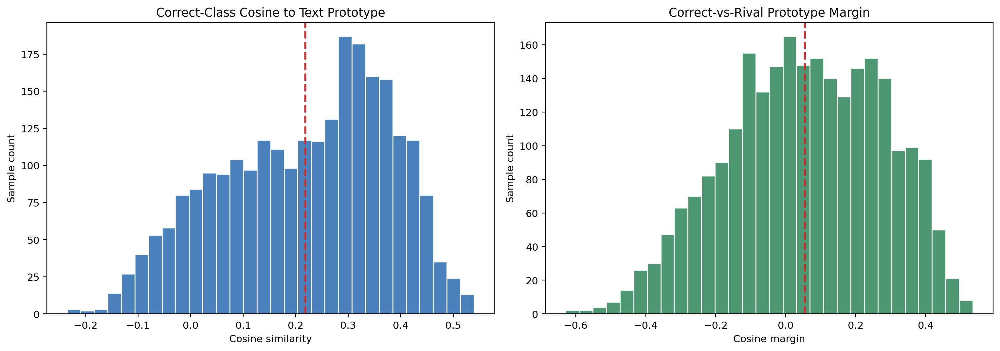

이 시각화는 fused latent가 정답 class의 text prototype과 얼마나 직접적으로 정렬되는지를 보여준다. 먼저 vanilla text cross-attention histogram을 보면, correct-class cosine 분포가 `0` 근처와 `0.15~0.18` 부근에 걸쳐 넓게 퍼져 있고 일부 샘플은 여전히 음수 영역에 남아 있다. 평균선도 `0.0351`로 거의 0 근처에 머문다. 이는 text가 들어갔다고 해서 모든 샘플이 자신의 class text prototype에 강하게 붙는 것은 아니라는 뜻이다.

오른쪽 correct-vs-rival margin histogram은 이 점을 더 분명히 보여준다. 분포의 중심이 여전히 음수 쪽에 놓여 있으며 평균 margin도 `-0.1204`다. 즉 vanilla text cross-attention에서는 많은 샘플이 정답 text prototype보다 rival prototype과 더 가깝다. 그럼에도 불구하고 accuracy가 baseline보다 좋아졌다는 것은, 이 모델이 text를 strict nearest-prototype decision rule로 사용한다기보다 latent geometry를 semantic하게 재배치하는 anchor로 사용하고 있음을 시사한다.

반면 InfoNCE를 추가한 경우에는 분포 모양이 질적으로 바뀐다. Correct-class cosine histogram 전체가 우측으로 이동하면서 평균이 `0.2184`까지 증가하고, margin histogram도 0을 기준으로 오른쪽으로 이동해 평균이 `+0.0552`가 된다. 즉 InfoNCE는 단순히 text feature를 섞는 수준을 넘어, fused latent가 자신의 정답 text prototype을 rival prototype보다 더 가깝게 보도록 loss 차원에서 직접 압박하는 역할을 한다.

실제 full180 report 기준으로:

- `mean_correct_class_cosine`: `0.0351 -> 0.2184`
- `mean_correct_vs_rival_margin`: `-0.1204 -> +0.0552`
- `prototype_retrieval_accuracy`: `0.0972 -> 0.5921`

이 수치는 그림에서 보이는 이동 방향과 일관된다. 따라서 vanilla text cross-attention은 semantic smoothing 중심, InfoNCE variant는 prototype alignment 중심의 모델로 구분해 해석하는 것이 자연스럽다.

---

#### 5.9.8 Confusion-Pair Latent Plot

헷갈리기 쉬운 class pair에 대한 UMAP 비교:

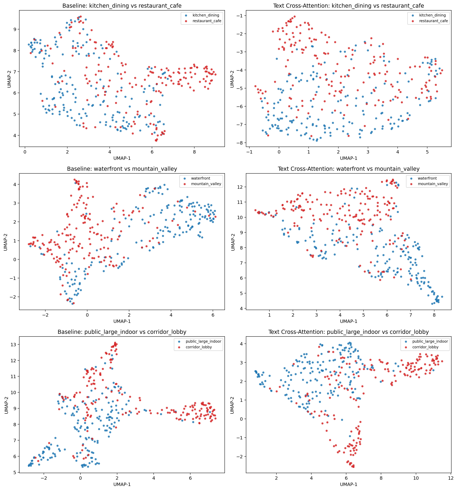

이 그림은 전체 latent space보다 더 직접적으로, 실제로 자주 혼동되는 class pair에서 text cross-attention이 class boundary를 어떻게 재배치하는지를 보여준다. 여기서 중요한 것은 text가 항상 두 클래스를 멀리 떼어 놓는 것이 아니라, 같은 semantic neighborhood 내부에서 더 구조적인 배열을 만들도록 작동한다는 점이다.

`kitchen_dining` vs `restaurant_cafe`를 보면 baseline에서는 두 클래스가 하나의 큰 곡선형 manifold 위에서 넓게 섞여 있으며, 좌측 상단과 중앙 영역에서 파란 점과 빨간 점이 강하게 혼합된다. Text cross-attention으로 가면 여전히 완전 분리는 아니지만, `kitchen_dining`은 상대적으로 아래쪽과 좌측 아크를 더 많이 차지하고 `restaurant_cafe`는 우측 상단과 우측 반원 영역을 더 많이 차지한다. 즉 겹침은 남아 있어도 class가 점유하는 영역 자체는 baseline보다 더 일관되게 나뉜다. 이와 동시에 confusion matrix에서 `kitchen_dining -> restaurant_cafe`는 `117 -> 77`로 감소하지만, 반대 방향인 `restaurant_cafe -> kitchen_dining`은 `89 -> 139`로 증가한다. 이는 text가 두 클래스를 완전히 분리했다기보다, kitchen 쪽 중심을 더 안정화하는 대신 restaurant 쪽 일부 샘플을 같은 semantic band 안으로 끌어들였다고 해석할 수 있다.

`waterfront` vs `mountain_valley`에서도 비슷한 패턴이 보인다. Baseline에서는 `mountain_valley`가 좌측의 큰 곡선 군집을, `waterfront`가 우측의 elongated cluster를 형성하지만 중앙 연결부와 일부 하단 영역에서는 혼합이 남아 있다. Text cross-attention에서는 `waterfront`가 하단과 좌측 하단 쪽을 더 많이 차지하고, `mountain_valley`는 상단과 우측 상단에 더 많이 분포하면서 수직 방향 분리가 조금 더 뚜렷해진다. 다만 중앙 연결부의 overlap은 계속 남아 있어, 자연 scene 계열 내부의 semantic proximity가 완전히 해소되지는 않는다. confusion matrix에서도 `waterfront -> mountain_valley`가 `165 -> 171`로 약간 증가하는 반면 `mountain_valley` 정분류 수는 `362 -> 400`으로 늘어난다. 즉 mountain 쪽 prototype은 더 안정화되지만 waterfront 일부 샘플은 여전히 같은 자연 scene manifold 안에 머문다.

`public_large_indoor` vs `corridor_lobby`는 세 쌍 중 text 효과가 가장 구조적으로 보이는 사례다. Baseline에서는 두 클래스가 S자 형태의 경로를 따라 길게 섞여 있고, 중앙과 우측 하단 영역에서 red/blue가 다수 중첩된다. Text cross-attention 이후에는 `corridor_lobby`가 우측과 하단의 elongated branch를 더 강하게 차지하고, `public_large_indoor`는 좌측 및 중앙 상부에 더 많이 남는다. 여전히 교차 영역은 존재하지만, 클래스가 주로 위치하는 branch 자체가 조금 더 분화된다. 이는 `public_large_indoor -> corridor_lobby` 혼동이 `85 -> 112`로 증가함에도 불구하고 `public_large_indoor` 정분류 수가 `188 -> 196`으로 소폭 증가하는 현상과 맞닿아 있다. 다시 말해 class pair 내부에서 일부 trade-off가 생기지만, 동시에 특정 클래스 중심은 더 응집될 수 있다.

종합하면 pairwise UMAP은 text cross-attention이 confusion pair를 무조건 멀리 떼어 놓는 separator라기보다, semantic neighbor 내부에서 class별 점유 영역을 다시 배치하는 reorganizer에 가깝다는 점을 보여준다.

---

#### 5.9.9 Attention Map Interpretation

Cross-attention heatmap은 모델이 이미지의 어떤 영역을 중요하게 보는지 확인하기 위해 사용했다.

Text cross-attention attention map examples:

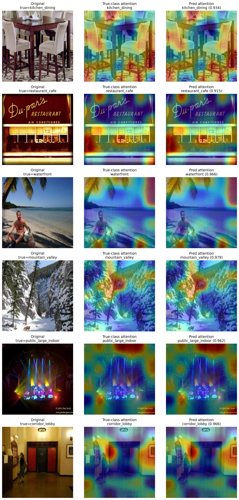

Attention map은 text-guided model이 단순히 전역 feature vector만 섞는 것이 아니라, 장면을 구분하는 데 중요한 공간적 단서를 어디에서 끌어오는지를 보여준다. 흥미로운 점은 true-class attention과 predicted-class attention이 대부분 매우 유사하다는 것이다. 이는 제시된 예제들이 모두 높은 confidence로 올바르게 분류되었고, 모델의 최종 예측이 실제로 같은 공간 단서를 기반으로 형성되었음을 시사한다.

`kitchen_dining` 예제에서는 테이블 상판과 의자, 그리고 식사 공간의 중심 구성이 상대적으로 강조된다. 다만 열지도는 물체 경계만 날카롭게 따르기보다 테이블이 놓인 실내 구역 전체를 넓게 덮는다. 즉 모델은 개별 object detection식으로 컵이나 의자 하나만 보는 것이 아니라, dining setup 전체가 만드는 indoor dining context를 읽고 있다.

`restaurant_cafe` 예제에서는 상단 간판의 텍스트 영역, 전면 유리창, storefront의 수평 구조가 함께 반응한다. 이는 restaurant/cafe class에서 중요한 단서가 단순히 테이블 유무가 아니라 상업 공간의 정면성, sign, window frontage 같은 public dining cue라는 점을 잘 보여준다.

`waterfront` 예제에서는 수평선, 수면, 해변의 열린 공간이 넓게 활성화된다. 사람이나 전경 object보다 바다와 하늘이 맞닿는 넓은 수평 구조가 더 큰 비중을 차지한다는 점에서, 모델이 scene의 semantic identity를 global layout 차원에서 파악하고 있음을 확인할 수 있다.

`mountain_valley` 예제에서는 암석 절벽, 계곡의 깊이감, 원경 지형선이 강하게 반응한다. 특히 수직적인 rock structure와 뒤쪽 산 능선이 동시에 강조되는데, 이는 waterfront와 대비되는 topographic cue가 무엇인지를 잘 보여준다.

`public_large_indoor` 예제에서는 무대 조명, 상단의 넓은 어두운 천장 영역, 중앙 stage zone이 함께 활성화된다. 이 클래스는 단순한 indoor room보다 large public venue의 scale과 lighting arrangement가 중요한데, attention map도 바로 그 지점을 짚는다.

`corridor_lobby` 예제에서는 중앙 통로, 양쪽 벽면, door frame과 같은 선형 perspective cue가 두드러진다. 특히 hallway의 깊이 방향으로 이어지는 중앙부가 강하게 반응하는데, 이는 public_large_indoor와 달리 corridor/lobby가 공간의 규모보다 통로 구조와 방향성에 의해 정의된다는 점과 일치한다.

결론적으로 이 attention map들은 text cross-attention이 이미지 전체를 무차별적으로 보는 것이 아니라, 각 class를 설명하는 구조적 단서와 semantic context가 놓인 영역을 비교적 일관되게 참조하고 있음을 보여준다.

---
### 5.10 How Text Cross-Attention Can Be Used Better

현재 결과를 종합해 보면, text cross-attention은 모든 장면 분류 문제에서 만능 해법이라기보다는 특정 조건에서 특히 효과가 잘 드러나는 방식에 가깝다. 아래 항목들은 실제 실험 결과를 바탕으로, 어떤 상황에서 이 접근이 가장 설득력 있게 작동하는지를 정리한 것이다.

#### 5.10.1 Visual Noise가 큰 이미지

조명, 색감, 배경, texture가 불안정한 이미지에서는 visual-only feature가 쉽게 흔들릴 수 있다. Text semantic prior는 이런 visual noise를 줄이고, 이미지가 어떤 장면인지에 대한 high-level anchor를 제공한다.

#### 5.10.2 같은 Class 내부 Variation이 큰 경우

같은 class라도 viewpoint, lighting, object composition이 크게 달라질 수 있다. Text prompt는 이 class가 가져야 하는 공통 semantic concept을 제공하기 때문에, 같은 class sample들이 더 안정적으로 묶이도록 도와준다.

#### 5.10.3 Coarse Semantic Grouping이 중요한 경우

Indoor, outdoor, natural landscape, urban scene, food-related scene처럼 상위 의미 구조가 중요한 경우 text guidance가 도움이 된다. Text는 visual feature가 놓치기 쉬운 semantic hierarchy를 보완할 수 있다.

---

### 5.11 Future Improvements

현재의 text cross-attention 모델은 의미 기반 smoothing과 prototype alignment 측면에서 분명한 장점을 보였지만, 동시에 fine-grained class pair에서의 혼동과 과도한 semantic smoothing이라는 한계도 드러냈다. 따라서 앞으로의 개선 방향은 단순히 text를 더 많이 넣는 것이 아니라, “어떻게 더 정교하게 주입할 것인가”에 맞춰져야 한다. 아래 제안들은 그 연장선에서 도출된 아이디어들이다.

#### 5.11.1 More Discriminative Text Prompts

현재 prompt가 class의 일반적인 의미를 설명하는 데 집중했다면, 앞으로는 class 간 차이를 더 분명히 드러내는 prompt를 사용할 수 있다.

예를 들어:

```text
kitchen_dining:
a private home kitchen or dining room with household furniture, dining table, cabinets, and domestic indoor setting

restaurant_cafe:
a commercial public dining place with signs, counters, tables, customers, storefront, and cafe interior
```

이처럼 공통점뿐 아니라 차이점을 prompt에 넣으면 fine-grained confusion을 줄이는 데 도움이 될 수 있다.

---

#### 5.11.2 Learnable Gating

Text를 항상 같은 강도로 넣으면 semantic smoothing이 과해질 수 있다. 따라서 visual feature와 text feature 사이에 learnable gate를 둘 수 있다.

예시는 다음과 같다.

```math
\mathbf{z}_{fused} = \mathbf{z}_{img} + \alpha \cdot \mathrm{CrossAttention}(\mathbf{z}_{img}, \mathbf{z}_{text})
```

여기서 `alpha`는 learnable gate로 둘 수 있다.

이렇게 하면 쉬운 sample에서는 visual feature를 더 믿고, 애매한 sample에서는 text prior를 더 활용하는 방식으로 동작할 수 있다.

---

#### 5.11.3 Contrastive Loss for Confusing Pairs

현재 text-guided model은 same-class compactness를 높이는 데 효과가 있지만, semantically similar different-class도 함께 가까워질 수 있다.

이를 보완하기 위해 supervised contrastive loss나 margin loss를 추가할 수 있다.

목표는 다음과 같다.

```text
same class는 더 가깝게
different class는 의미적으로 가까워도 일정 margin 이상 떨어지게
```

특히 다음 class pair에 대해 효과적일 수 있다.

- `kitchen_dining` vs `restaurant_cafe`
- `waterfront` vs `mountain_valley`
- `public_large_indoor` vs `corridor_lobby`

---

#### 5.11.4 Multi-Level Text Description

Class name 하나만 사용하는 대신, 계층적인 text description을 사용할 수 있다.

예를 들어 `waterfront`는 다음처럼 표현할 수 있다.

```text
Level 1: outdoor nature scene
Level 2: water-related landscape
Level 3: beach, ocean, shoreline, lakefront, waves
```

`kitchen_dining`은 다음처럼 표현할 수 있다.

```text
Level 1: indoor scene
Level 2: food-related indoor scene
Level 3: home kitchen, dining table, cabinets, domestic eating space
```

이 방식은 coarse semantic structure와 fine-grained visual clue를 함께 제공할 수 있다.

---

#### 5.11.5 Image-Only and Text-Fused Ensemble

Text가 과하게 smoothing하는 경우를 막기 위해 image-only logits와 text-fused logits를 함께 사용할 수 있다.

```math
\mathrm{logits}_{final} = \beta \cdot \mathrm{logits}_{image} + (1-\beta) \cdot \mathrm{logits}_{fused}
```

이 방식은 visual-only branch가 fine detail을 보존하고, text-fused branch가 semantic consistency를 제공하도록 만들 수 있다.

---

## 6. Repository Structure

저장소 구조는 애플리케이션 코드와 연구용 실험 코드를 함께 담을 수 있도록 비교적 명확하게 분리되어 있다. 아래 트리는 전체 프로젝트의 큰 뼈대를 보여주며, 그 아래 설명은 실제로 어떤 파일이 어떤 역할을 맡는지를 빠르게 파악하기 위한 가이드다.

```text
VisionCraft/
├── app.py
├── checkpoint/
│   └── scene_classifier_resnet50_v11_text_crossattn_e20.pt
├── src/
│   ├── analyzer/
│   │   └── low-level image analysis modules
│   ├── enhancer/
│   │   └── traditional enhancement pipeline
│   ├── models/
│   │   ├── train_scene_classifier.py
│   │   ├── evaluate_scene_classifier.py
│   │   ├── scene_text_prompts.py
│   │   ├── analyze_visual_baseline_latent.py
│   │   ├── analyze_text_cross_attention_latent.py
│   │   └── analyze_latent_comparison.py
│   └── utils/
├── logs/
│   └── latent_comparison_v11_full180/
└── README.md
```

자주 보게 되는 파일들의 역할은 다음과 같다.

- `app.py`
  - 이미지 분석 및 개선을 위한 Gradio 애플리케이션
- `src/analyzer/`
  - 밝기, 대비, blur, edge, color balance 등 저수준 이미지 분석 모듈
- `src/enhancer/`
  - OpenCV 기반 전통적 이미지 개선 파이프라인
- `src/models/train_scene_classifier.py`
  - scene classification 학습 파이프라인
- `src/models/evaluate_scene_classifier.py`
  - 학습된 scene classifier 평가 코드
- `src/models/scene_text_prompts.py`
  - text-guided cross-attention에 사용되는 class prompt 정의
- `src/models/analyze_visual_baseline_latent.py`
  - visual-only baseline latent 분석
- `src/models/analyze_text_cross_attention_latent.py`
  - text-guided model latent 분석
- `src/models/analyze_latent_comparison.py`
  - UMAP, cosine distance, boxplot, attention map 등 비교 시각화 생성

---

## 7. How to Run

실행 방법은 크게 두 갈래로 나뉜다. 하나는 사용자가 직접 이미지를 넣어보는 메인 애플리케이션 실행이고, 다른 하나는 학습·평가·시각화처럼 연구용 실험을 재현하는 방식이다. 우선 메인 애플리케이션은 다음처럼 실행하면 된다.

```bash
source .venv/bin/activate
python app.py
```

또는:

```bash
.venv/bin/python app.py
```

현재 기본 scene classification checkpoint는 text cross-attention model로 연결되어 있다.

```text
checkpoint/scene_classifier_resnet50_v11_text_crossattn_e20.pt
```

---

## 8. Final Summary

VisionCraft는 scene-aware image analysis and enhancement를 목표로 출발한 프로젝트지만, 최종적으로는 단순 보정 도구를 넘어 장면 이해와 표현 학습 연구까지 함께 담아낸 컴퓨터 비전 파이프라인으로 확장되었다. 처음에는 밝기, 대비, blur 같은 저수준 품질 분석에서 출발했지만, 이후 scene classification, semantic segmentation, text-guided cross-attention을 결합하면서 “이미지를 어떻게 더 좋게 보이게 만들 것인가”와 “이미지를 어떻게 더 잘 이해할 것인가”라는 두 질문을 동시에 다루게 되었다.

이 프로젝트의 주요 특징은 다음과 같다.

1. 밝기, 대비, blur, edge, color balance, exposure를 포함한 저수준 이미지 품질 분석
2. YOLOv8 기반 object detection
3. SegFormer 기반 semantic segmentation
4. crop suggestion, OCR, perspective rectification을 포함한 실용적 이미지 분석 기능
5. OpenCV 기반 traditional enhancement pipeline
6. Places365 subset 기반 14-class scene classifier
7. CLIP text embedding을 활용한 text-guided cross-attention model
8. latent space와 attention을 분석하기 위한 visualization suite

실험 결과 text cross-attention model은 visual-only baseline보다 accuracy를 소폭 개선했다.

```text
visual-only baseline: 59.79%
text cross-attention: 60.56%
```

정확도 개선 폭만 놓고 보면 아주 극적인 수준은 아니다. 그러나 latent analysis와 prototype alignment 결과까지 함께 보면, text-guided model은 same-class compactness를 높이고, semantic structure를 더 또렷하게 만들며, 특히 InfoNCE extension을 통해 text prototype과의 정렬까지 강화하는 경향을 일관되게 보여주었다. 이는 text가 visual feature를 대체하는 것이 아니라, scene-level semantic anchor로 작동하면서 representation을 더 안정적으로 정렬한다는 해석을 가능하게 한다.

요약하면 VisionCraft는 단순히 이미지를 보기 좋게 만드는 도구가 아니라, 이미지가 무엇을 담고 있는지 이해하고, 그 이해를 바탕으로 분석과 보정을 수행하는 scene-aware computer vision system이다.
