# VisionCraft: Scene-Aware Image Understanding & Enhancement

## Abstract

VisionCraft는 장면(Scene)의 의미론적 맥락을 이해하고 이를 이미지 분석 및 개선 과정에 반영하기 위한 Scene-Aware Computer Vision Framework이다. 기존의 이미지 보정 시스템은 주로 밝기, 대비, 선명도와 같은 저수준(low-level) 통계량에 의존하여 동일한 보정 전략을 모든 이미지에 적용하는 경우가 많다. 그러나 실제 환경에서는 같은 수준의 밝기나 대비를 가진 이미지라도 장면의 종류에 따라 요구되는 보정 방식이 달라질 수 있다.

이를 해결하기 위해 VisionCraft는 이미지 품질 분석(Image Quality Analysis), 장면 분류(Scene Classification), 객체 검출(Object Detection), 의미론적 분할(Semantic Segmentation)을 하나의 통합 파이프라인으로 결합하였다. 시스템은 단순히 보정된 이미지를 출력하는 데 그치지 않고, 이미지의 품질 상태와 장면 구조를 분석하여 왜 특정 보정이 필요한지에 대한 시각적·정량적 근거를 함께 제공한다.

또한 본 프로젝트는 응용(Application) 관점뿐 아니라 연구(Research) 관점의 실험도 포함한다. 연구 파이프라인에서는 CLIP 기반 Text Embedding을 ResNet50 Scene Classifier의 Latent Space에 주입하는 Text-Guided Cross-Attention 구조를 제안하였으며, 추가적으로 InfoNCE 기반 Contrastive Learning을 적용하여 Visual Representation과 Text Prototype 간의 Alignment를 강화하는 방법을 탐구하였다.

실험 결과, Text-Guided Cross-Attention 모델은 Visual-Only Baseline 대비 Validation Accuracy를 59.79%에서 60.56%까지 향상시켰으며, 최종적으로 Text Cross-Attention + InfoNCE 모델은 60.75%의 Validation Accuracy를 기록하였다. 또한 UMAP, t-SNE, centroid cosine distance, prototype alignment, attention visualization을 통해 텍스트 기반 의미 정보가 Latent Representation을 보다 구조적이고 의미론적인 방향으로 재구성하는 현상을 확인하였다.

결과적으로 VisionCraft는 Scene-Aware Image Enhancement를 위한 실용적 시스템인 동시에, Multimodal Representation Learning이 Scene Classification에 미치는 영향을 분석하기 위한 연구 플랫폼으로 활용될 수 있다.

---

## 1. Introduction

### 1.1 Motivation

기존의 Image Processing Pipeline은 대부분 Pixel-level Statistics에 의존해 왔다. 밝기(Brightness), 대비(Contrast), 선명도(Sharpness)와 같은 Low-level Feature는 이미지 품질을 판단하는 데 중요한 역할을 하지만, 실제 사람이 인지하는 장면(Scene)의 의미와 맥락을 충분히 설명하지는 못한다.

예를 들어 조명이 부족한 실내 공간과 흐린 날의 해변 풍경은 모두 노출(Exposure) 보정이 필요할 수 있다. 그러나 동일한 보정 공식을 두 이미지에 일괄적으로 적용하는 것은 충분히 적절한 해결책이 아닐 수 있다. 실내 사진에서는 가구 구조와 조명 분포가 중요하며, 자연 풍경에서는 하늘과 지형의 색채 대비 및 질감(Texture)이 더 중요한 요소가 된다.

즉, 이미지를 단순한 픽셀 집합으로 바라보는 접근에는 한계가 있으며, 보다 효과적인 이미지 분석과 개선을 위해서는 이미지가 담고 있는 의미론적 맥락(Semantic Context)을 함께 고려해야 한다.

VisionCraft는 이러한 문제의식에서 출발하였다. 본 프로젝트의 목표는 단순한 이미지 보정을 넘어, 이미지의 장면 구조와 의미를 이해하고 그 결과를 분석 및 개선 과정에 반영하는 Scene-Aware Computer Vision Framework를 구축하는 것이다.

### 1.2 Problem Statement

Computer Vision 분야의 주요 난제 중 하나는 시각적 유사성(Visual Similarity)과 의미적 차이(Semantic Difference) 사이의 간극이다.

예를 들어 다음과 같은 장면들은 서로 다른 의미를 가지지만 시각적으로 매우 유사할 수 있다.

* restaurant_cafe ↔ kitchen_dining
* waterfront ↔ mountain_valley
* public_large_indoor ↔ corridor_lobby
* bedroom ↔ office_study

이러한 클래스들은 공통 객체(Object), 유사한 색상 분포(Color Distribution), 비슷한 공간 구조(Spatial Layout)를 공유하기 때문에 단순한 Visual Feature만으로는 안정적인 분류 경계를 형성하기 어렵다.

또한 기존 이미지 개선 시스템 역시 대부분 장면의 의미를 고려하지 않은 채 Brightness, Contrast, Blur와 같은 물리적 지표에만 기반하여 동작한다. 따라서 이미지가 실제로 어떤 공간인지, 어떤 객체가 중요한지, 어떤 영역이 보존되어야 하는지에 대한 이해 없이 동일한 보정 전략이 적용되는 경우가 많다.

결과적으로 기존 접근 방식은 다음과 같은 한계를 가진다.

* 장면의 의미를 반영하지 못함
* 시각적으로 유사한 클래스 간 혼동 발생
* 보정 과정의 설명 가능성(Explainability) 부족
* 객체와 영역의 중요도를 고려하지 못함

VisionCraft는 이러한 한계를 완화하기 위해 Low-level Image Analysis와 High-level Scene Understanding를 하나의 통합 파이프라인으로 결합하였다.

### 1.3 Why Scene Understanding Matters

VisionCraft는 입력 이미지에 대해 단순한 품질 분석만 수행하지 않는다. 시스템은 Brightness, Blur, Edge Density, Dynamic Range와 같은 물리적 지표를 계산하는 동시에, Scene Classification, Object Detection, Semantic Segmentation을 수행하여 이미지의 구조와 의미를 함께 해석한다.

이를 통해 시스템은 단일 이미지를 입력받았을 때 다음과 같은 핵심 질문들에 답하고자 한다.

* 장면 인식 (Scene Identity)
    이 이미지는 어떤 공간적·상황적 맥락을 가지는가?
* 품질 진단 (Quality Diagnosis)
    시각적 품질 저하의 원인은 무엇인가?
* 영역 분석 (Semantic ROI Analysis)
    어떤 객체와 영역이 보존되거나 강조되어야 하는가?
* 문맥 기반 보정 (Context-aware Enhancement)
    현재 장면에 가장 적합한 보정 전략은 무엇인가?
* 모델 해석 (Explainability)
    분류 모델은 어떤 시각적 단서를 근거로 현재 장면을 판단하였는가?

이러한 접근을 통해 VisionCraft는 단순한 Filter Application Tool을 넘어, 이미지 품질 진단, 장면 이해, 객체 분석, 의미론적 영역 해석, 장면 기반 보정, 그리고 이를 해석하기 위한 시각화까지 하나의 파이프라인 안에서 수행하는 통합적인 Computer Vision Framework를 지향한다.

---

## 2. Contributions

본 프로젝트의 주요 기여점은 다음과 같다.

### 2.1 Technical Contributions

1. 저수준 이미지 품질 분석과 고수준 장면 이해를 결합한 Scene-Aware Image Enhancement Pipeline을 제안하였다.

2. Brightness, Contrast, Blur, Exposure 분석과 Object Detection, Semantic Segmentation을 통합하여 설명 가능한(Explainable) 이미지 분석 프레임워크를 구축하였다.

3. 사용자가 이미지 한 장만 업로드하면 분석, 해석, 보정, 시각화를 모두 수행할 수 있는 통합형 Gradio Application을 구현하였다.

4. 객체 검출과 의미론적 분할 결과를 활용하여 Semantic-Aware Crop Recommendation 및 Region-Aware Enhancement 기능을 설계하였다.

5. OCR, Perspective Rectification, Auto Straighten 기능을 포함하여 실제 환경에서 활용 가능한 종합적인 Computer Vision Toolkit을 구축하였다.

### 2.2 Research Contributions

1. Places365 기반 장면 데이터를 재구성하여 Scene-Aware Enhancement에 적합한 14개 Scene Taxonomy를 설계하였다.

2. CLIP 기반 Text Embedding을 활용하여 장면 의미 정보를 Latent Space에 주입하는 Text-Guided Cross-Attention Scene Classifier를 제안하였다.

3. Visual Representation과 Class-Level Text Prototype의 Alignment를 강화하기 위해 InfoNCE 기반 Contrastive Learning 기법을 적용하였다.

4. Accuracy 비교를 넘어 UMAP, t-SNE, Cosine Similarity, Prototype Alignment, Attention Map Visualization을 활용한 Latent Space 분석을 수행하였다.

5. Text Prior가 Scene Classification 과정에서 Semantic Smoothing 역할을 수행함을 관찰하였으며, 이에 따른 장점과 Trade-off를 정량적·정성적으로 분석하였다.

---

## 3. System Overview

VisionCraft는 단순한 이미지 보정 애플리케이션이 아니라, 이미지 이해(Image Understanding)와 이미지 개선(Image Enhancement)을 통합적으로 수행하기 위한 Scene-Aware Computer Vision Framework이다.

본 프로젝트는 크게 두 개의 상호 보완적인 파이프라인으로 구성된다.

1. Application Pipeline
   - 실제 이미지 분석 및 개선을 수행하는 통합형 Application System

2. Research Pipeline
   - 장면 분류(Scene Classification) 과정에서 텍스트 의미 정보(Text Prior)가 Latent Representation에 미치는 영향을 분석하기 위한 연구 프레임워크

Application Pipeline은 사용자가 업로드한 이미지를 분석하고 개선하는 데 초점을 맞추며, Research Pipeline은 Scene Classification 모델의 표현 학습(Representation Learning)을 분석하는 데 초점을 둔다.

---

### 3.1 Overall Architecture

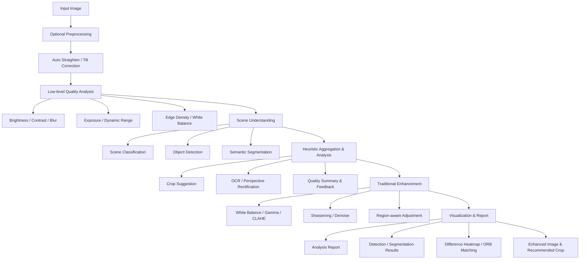
```mermaid
flowchart TD

A[Input Image]

A --> B[Optional Preprocessing]
B --> B1[Auto Straighten / Tilt Correction]

B1 --> C[Low-level Quality Analysis]
C --> C1[Brightness / Contrast / Blur]
C --> C2[Exposure / Dynamic Range]
C --> C3[Edge Density / White Balance]

C --> D[Scene Understanding]
D --> D1[Scene Classification]
D --> D2[Object Detection]
D --> D3[Semantic Segmentation]

D --> E[Heuristic Aggregation & Analysis]
E --> E1[Crop Suggestion]
E --> E2[OCR / Perspective Rectification]
E --> E3[Quality Summary & Feedback]

E --> F[Traditional Enhancement]
F --> F1[White Balance / Gamma / CLAHE]
F --> F2[Sharpening / Denoise]
F --> F3[Region-aware Adjustment]

F --> G[Visualization & Report]
G --> G1[Analysis Report]
G --> G2[Detection / Segmentation Results]
G --> G3[Difference Heatmap / ORB Matching]
G --> G4[Enhanced Image & Recommended Crop]
```

기존의 이미지 보정 시스템이 단순히 필터를 적용하는 방식이었다면, VisionCraft는 입력 이미지를 먼저 분석하고(Analyze), 장면을 해석하며(Understand), 여러 모듈의 결과를 종합한 뒤(Integrate), 그 결과를 바탕으로 보정과 시각화를 수행한다.

즉, 다음과 같은 process 매커니즘을 따른다.

```text
Input
  ↓
Analyze
  ↓
Understand
  ↓
Integrate
  ↓
Enhance
  ↓
Explain
```

 이러한 구조를 통해 VisionCraft는 단순한 Pixel-level Processing을 넘어, 장면의 의미론적 맥락(Semantic Context)을 반영하는 Scene-Aware Computer Vision Framework를 지향한다.

### 3.2 Application Pipeline

Application Pipeline은 사용자가 실제로 사용하는 메인 시스템이다.

사용자가 이미지를 업로드하면 다양한 Computer Vision 모듈들이 순차적으로 실행되며, 최종적으로 보정된 이미지와 분석 리포트를 함께 생성한다.

Application Pipeline은 다음 네 단계로 구성된다.

#### 1. Image Quality Analysis

이미지의 물리적 품질 상태를 분석한다.

주요 분석 항목은 다음과 같다.

- Brightness
- Contrast
- Blur
- Edge Density
- Dynamic Range
- Exposure Condition
- White Balance

이 단계에서는 이미지 품질 저하의 원인을 정량적으로 진단한다.

---

#### 2. Scene Understanding

이미지의 의미론적 구조를 분석한다.

사용되는 주요 모델은 다음과 같다.

- Scene Classification
- YOLOv8 Object Detection
- SegFormer Semantic Segmentation

이를 통해 시스템은

- 어떤 공간인지
- 어떤 객체가 존재하는지
- 어떤 영역이 중요한지

를 파악한다.

---

#### 3. Heuristic Aggregation and Analysis

품질 분석 결과와 Scene Understanding 결과를 통합하여 후속 처리에 필요한 해석 단서를 구성한다.

이 단계에서는 예를 들어 다음과 같은 작업이 수행된다.

- Detection 기반 또는 Segmentation 기반 Crop Suggestion
- OCR 수행을 위한 Perspective Rectification
- 장면, 객체, 영역, 품질 지표를 종합한 Quality Summary와 Feedback 생성
- Rule-of-Thirds와 객체 위치를 반영한 Composition 분석

즉, 이 단계는 독립적인 reasoning engine이라기보다 여러 분석 모듈의 출력을 종합하여 사람이 해석 가능한 중간 결과를 구성하는 rule-based aggregation 단계에 가깝다.

---

#### 4. Traditional Enhancement and Visualization

분석 결과를 바탕으로 실제 이미지 보정을 수행하고, 전후 비교와 중간 산출물을 함께 시각화한다.

포함 기능은 다음과 같다.

- Exposure Correction
- White Balance Correction
- CLAHE
- Adaptive Sharpening
- Denoising
- Region-aware Enhancement
- Detection / Segmentation Visualization
- Difference Heatmap
- ORB Matching
- Final Analysis Report

현재 구현의 enhancement는 학습 기반 생성 모델이 아니라 전통적 영상처리 기반 보정 파이프라인이다. 다만 모든 이미지에 동일한 필터를 기계적으로 적용하는 대신, 품질 지표와 장면 해석 결과를 함께 반영하여 보정 강도와 적용 영역을 조절한다.

---

### 3.3 Research Pipeline

Research Pipeline은 VisionCraft의 연구적 기여를 담당하는 실험 프레임워크이다.

본 연구의 핵심 질문은 다음과 같다.

> 텍스트 기반 의미 정보(Text Prior)는 Scene Classification 과정에서 Latent Representation을 어떻게 변화시키는가?

이를 검증하기 위해 다음 세 가지 모델을 비교하였다.

#### Visual-Only Baseline

기본적인 ResNet50 기반 Scene Classification 모델이다.

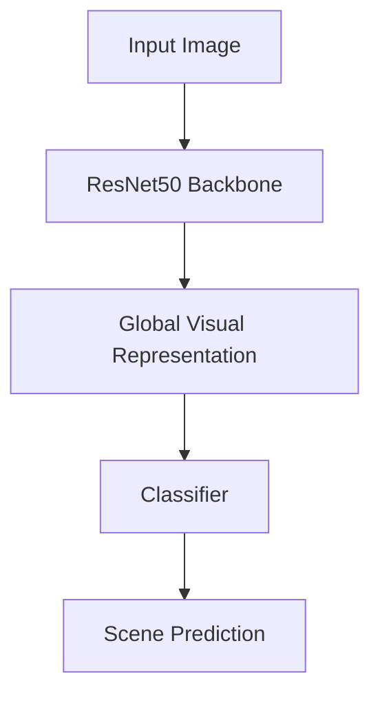
```mermaid
flowchart TD

A[Input Image]
A --> B[ResNet50 Backbone]
B --> C[Global Visual Representation]
C --> D[Classifier]
D --> E[Scene Prediction]
```

---

#### Text-Guided Cross-Attention

CLIP 기반 Text Embedding을 Latent Space에 주입하는 구조이다.

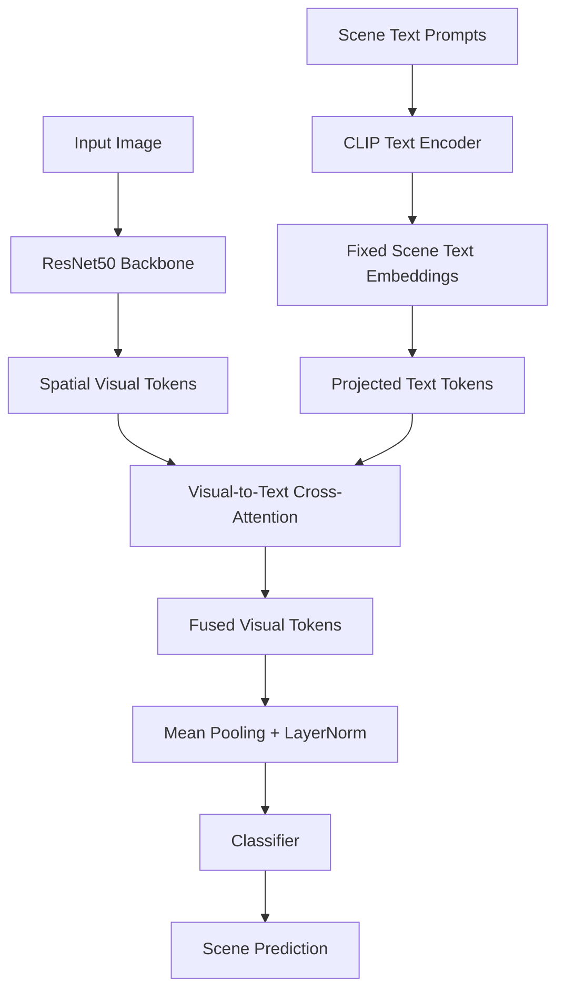
```mermaid
flowchart TD

A[Input Image] --> B[ResNet50 Backbone]
B --> C[Spatial Visual Tokens]

T[Scene Text Prompts] --> U[CLIP Text Encoder]
U --> V[Fixed Scene Text Embeddings]
V --> W[Projected Text Tokens]

C --> X[Visual-to-Text Cross-Attention]
W --> X

X --> Y[Fused Visual Tokens]
Y --> Z[Mean Pooling + LayerNorm]
Z --> P[Classifier]
P --> Q[Scene Prediction]
```

---

#### Text-Guided Cross-Attention + InfoNCE

Cross-Attention 구조에 Contrastive Learning을 추가한 모델이다.

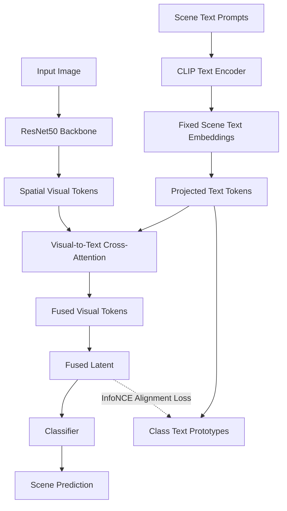
```mermaid
flowchart TD

A[Input Image] --> B[ResNet50 Backbone]
B --> C[Spatial Visual Tokens]

T[Scene Text Prompts] --> U[CLIP Text Encoder]
U --> V[Fixed Scene Text Embeddings]
V --> W[Projected Text Tokens]

C --> X[Visual-to-Text Cross-Attention]
W --> X

X --> Y[Fused Visual Tokens]
Y --> Z[Fused Latent]
Z --> P[Classifier]
P --> Q[Scene Prediction]

W --> R[Class Text Prototypes]
Z -. InfoNCE Alignment Loss .-> R
```

현재 구현에서 Cross-Attention은 visual token이 class-level text token을 참조하는 단방향 구조이며, InfoNCE는 attention block 내부에 삽입되는 것이 아니라 fused latent와 projected text prototype 사이에 추가되는 보조 학습 loss로 작동한다.

본 연구에서는 단순한 Accuracy 비교를 넘어 다음과 같은 분석을 수행하였다.

- Classification Accuracy
- Confusion Matrix
- UMAP Visualization
- t-SNE Visualization
- Cosine Similarity Analysis
- Prototype Alignment Analysis
- Attention Map Visualization

궁극적으로 Research Pipeline은 성능 향상 여부뿐 아니라, 텍스트 기반 의미 정보가 Scene Representation을 어떻게 재구성하는지를 정량적·정성적으로 분석하는 것을 목표로 한다.

---


## 4. Application Pipeline

### 4.1 Image Quality Analysis

#### 4.1.1 Brightness Analysis

Brightness Analysis는 입력 이미지의 전반적인 조도 수준을 가장 단순하면서도 해석 가능한 방식으로 정량화하기 위한 단계이다. 현재 구현은 RGB 이미지를 grayscale로 변환한 뒤, 전체 픽셀의 평균 intensity를 계산하고 이를 0에서 100 사이의 점수로 정규화한다.

그레이스케일 영상 $I_{\mathrm{gray}}$에 대해 평균 밝기 $\mu_I$는 다음과 같이 정의된다.

$$
\mu_I = \frac{1}{HW} \sum_{y=1}^{H} \sum_{x=1}^{W} I_{\mathrm{gray}}(x,y)
$$

여기서 $H, W$는 이미지의 높이와 너비이다. 최종 brightness score는 다음과 같이 계산된다.

$$
\mathrm{BrightnessScore} = \frac{\mu_I}{255} \times 100
$$

이 점수는 [brightness.py](/Users/minchankang/Desktop/학업과제및자료/26학년도%201학기/컴퓨터%20비전/Final_Project/src/analyzer/brightness.py) 에서 직접 계산되며, 후속 단계에서는 전역 밝기 보정과 gamma correction의 적용 여부를 판단하는 기준으로 활용된다. 예를 들어 brightness score가 낮으면 전역 $\beta$ offset을 증가시키고, 극단적으로 낮은 경우에는 추가적인 gamma correction을 수행한다.

Brightness score는 단일 평균값이기 때문에 spatially localized underexposure를 완전히 설명하지는 못한다. 그러나 VisionCraft에서는 이 지표를 blur, contrast, exposure state와 함께 사용하므로 단독 지표의 한계를 일정 부분 보완할 수 있다.

---

#### 4.1.2 Contrast Analysis

Contrast Analysis는 이미지의 intensity 분포가 얼마나 넓게 퍼져 있는지를 측정하기 위한 단계이다. 현재 구현은 grayscale intensity의 표준편차를 기반으로 global contrast를 추정한다.

그레이스케일 영상의 평균을 $\mu_I$라고 할 때 intensity 표준편차 $\sigma_I$는 다음과 같다.

$$
\sigma_I = \sqrt{\frac{1}{HW}\sum_{y=1}^{H}\sum_{x=1}^{W}\left(I_{\mathrm{gray}}(x,y)-\mu_I\right)^2}
$$

VisionCraft는 이를 경험적 기준값 64로 나누어 0에서 100 사이의 점수로 변환한다.

$$
\mathrm{ContrastScore} = \min\left(\frac{\sigma_I}{64}\times 100,\;100\right)
$$

이 수식은 [contrast.py](/Users/minchankang/Desktop/학업과제및자료/26학년도%201학기/컴퓨터%20비전/Final_Project/src/analyzer/contrast.py) 에 구현되어 있다. contrast score가 낮을수록 전역 brightness/contrast scaling에서 scale factor $\alpha$가 증가하며, 이후 CLAHE 단계에서도 국소 대비 회복이 수행된다.

이 방식은 histogram spread를 직관적으로 반영한다는 장점이 있지만, 장면 내부의 국소 contrast variation까지는 충분히 설명하지 못한다. 따라서 VisionCraft는 전역 contrast score를 먼저 계산한 뒤, 별도의 CLAHE를 통해 local contrast 보정을 추가적으로 수행한다.

---

#### 4.1.3 Blur Analysis

Blur Analysis는 이미지의 경계 정보가 얼마나 날카롭게 유지되는지를 추정하는 단계이다. 현재 구현은 Laplacian variance를 사용하여 고주파 edge 성분의 강도를 수치화한다.

그레이스케일 영상 $I_{\mathrm{gray}}$에 대해 Laplacian 응답을 $\Delta I$라고 하면, blur 측정값은

$$
\mathrm{Var}_{\Delta} = \mathrm{Var}\left(\Delta I_{\mathrm{gray}}\right)
$$

로 정의된다. VisionCraft는 이 값을 경험적 기준값 500으로 나누어 다음과 같이 점수화한다.

$$
\mathrm{BlurScore} = \min\left(\frac{\mathrm{Var}_{\Delta}}{500}\times 100,\;100\right)
$$

해당 수식은 [blur.py](/Users/minchankang/Desktop/학업과제및자료/26학년도%201학기/컴퓨터%20비전/Final_Project/src/analyzer/blur.py) 에 구현되어 있다. 여기서 score가 높다는 것은 edge energy가 충분하다는 뜻이며, score가 낮다는 것은 image가 흐리거나 defocus/low-pass degradation의 영향을 받았을 가능성을 의미한다.

이 blur score는 이후 adaptive sharpening 강도 조절의 핵심 입력으로 사용된다. 예를 들어 blur score가 30 미만이면 비교적 강한 sharpening이 적용되고, 60 이상이면 sharpening을 생략한다. 또한 인물 장면이나 indoor scene에서는 sharpening 강도를 별도로 낮춰 과도한 edge enhancement를 억제한다.

---

#### 4.1.4 Edge Density Analysis

Edge Density Analysis는 이미지 전체에서 구조적 경계가 얼마나 많이 존재하는지를 추정하는 단계이다. 현재 구현은 Canny edge detector를 적용한 뒤, edge pixel의 비율을 계산한다.

먼저 grayscale 영상에 대해 Canny edge map $E(x,y)$를 생성한다.

$$
E(x,y) \in \{0,1\}
$$

그 다음 전체 edge density는

$$
\mathrm{EdgeDensity} = \frac{1}{HW}\sum_{y=1}^{H}\sum_{x=1}^{W} E(x,y)
$$

로 정의되며, 최종 점수는

$$
\mathrm{EdgeDensityScore} = \mathrm{EdgeDensity}\times 100
$$

이다. 해당 로직은 [edge_density.py](/Users/minchankang/Desktop/학업과제및자료/26학년도%201학기/컴퓨터%20비전/Final_Project/src/analyzer/edge_density.py) 에 구현되어 있다.

Edge density는 blur와 유사해 보일 수 있지만 역할이 다르다. blur score는 edge sharpness를 측정하고, edge density는 장면의 구조적 복잡도와 고빈도 경계의 양을 측정한다. VisionCraft에서는 edge density가 매우 낮을 경우 bilateral filtering을 선택하여 구조를 보존하면서 노이즈를 줄이고, 저조도이면서 blur가 큰 경우에는 median filtering을 적용하는 등 denoising policy를 선택하는 데 사용한다.

---

#### 4.1.5 Color Balance Analysis

Color Balance Analysis는 이미지가 특정 채널 방향으로 얼마나 치우쳐 있는지를 추정하는 단계이다. 현재 구현은 Gray-World assumption을 기반으로 채널 평균과 전체 평균의 차이를 측정한다.

RGB 채널 평균을 각각 $\mu_R, \mu_G, \mu_B$라고 하고, 전체 평균을

$$
\mu_{\mathrm{all}} = \frac{\mu_R + \mu_G + \mu_B}{3}
$$

라고 두면, 채널별 white balance scale은

$$
s_c = \frac{\mu_{\mathrm{all}}}{\mu_c}, \quad c \in \{R,G,B\}
$$

로 정의된다. 이는 [color_balance.py](/Users/minchankang/Desktop/학업과제및자료/26학년도%201학기/컴퓨터%20비전/Final_Project/src/analyzer/color_balance.py) 에서 그대로 구현되어 있으며, 이후 traditional enhancement의 white balance 단계에서도 동일한 철학이 사용된다.

또한 color cast의 강도는 다음과 같이 추정한다.

$$
\mathrm{Imbalance} = \frac{\max\left(|\mu_R-\mu_{\mathrm{all}}|,\;|\mu_G-\mu_{\mathrm{all}}|,\;|\mu_B-\mu_{\mathrm{all}}|\right)}{\mu_{\mathrm{all}}}
$$

그리고 이를 점수화하여

$$
\mathrm{ColorCastScore} = \min(100,\;220 \times \mathrm{Imbalance})
$$

로 표현한다. 점수 크기에 따라 `mild`, `moderate`, `strong` 수준의 white-balance shift가 결정되며, 어느 채널이 high 또는 low 방향으로 치우쳤는지도 함께 기록된다.

이 분석은 단순한 미학적 색상 평가를 넘어, 전역 white balance 보정의 필요성과 채널별 보정 강도를 정하는 근거로 사용된다.

---

#### 4.1.6 Exposure and Dynamic Range Analysis

Exposure Analysis는 단순 평균 밝기보다 더 풍부한 photometric 상태를 추정하기 위해 shadow ratio, highlight ratio, 그리고 percentile-based dynamic range를 함께 사용한다. 구현은 [exposure.py](/Users/minchankang/Desktop/학업과제및자료/26학년도%201학기/컴퓨터%20비전/Final_Project/src/analyzer/exposure.py) 에 있다.

먼저 shadow ratio와 highlight ratio는 다음과 같이 정의된다.

$$
\mathrm{ShadowRatio} = \frac{1}{HW}\sum_{x,y}\mathbf{1}[I_{\mathrm{gray}}(x,y)\le 45]
$$

$$
\mathrm{HighlightRatio} = \frac{1}{HW}\sum_{x,y}\mathbf{1}[I_{\mathrm{gray}}(x,y)\ge 225]
$$

또한 intensity distribution의 5th percentile과 95th percentile을 각각 $p_5, p_{95}$라고 할 때 dynamic range는

$$
\mathrm{DynamicRange} = p_{95} - p_5
$$

로 정의된다. 이를 점수로 정규화하면

$$
\mathrm{DynamicRangeScore} = \min\left(\frac{\mathrm{DynamicRange}}{180}\times 100,\;100\right)
$$

가 된다.

이후 exposure state는 rule-based로 결정된다.

- $\mathrm{ShadowRatio} > 0.32$ 이고 $p_{95} < 190$ 이면 `underexposed`
- $\mathrm{HighlightRatio} > 0.18$ 이고 $p_5 > 40$ 이면 `overexposed`
- $\mathrm{DynamicRange} < 85$ 이면 `low_dynamic_range`
- 그 외에는 `balanced`

이 설계는 단순 평균 밝기만으로는 구분하기 어려운 underexposed image와 low-dynamic-range image를 분리하는 데 유용하다. 예를 들어 brightness가 중간 수준이어도 dynamic range가 지나치게 좁으면 contrast flattening이나 haze-like degradation으로 간주할 수 있다.

---

### 4.2 Scene Understanding

#### 4.2.1 Scene Classification

Scene Classification은 입력 이미지의 high-level semantic identity를 추정하는 단계이다. 현재 앱에서는 [scene_classifier.py](/Users/minchankang/Desktop/학업과제및자료/26학년도%201학기/컴퓨터%20비전/Final_Project/src/models/scene_classifier.py) 가 기본 추론 진입점이며, 기본 체크포인트는 `scene_classifier_resnet50_v11_text_crossattn_e20.pt` 이다.

추론 시 이미지는 학습 시 사용한 transform을 거쳐 backbone으로 입력되며, 최종 logits $\mathbf{z}$에 대해 softmax를 적용하여 클래스 확률을 계산한다.

$$
p(y=k\mid x) = \frac{\exp(z_k)}{\sum_j \exp(z_j)}
$$

최종 예측 라벨은

$$
\hat{y} = \arg\max_k p(y=k\mid x)
$$

로 결정된다. 앱은 top-3 후보와 confidence도 함께 저장하여, 단일 hard label만이 아니라 prediction uncertainty를 해석할 수 있게 한다.

현재 애플리케이션 관점에서 scene classifier의 역할은 다음과 같다.

- 장면의 high-level identity 추정
- quality summary와 feedback에 semantic context 제공
- 일부 보정 단계에서 보조 신호 제공
- 연구 파이프라인의 attention 및 latent 해석을 위한 semantic anchor 제공

다만 crop recommendation이나 모든 enhancement rule이 scene label에 직접 의존하는 것은 아니다. 실제로는 detection, segmentation, low-level quality score가 더 직접적인 후속 입력으로 사용되며, scene label은 이를 보완하는 context cue에 가깝다.

또한 체크포인트를 불러오지 못하는 경우를 대비해 heuristic fallback도 구현되어 있다. 이 fallback은 HSV와 grayscale 통계에서 blue ratio, green ratio, brightness를 계산해 `nature`, `indoor`, `urban/outdoor` 같은 coarse category를 추정한다. 즉 앱은 learned model이 unavailable해도 완전히 실패하지 않도록 설계되어 있다.

---

#### 4.2.2 Object Detection

Object Detection은 [object_detector.py](/Users/minchankang/Desktop/학업과제및자료/26학년도%201학기/컴퓨터%20비전/Final_Project/src/models/object_detector.py) 에 구현되어 있으며, `ultralytics`의 `YOLOv8n`을 사용한다. 추론 시 confidence threshold는 0.35로 설정되어 있다.

각 detection은 bounding box

$$
b_i = (x_1, y_1, x_2, y_2)
$$

와 confidence $c_i$, class label $\ell_i$를 가진다. 추가적으로 VisionCraft는 각 박스에 대해 area ratio와 rule-of-thirds distance를 계산한다.

객체 중심을

$$
(c_x, c_y) = \left(\frac{x_1+x_2}{2},\; \frac{y_1+y_2}{2}\right)
$$

라고 하면, area ratio는

$$
\mathrm{AreaRatio}_i = \frac{(x_2-x_1)(y_2-y_1)}{HW}
$$

이다. 또한 rule-of-thirds 기준점 집합

$$
\mathcal{T} = \left\{
\left(\frac{W}{3},\frac{H}{3}\right),
\left(\frac{2W}{3},\frac{H}{3}\right),
\left(\frac{W}{3},\frac{2H}{3}\right),
\left(\frac{2W}{3},\frac{2H}{3}\right)
\right\}
$$

에 대해 가장 가까운 기준점과의 정규화 거리를

$$
\mathrm{ThirdsDistance}_i =
\min_{(t_x,t_y)\in\mathcal{T}}
\frac{\sqrt{(c_x-t_x)^2 + (c_y-t_y)^2}}{\max(W,H)}
$$

로 정의한다.

이 값들은 단순 시각화용이 아니라 crop suggestion에서 핵심적으로 사용된다. 객체가 thirds point에서 멀수록 더 강한 크롭이 제안되며, main object의 area ratio와 bbox 크기 역시 crop box 크기를 결정하는 데 활용된다.

따라서 object detection은 단순히 "무엇이 있는가"를 알려주는 것을 넘어, composition analysis와 subject-centric framing을 위한 정량 입력으로 사용된다.

---

#### 4.2.3 Semantic Segmentation

Semantic Segmentation은 [segmenter.py](/Users/minchankang/Desktop/학업과제및자료/26학년도%201학기/컴퓨터%20비전/Final_Project/src/models/segmenter.py) 에 구현되어 있으며, `nvidia/segformer-b0-finetuned-ade-512-512` 모델을 사용한다. 모델 출력은 각 픽셀의 semantic class ID map이며, VisionCraft는 이를 원본 해상도에 맞게 post-process한다.

픽셀 단위 semantic prediction map을 $S(x,y)$라고 하면, 클래스 $k$에 대한 mask는

$$
M_k(x,y) = \mathbf{1}[S(x,y)=k]
$$

로 정의된다. 각 클래스의 pixel ratio는

$$
\mathrm{Ratio}_k = \frac{1}{HW}\sum_{x,y} M_k(x,y)
$$

이며, 이를 백분율로 변환해 top semantic component를 요약한다.

VisionCraft는 segmentation 결과에서 특히 다음 세 종류의 영역을 중요하게 사용한다.

- `person_mask`
- `sky_mask`
- `background_mask`

여기서 background mask는

$$
M_{\mathrm{bg}} = \neg(M_{\mathrm{person}} \lor M_{\mathrm{sky}})
$$

로 정의된다. 만약 SegFormer가 person class를 안정적으로 반환하지 못하면, YOLO detection box를 이용해 person mask를 fallback으로 생성한다. 이는 앱 수준에서 인물 중심 이미지를 완전히 놓치지 않기 위한 pragmatic design이다.

이 segmentation 결과는 다음과 같은 후속 단계에 사용된다.

- segmentation-based crop fallback
- sky/person/background region-aware enhancement
- semantic overlay visualization
- scene composition summary

즉 segmentation은 단순 scene parsing 결과를 보여주는 데서 끝나지 않고, 실제 enhancement와 visualization 모두에 직접 연결된다.

---

### 4.3 Image Enhancement

#### 4.3.1 Auto Straighten

Auto Straighten은 현재 [tilt_correction.py](/Users/minchankang/Desktop/학업과제및자료/26학년도%201학기/컴퓨터%20비전/Final_Project/src/analyzer/tilt_correction.py) 에 구현되어 있으며, 풍경/실내/건축 장면에서 수평선 또는 수직선 기반의 전역 기울기를 자동으로 추정한다.

먼저 grayscale image에 Canny edge detector를 적용한 뒤, probabilistic Hough transform으로 선분 집합을 추출한다. 각 선분 $i$의 양 끝점을 $(x_1,y_1), (x_2,y_2)$라고 할 때, 수평 기준 angle은

$$
\theta_i = \mathrm{atan2}(y_2-y_1,\; x_2-x_1)
$$

의 degree 표현으로 계산된다. near-horizontal line은 그대로 candidate로 사용하고, near-vertical line은 equivalent tilt로 변환하여 동일한 correction space에서 다룬다.

각 선분의 길이

$$
w_i = \sqrt{(x_2-x_1)^2 + (y_2-y_1)^2}
$$

를 weight로 사용하여, 최종 대표 기울기는 weighted median으로 계산한다.

$$
\theta^{*} = \mathrm{WeightedMedian}(\{\theta_i\}, \{w_i\})
$$

또한 line angle들의 weighted median deviation이 일정 threshold보다 크거나, 추정 각도의 절댓값이 과도하게 크면 자동 보정을 건너뛴다. 즉 VisionCraft는 항상 강제 회전을 수행하는 것이 아니라, 선분들의 합의가 충분할 때만 correction preview를 생성한다.

회전은 OpenCV의 affine rotation으로 수행되며, 회전 후 생기는 invalid border는 largest valid rectangle을 찾아 다시 crop한 뒤 원본 해상도로 resize한다. 따라서 본 모듈은 단순 회전뿐 아니라 회전 이후 생기는 black border artifact까지 함께 처리한다.

---

#### 4.3.2 Crop Suggestion

Crop Suggestion은 [crop_suggestion.py](/Users/minchankang/Desktop/학업과제및자료/26학년도%201학기/컴퓨터%20비전/Final_Project/src/analyzer/crop_suggestion.py) 에 구현되어 있다. 이 모듈은 scene label에 직접 의존하지 않고, 우선적으로 object detection 결과를 사용하며, detection이 없을 경우 segmentation 결과로 fallback한다.

Detection 기반 crop의 경우, main object는 가장 큰 area ratio를 가진 detection으로 선택된다. 그 객체 중심 $(c_x,c_y)$와 가장 가까운 rule-of-thirds point $(t_x,t_y)$를 찾은 뒤, crop box의 중심을 해당 thirds point에 맞추도록 이동시킨다.

객체의 bbox 크기를 $(w_o, h_o)$라고 할 때 최소 crop 크기는 경험적으로

$$
W_{\mathrm{crop}} \ge 1.9\, w_o,\qquad
H_{\mathrm{crop}} \ge 1.9\, h_o
$$

가 되도록 설정된다. 또한 객체가 thirds point에서 멀수록 더 강한 crop scale을 적용한다.

Segmentation fallback의 경우에는 `sky`, `water`, `mountain`, `tree`, `road`, `building` 등 우선 label을 합쳐 하나의 merged mask를 만든 뒤, 그 bounding region을 중심으로 장면 crop을 생성한다.

즉 crop suggestion은 aesthetic cropping을 위한 완전한 생성 모듈이 아니라, 객체 또는 semantic region을 더 안정적인 구도에 위치시키기 위한 heuristic framing module에 가깝다.

---

#### 4.3.3 OCR and Perspective Rectification

OCR and Perspective Rectification은 [document_text.py](/Users/minchankang/Desktop/학업과제및자료/26학년도%201학기/컴퓨터%20비전/Final_Project/src/analyzer/document_text.py) 에 구현되어 있으며, 문서형 이미지에서 정면 보정과 텍스트 추출을 수행한다.

Perspective rectification은 먼저 문서 영역에 해당하는 사각형 contour를 자동 검출하거나, 사용자가 직접 4개의 꼭짓점을 지정하여 수행된다. 네 점이 주어졌을 때 homography 기반 사영 변환은

$$
\mathbf{x}' \sim H\mathbf{x}
$$

로 표현되며, OpenCV의 `getPerspectiveTransform`과 `warpPerspective`를 사용해 정면 보정된 이미지로 변환한다.

자동 검출 경로에서는 edge map, adaptive threshold, contour approximation을 결합하여 가장 그럴듯한 quadrilateral을 찾는다. 각 후보 사각형은 area, 변 길이 균형, border proximity, center distance를 함께 고려한 점수로 평가된다.

OCR 자체는 하나의 엔진에 고정되지 않는다. 우선순위는 다음과 같다.

1. OpenAI multimodal OCR 경로
2. PaddleOCR
3. EasyOCR
4. Tesseract

또한 OCR 정확도를 높이기 위해 grayscale, denoised, adaptive threshold, Otsu threshold, upscaled image 등 여러 전처리 variant를 생성하고, 가장 안정적인 결과를 선택한다. 즉 VisionCraft의 OCR 모듈은 단순 텍스트 추출보다는 `rectification + preprocessing + multi-engine fallback`을 결합한 robust document reading pipeline에 가깝다.

---

#### 4.3.4 Traditional Enhancement

Traditional Enhancement는 [traditional_enhance.py](/Users/minchankang/Desktop/학업과제및자료/26학년도%201학기/컴퓨터%20비전/Final_Project/src/enhancer/traditional_enhance.py) 에 구현되어 있다. 이 모듈은 diffusion이나 GAN 기반 보정이 아니라, 품질 분석 결과를 입력으로 받아 classical image processing operator의 적용 강도와 순서를 조절하는 heuristic enhancement pipeline이다.

전체 순서는 대략 다음과 같다.

1. White Balance
2. Brightness / Contrast Scaling
3. Gamma Correction
4. CLAHE
5. Adaptive Sharpening
6. Adaptive Denoising
7. Region-aware Adjustment

먼저 white balance는 Gray-World assumption을 이용한다. 채널 평균을 $\mu_R,\mu_G,\mu_B$라 하면, 각 채널 scale은

$$
s_c = \frac{\mu_{\mathrm{all}}}{\mu_c}
$$

이고, 보정 후 픽셀은

$$
I'_c(x,y) = \mathrm{clip}(s_c \cdot I_c(x,y), 0, 255)
$$

로 계산된다.

그 다음 전역 밝기/대비 보정은 OpenCV의 선형 intensity transform

$$
I'' = \alpha I' + \beta
$$

를 사용한다. 여기서 $\alpha$와 $\beta$는 brightness score와 contrast score에 따라 동적으로 결정된다. contrast가 낮으면 $\alpha$를 증가시키고, brightness가 너무 낮거나 높으면 $\beta$를 조정한다.

Gamma correction은 brightness가 극단적으로 낮거나 높을 때만 적용된다.

$$
I_{\gamma}(x,y) = 255\left(\frac{I''(x,y)}{255}\right)^\gamma
$$

저조도에서는 $\gamma < 1$, 과도한 밝기에서는 $\gamma > 1$을 사용한다.

CLAHE는 LAB color space에서 $L$ channel에만 적용된다. 이는 색상 채널을 직접 왜곡하지 않고 local luminance contrast를 회복하기 위한 설계이다. 이후 blur score에 따라 unsharp-mask 형태의 adaptive sharpening이 적용된다.

$$
I_{\mathrm{sharp}} = (1+s)I - s\,G_\sigma(I)
$$

여기서 $s$는 blur score에 따라 달라지는 sharpening strength이며, person 장면이나 indoor scene에서는 과도한 sharpening을 피하기 위해 별도로 축소된다.

Denoising 단계는 edge density, blur, brightness에 따라 filter가 바뀐다.

- edge density가 낮으면 bilateral filtering
- blur가 매우 크고 저조도이면 median filtering
- 그 외에는 fast non-local means denoising

마지막으로 segmentation mask가 available하면 person, sky, background에 대해 region-aware adjustment를 수행한다. background는 추가 denoise, sky는 saturation/brightness boost, person은 원본과의 soft blending으로 보정된다. 즉 VisionCraft의 enhancement는 단일 global filter가 아니라, 전역 보정과 영역별 보정을 순차적으로 결합한 hybrid pipeline이다.

---

## 5. How to Use VisionCraft

VisionCraft의 내부 파이프라인은 다수의 모듈로 구성되어 있지만, 실제 사용 흐름 자체는 비교적 단순하다. 사용자는 이미지를 업로드하고 `Analyze and Enhance` 버튼만 실행하면, 품질 분석부터 장면 해석, 보정 결과, 시각화 리포트까지 하나의 흐름으로 확인할 수 있다. 이 장의 목적은 시스템의 구현 세부보다 먼저, 실제 사용자가 어떤 순서로 VisionCraft를 경험하게 되는지를 보여주는 것이다.

### 5.1 Basic Workflow

기본 사용 절차는 다음과 같다.

1. 프로젝트 루트에서 애플리케이션을 실행한다.

```bash
.venv/bin/python app.py
```

2. 브라우저에서 Gradio UI를 열고 분석할 이미지를 업로드한다.
   Local 실행 기준 기본 주소는 `http://127.0.0.1:7860` 이다.

3. `Analyze and Enhance` 버튼을 눌러 전체 파이프라인을 실행한다.

4. 우측의 `Enhanced Image`와 하단의 세부 탭을 통해 intermediate result와 최종 결과를 확인한다.

주요 탭은 다음과 같다.

- `Auto Straighten`: 기울기 추정과 straighten preview 확인
- `Detection`: YOLO 기반 객체 검출 결과 확인
- `Segmentation Overlay`: semantic segmentation overlay 확인
- `Segmentation Components`: 주요 semantic region 분해 확인
- `Auto Crop Preview`: 추천 crop box 확인
- `Difference Heatmap`: 보정 전후 변화 영역 확인
- `ORB Matching`: 보정 전후 구조 보존 여부 확인
- `Manual 4-Point Rectification`: 문서형 이미지 수동 보정 및 OCR 보조

### 5.2 Practical Notes

실사용 시 주의할 점은 다음과 같다.

- `Difference Heatmap`과 `ORB Matching`은 이미지를 업로드한 직후에는 비어 있을 수 있으며, 반드시 `Analyze and Enhance`를 실행해야 결과가 생성된다.
- 전체화면이 아니면 화면 너비에 따라 일부 탭이 접혀 보일 수 있으므로, 전체화면 사용을 권장한다.
- OCR 결과를 확인하려면 `Enable Text Processing (OCR)`를 켜고, `Manual 4-Point Rectification` 탭에서 4개 점을 지정한 뒤 다시 `Analyze and Enhance`를 실행해야 한다.
- OpenAI API key가 등록되어 있으면 OpenAI multimodal OCR 경로를 사용할 수 있고, 그렇지 않으면 PaddleOCR, EasyOCR, Tesseract 순으로 fallback이 시도된다.

### 5.3 Main UI Examples

다음은 실제 애플리케이션 메인 UI 예시이다. 아래 예시 이미지들은 프로젝트 개발자가 직접 촬영한 사진을 바탕으로 생성된 시각화 결과이다.

| Example 1 | Example 2 | Example 3 |
|---|---|---|
| 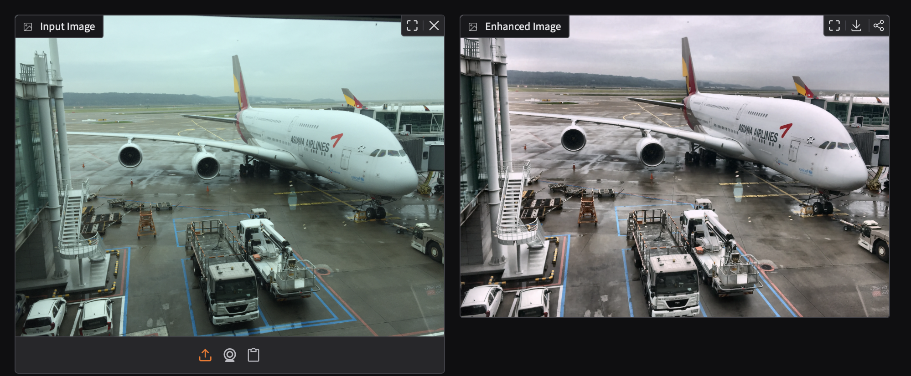 | 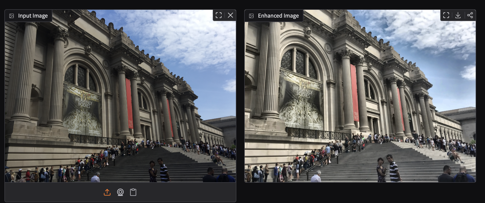 | 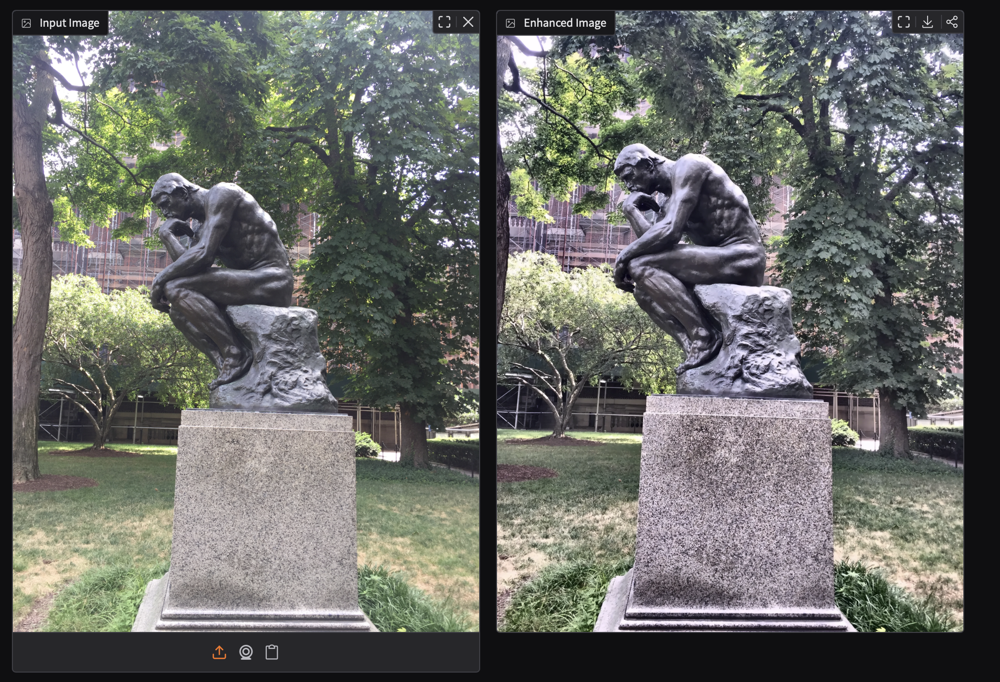 |

### 5.4 Module-wise Visualization Examples

각 세부 탭에서 제공되는 시각화 예시는 다음과 같다.

| Function | Example |
|---|---|
| Auto Straighten / Tilt Correction | 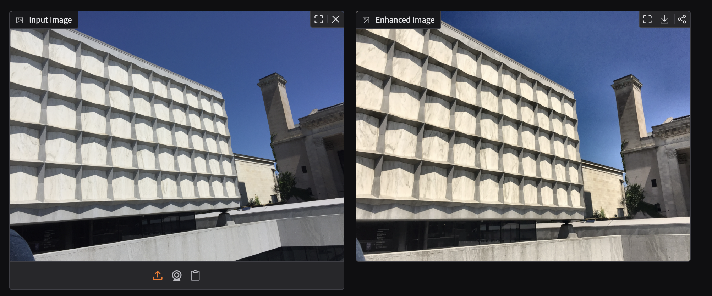 |
| Object Detection | 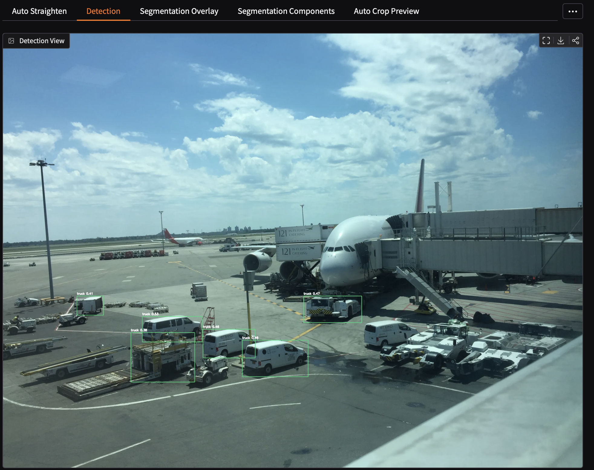 |
| Segmentation Overlay | 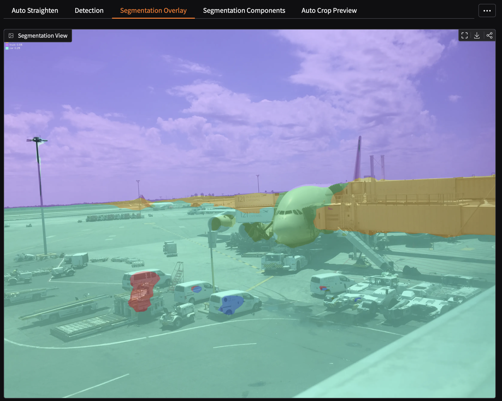 |
| Segmentation Components | 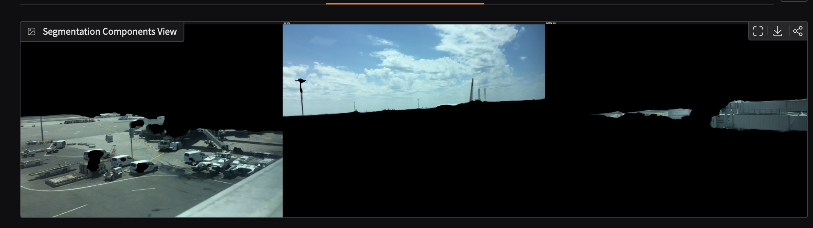 |
| Auto Crop Preview | 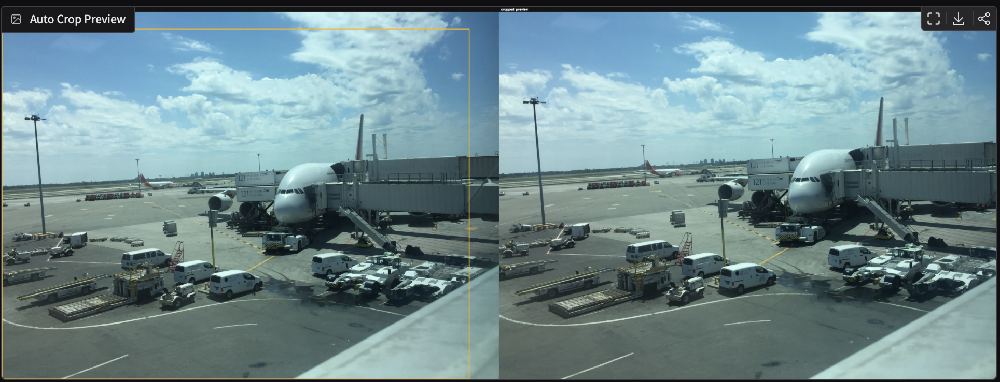 |
| Difference Heatmap | 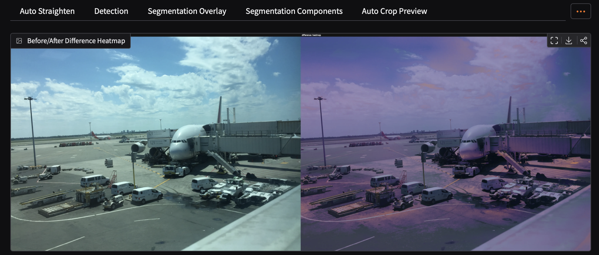 |
| ORB Matching | 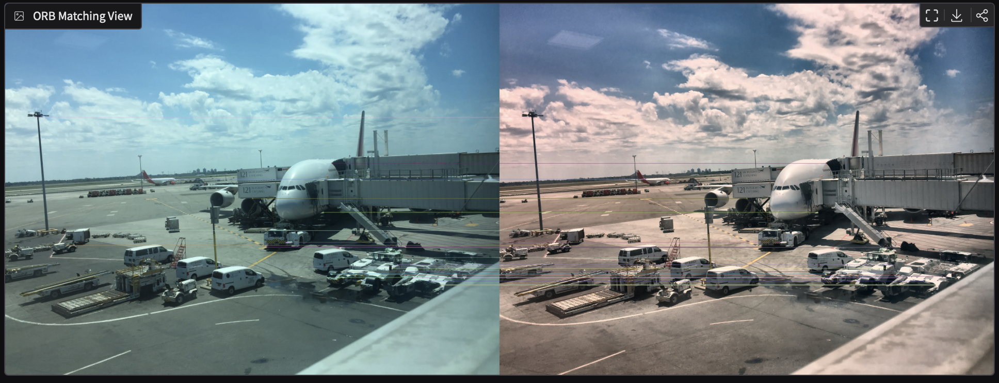 |
| Manual 4-Point Input | 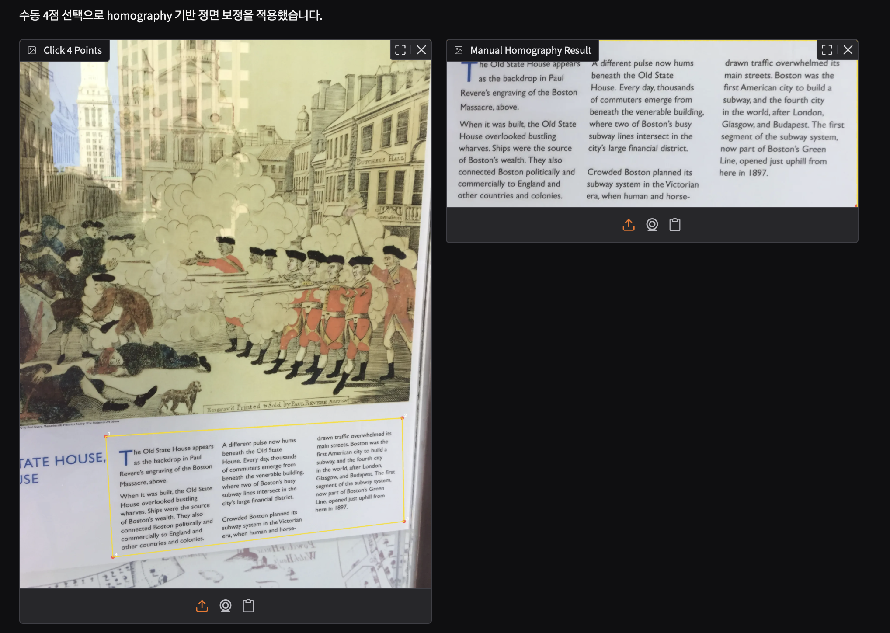 |
| Manual Rectification Result | 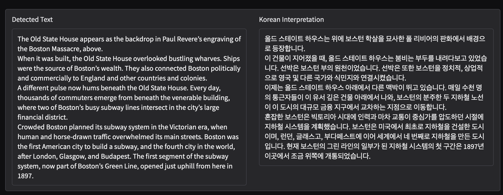 |

이 예시들은 VisionCraft가 단순히 최종 결과 이미지 하나만 반환하는 도구가 아니라, 각 단계에서 어떤 분석과 보정이 일어났는지를 사용자가 직접 추적할 수 있도록 설계되어 있음을 보여준다.

### 5.5 Analysis Report Examples

VisionCraft는 탭별 시각화뿐 아니라, 분석 결과를 하나의 해석 가능한 report 형태로도 정리한다. 다음 예시는 실제로 사용자에게 어떤 종류의 분석 정보가 제공되는지를 보여준다.

| Analysis 1 | Analysis 2 |
|---|---|
| 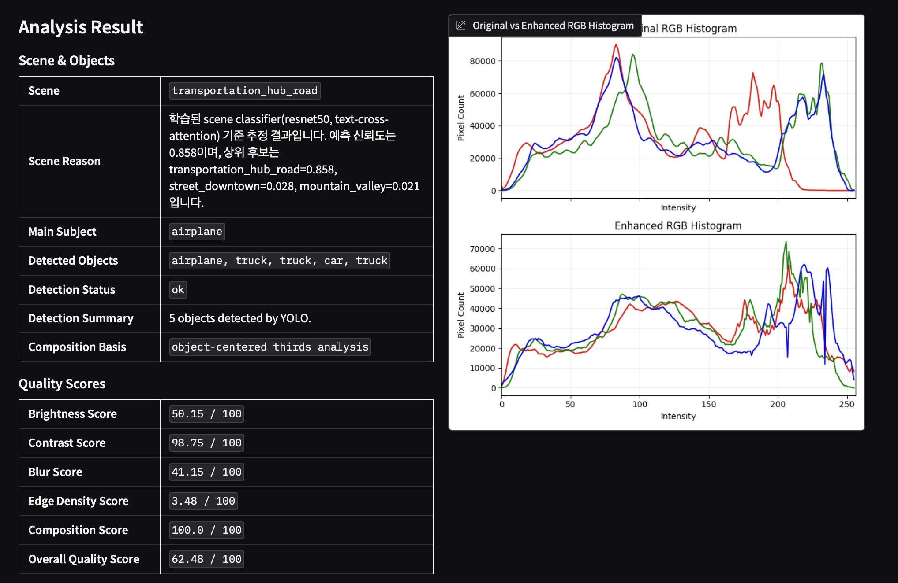 | 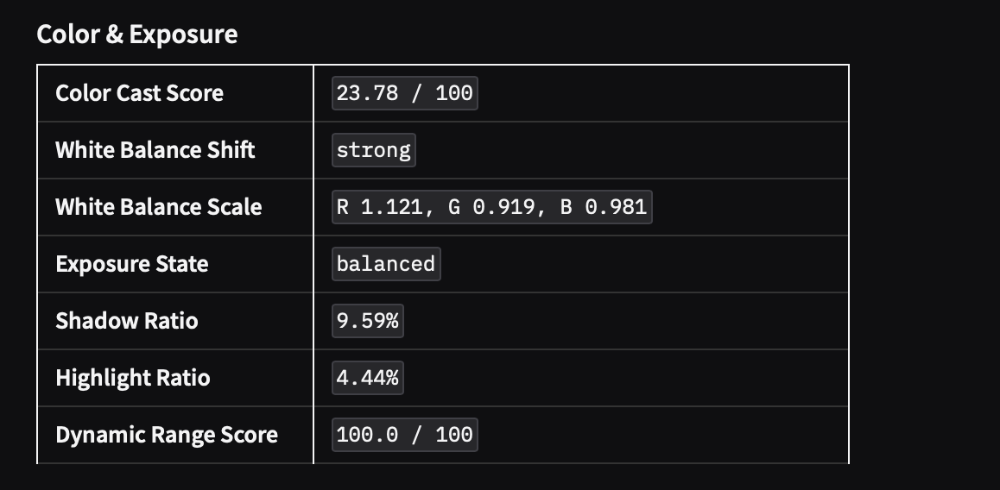 |

| Analysis 3 | Analysis 4 |
|---|---|
| 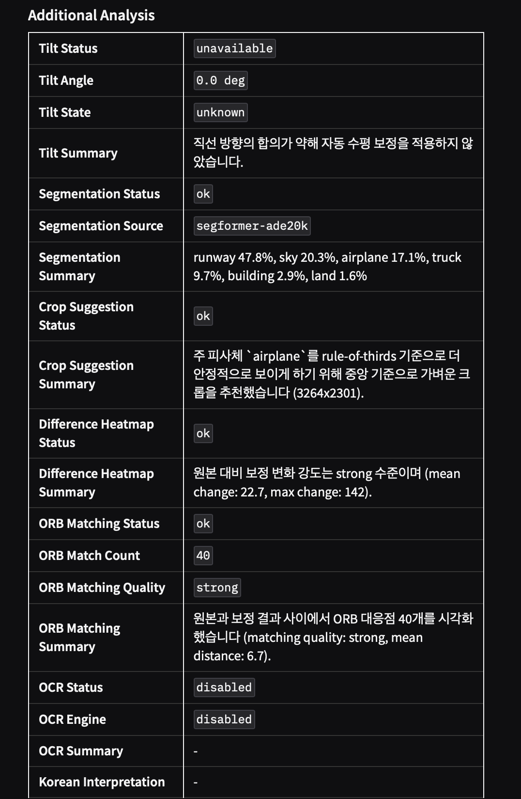 | 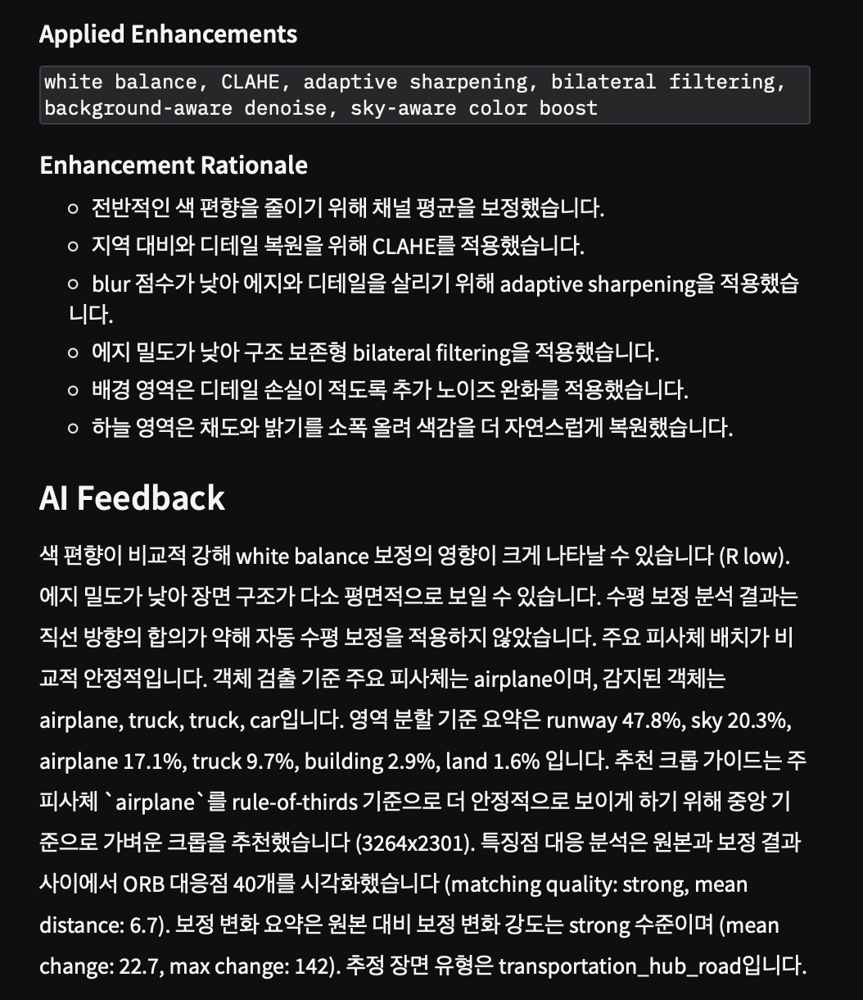 |

---

## 6. Research Pipeline

### 6.1 Motivation

Scene classification은 겉보기에는 비교적 직관적인 문제처럼 보이지만, 실제로는 높은 intra-class variation과 강한 inter-class similarity 때문에 안정적인 decision boundary를 형성하기 어렵다. 동일한 class label을 가진 이미지들이 항상 동일한 visual pattern을 공유하는 것은 아니며, 서로 다른 class들이 매우 유사한 object composition과 color distribution을 갖는 경우도 빈번하다.

대표적인 예가 `restaurant_cafe`와 `kitchen_dining`, `waterfront`와 `mountain_valley`, `public_large_indoor`와 `corridor_lobby` 같은 class pair이다. 이러한 장면들은 서로 다른 semantic identity를 갖지만, visual evidence만 놓고 보면 동일하거나 매우 가까운 latent cluster를 형성하기 쉽다.

특히 `waterfront`처럼 class 이름은 분명하지만 실제 이미지 안에서 물 영역이 작거나, 반대로 하늘과 산이 더 크게 보이는 경우 모델은 `mountain_valley` 또는 일반 outdoor landscape와의 경계를 안정적으로 유지하기 어렵다. 즉 scene classification의 핵심 난제는 class-level semantic identity와 image-level appearance 사이의 간극이라고 볼 수 있다.

본 연구는 이 문제를 완화하기 위해, visual feature만으로 class를 분리하는 대신 class-level text prior를 latent space에 주입하는 방식을 탐구한다. 핵심 가정은 다음과 같다.

- raw visual feature만으로는 ambiguous한 sample이라도 class semantic description을 함께 주입하면 latent representation이 보다 semantically organized된 방향으로 정렬될 수 있다.
- 그 결과 visually similar but semantically different scene pair의 경계가 더 안정화될 수 있다.

VisionCraft의 연구 파이프라인은 이 가설을 검증하기 위해 visual-only baseline, vanilla text cross-attention, text cross-attention + InfoNCE의 세 설정을 비교한다.

---

### 6.2 Dataset Design

연구에 사용된 데이터셋의 출발점은 MIT CSAIL이 공개한 Places365 scene recognition dataset이다. Places 계열 데이터셋은 object-centric classification이 아니라 `scene-centric recognition`을 목표로 설계된 대표적인 대규모 장면 인식 데이터셋으로, 사람, 자동차, 컵처럼 개별 객체를 맞히는 대신 `bedroom`, `street`, `restaurant`, `forest`와 같은 환경 자체를 분류하는 데 초점을 둔다.

공식 사이트에 따르면 Places 데이터베이스는 10 million 이상 이미지와 400+ scene category를 포함하는 대규모 장면 이해 데이터셋 계열이며, 그중 Places365는 365개의 핵심 scene category를 중심으로 구성된 widely used benchmark subset이다. 또한 공개된 download page 기준으로 Places365-Standard는 365개 class에 대해 약 1.8 million training image를 포함한다.

관련 공식 링크는 다음과 같다.

- Places 공식 사이트: [Places: A 10 million Image Database for Scene Recognition](https://places2.csail.mit.edu/)
- Places download page: [Places365 / Places2 Download](https://places2.csail.mit.edu/download.html)

Places365가 본 연구에 적합한 이유는 다음과 같다.

1. scene category 자체를 예측하는 benchmark이므로 VisionCraft의 scene classification 목표와 직접적으로 맞닿아 있다.
2. indoor/outdoor, natural/man-made, private/public과 같은 고수준 semantic distinction을 폭넓게 포함한다.
3. 서로 시각적으로 유사하지만 의미적으로는 다른 scene pair가 충분히 존재하여, semantic ambiguity와 representation learning 문제를 실험하기에 적합하다.

다만 Places365 원본 label space는 VisionCraft의 응용 목적에 비해 지나치게 세분되어 있다. 예를 들어 실제 enhancement 관점에서는 세부 장소명 하나하나를 모두 구분하는 것보다, 장면이 indoor인지 outdoor인지, 자연 풍경인지 실내 생활 공간인지, 공공 실내인지 개인 실내인지와 같은 상위 semantic grouping이 더 중요할 수 있다.

따라서 본 연구에서는 Places365 원본 카테고리를 VisionCraft의 응용 목적에 맞게 재구성한 14-class scene taxonomy를 사용하였다. 이 taxonomy는 단순 benchmark score를 위한 클래스 집합이 아니라, 실제 이미지 개선과 장면 이해 관점에서 의미가 있는 상위 semantic group을 만들기 위해 설계되었다.

최종 클래스 집합은 다음과 같은 indoor/outdoor, natural/man-made, private/public 성격을 함께 반영한다.

- bedroom
- office_study
- kitchen_dining
- restaurant_cafe
- corridor_lobby
- public_large_indoor
- residential_outdoor
- street_downtown
- transportation_hub_road
- waterfront
- mountain_valley
- forest_nature
- open_field_landscape
- urban_or_misc outdoor 계열 장면

원본 Places365 label은 [visioncraft_scene_mapping.py](/Users/minchankang/Desktop/학업과제및자료/26학년도%201학기/컴퓨터%20비전/Final_Project/src/models/visioncraft_scene_mapping.py) 의 매핑 규칙을 통해 상위 VisionCraft class로 재구성된다. 이 설계의 핵심 목적은 두 가지이다.

1. 애플리케이션 관점에서 실제 scene-aware enhancement에 의미 있는 coarse semantic category를 구성하는 것
2. 연구 관점에서 visually similar class pair를 일부러 남겨 두어 representation learning의 한계를 드러내는 것

즉 본 데이터셋은 classification 자체보다도, semantic ambiguity가 높은 scene classification 환경을 의도적으로 구축하기 위한 experimental substrate에 가깝다.

---

### 6.3 Backbone Choice

#### 6.3.1 Why ResNet50

본 연구에서 기본 visual backbone으로 ResNet50을 선택한 이유는 단순히 널리 쓰이는 네트워크이기 때문이 아니라, scene classification task의 구조적 특성과 연구 목적을 동시에 고려했기 때문이다.

첫째, ResNet의 residual block은 깊은 네트워크 학습에서 optimization difficulty를 완화한다. 일반적인 residual block은 목표 함수 $\mathcal{H}(\mathbf{x})$를 직접 학습하는 대신

$$
\mathbf{y} = \mathcal{F}(\mathbf{x}, W) + \mathbf{x}
$$

의 형태로 residual correction $\mathcal{F}(\mathbf{x}, W)$만 학습한다. 따라서

$$
\mathcal{F}(\mathbf{x}, W) = \mathcal{H}(\mathbf{x}) - \mathbf{x}
$$

가 되며, 만약 어떤 block이 identity mapping에 가까운 동작을 해야 한다면 residual branch는 단순히 $\mathcal{F}(\mathbf{x}, W)\approx 0$을 만족하면 된다. 이는 깊은 네트워크가 처음부터 복잡한 변환 전체를 새로 학습해야 하는 부담을 줄여준다.

또한 loss $\mathcal{L}$에 대해 입력 $\mathbf{x}$로의 gradient를 쓰면

$$
\frac{\partial \mathcal{L}}{\partial \mathbf{x}}
=
\frac{\partial \mathcal{L}}{\partial \mathbf{y}}
\left(
\frac{\partial \mathcal{F}(\mathbf{x}, W)}{\partial \mathbf{x}} + I
\right)
$$

형태가 되므로, shortcut path의 identity term이 gradient flow를 안정화하고 degradation problem과 vanishing gradient를 완화하는 데 도움을 준다.

둘째, scene classification은 object recognition보다 더 넓은 contextual reasoning을 요구한다. 물체 하나의 존재 여부만이 아니라, 공간 구조, 배경 분포, texture arrangement, horizon-like cues, semantic co-occurrence를 함께 반영해야 한다. ResNet50은 ResNet18보다 더 깊고 풍부한 feature hierarchy를 제공하므로, such scene-level compositional pattern을 더 안정적으로 encoding할 수 있다.

셋째, 본 연구의 목표는 단일 최고 성능 모델을 한 번 얻는 것이 아니라, visual-only baseline, text-guided fusion, InfoNCE extension을 비교하며 latent representation 변화를 해석하는 데 있다. ResNet50은 표현력과 실험 반복 가능성 사이에서 적절한 균형을 제공하므로, 연구용 backbone으로 현실적인 선택이었다.

---

### 6.4 Training Strategy

학습은 supervised scene classification을 기본 축으로 하되, fusion mode에 따라 auxiliary signal이 달라지도록 설계하였다. 기본적인 objective는 class label에 대한 cross-entropy loss이며, text-guided model의 경우에는 visual-text fusion 이후의 fused latent를 classifier에 입력한다.

Visual-only baseline의 경우 입력 이미지 $x$는 backbone $f_\theta$를 거쳐 visual representation $\mathbf{h}$로 변환되고, classifier $g_\phi$를 통해 logits를 생성한다.

$$
\mathbf{h} = f_\theta(x), \qquad \mathbf{z} = g_\phi(\mathbf{h})
$$

최종 supervised classification loss는

$$
\mathcal{L}_{cls} = -\log p(y\mid x)
$$

이다.

Text-guided model에서는 backbone이 생성한 spatial feature map을 flatten하여 visual token sequence를 만들고, class-level text embedding을 text token sequence로 사용한다. 이후 cross-attention을 통해 fused visual token을 구성하고, mean pooling과 layer normalization 뒤 classifier에 넣는다.

학습 안정화를 위해 본 프로젝트는 다음과 같은 pragmatic strategy를 사용한다.

- 초반 2 epoch 동안 backbone freeze
- backbone unfreeze 이후 end-to-end fine-tuning
- `ReduceLROnPlateau` scheduler 사용
- validation accuracy 기준 best checkpoint 저장
- optional early stopping support

특히 backbone freeze는 multimodal fusion layer가 초기부터 backbone representation 전체를 과도하게 흔드는 것을 막기 위한 목적이 크다. 실제로 InfoNCE 실험에서도 초반 freeze가 없는 설정보다 freeze 2 epoch 설정이 훨씬 안정적인 validation behavior를 보였다.

---

### 6.5 Hyperparameters

현재 text-guided cross-attention 계열 실험에서 사용한 핵심 hyperparameter는 다음과 같다.

- backbone: `ResNet50`
- image size: `224`
- batch size: `16`
- optimizer: `AdamW`
- learning rate: `1e-4`
- weight decay: `1e-5`
- label smoothing: `0.1`
- freeze backbone epochs: `2`
- cross-attention dropout: `0.1`

InfoNCE extension에서는 여기에 다음 두 파라미터가 추가된다.

- text contrastive weight $\lambda_{con} = 0.05$
- text contrastive temperature $\tau = 0.10$

이 값들은 완전히 이론적으로 도출된 상수라기보다, representation alignment와 classification accuracy 사이의 trade-off를 고려해 선택한 empirical setting이다. 기존의 더 강한 설정보다 contrastive weight를 낮추고 temperature를 완만하게 높임으로써, prototype alignment 압력이 과도하게 커지는 문제를 줄이고자 했다.

최종 A 설정은 이러한 조정이 실제로 유효했음을 보여준다. 동일한 학습 recipe 위에서 contrastive weight를 `0.05`로 낮추고 temperature를 `0.10`으로 조정한 결과, Text Cross-Attention + InfoNCE 모델은 최종 validation accuracy `60.75%`를 기록하며 vanilla text cross-attention의 `60.56%`를 다시 넘어섰다.

---

### 6.6 Data Augmentation

VisionCraft의 연구 파이프라인은 강한 synthetic augmentation보다, 장면 identity를 지나치게 훼손하지 않는 범위의 standard augmentation을 사용하는 쪽에 가깝다. 이유는 scene classification에서는 geometric consistency와 global context가 중요하기 때문이다.

또한 학습 코드에는 optional mixup support가 존재한다. mixup coefficient $\lambda$를 Beta distribution에서 샘플링하면, 두 이미지 $(x_i, y_i), (x_j, y_j)$에 대해

$$
\tilde{x} = \lambda x_i + (1-\lambda)x_j
$$

$$
\tilde{y} = \lambda y_i + (1-\lambda)y_j
$$

로 mixed sample을 만들 수 있다. 다만 현재 text-cross-attention 실험의 핵심 비교에서는 mixup을 중심 설정으로 사용하지 않았고, semantic prior의 효과를 더 명확히 보기 위해 relatively conservative한 augmentation policy를 유지하였다.

---

### 6.7 Visual-Only Baseline

Visual-only baseline은 본 연구의 출발점이다. 이 모델은 이미지 외의 어떤 semantic prior도 사용하지 않으며, 오직 visual evidence만으로 14-class scene taxonomy를 분류한다.

형식적으로는

$$
\mathbf{h}_{vis} = f_\theta(x), \qquad
\mathbf{z} = g_\phi(\mathbf{h}_{vis})
$$

의 구조를 가진다. 본 실험에서 이 baseline은 validation accuracy `59.79%`를 기록하였다.

이 baseline은 두 가지 이유로 중요하다.

1. text prior가 전혀 없는 순수 visual representation의 기준점을 제공한다
2. 이후 text-guided model이 단순한 score gain만이 아니라 latent geometry를 어떻게 바꾸는지 비교할 수 있게 해준다

특히 confusion이 자주 발생하는 class pair는 대부분 semantic overlap이 큰 쌍이라는 점에서, baseline은 scene classification의 근본적인 ambiguity를 잘 드러내는 출발점으로 기능한다.

---

### 6.8 Text-Guided Cross-Attention

#### 6.8.1 Class Text Prompt

Text-guided model의 출발점은 각 scene class를 설명하는 class-level text prompt이다. 이 prompt들은 [scene_text_prompts.py](/Users/minchankang/Desktop/학업과제및자료/26학년도%201학기/컴퓨터%20비전/Final_Project/src/models/scene_text_prompts.py) 에 정의되어 있으며, 단순한 class name만이 아니라 해당 장면을 설명하는 짧은 자연어 문장으로 구성된다.

각 prompt는 CLIP text encoder를 통해 embedding vector $\mathbf{t}_k$로 변환된다.

$$
\mathbf{t}_k = \mathrm{CLIPTextEncoder}(p_k)
$$

여기서 $p_k$는 class $k$에 대한 prompt text이다. 이렇게 생성된 embedding들은 학습 전에 미리 precompute되어 `.npz` 파일로 저장되며, 학습 중에는 fixed class-level text token으로 사용된다.

이 설계는 학습 과정에서 text encoder까지 함께 업데이트하는 대신, stable semantic prior를 외부에서 주입하는 전략에 해당한다.

---

#### 6.8.2 Visual-Text Fusion

현재 구현의 text-guided fusion은 [text_cross_attention.py](/Users/minchankang/Desktop/학업과제및자료/26학년도%201학기/컴퓨터%20비전/Final_Project/src/models/text_cross_attention.py) 에 정의된 단방향 cross-attention 구조이다. ResNet50 backbone이 만든 feature map을 flatten하여 visual token sequence를 구성하면,

$$
\mathbf{V} \in \mathbb{R}^{N \times d_v}
$$

가 된다. 한편 class-level text embedding 집합은

$$
\mathbf{T} \in \mathbb{R}^{K \times d_t}
$$

의 token sequence로 볼 수 있다.

두 시퀀스는 각각 hidden dimension으로 projection된 뒤,

$$
Q = W_Q \mathbf{V}, \qquad
K = W_K \mathbf{T}, \qquad
V_t = W_V \mathbf{T}
$$

의 형태로 attention에 들어간다. 즉 query는 visual token에서 오고, key/value는 text token에서 온다. 따라서 이는 `visual-to-text` cross-attention이다.

attention output은

$$
\mathrm{Attn}(Q,K,V_t) = \mathrm{softmax}\left(\frac{QK^\top}{\sqrt{d}}\right)V_t
$$

로 계산되며, 최종 fused token은 residual connection과 feed-forward block을 거쳐

$$
\mathbf{V}_{fused} = \mathbf{V}_{proj} + \mathrm{Attn}(Q,K,V_t)
$$

의 형태로 얻어진다. 이후 token 평균을 취해 pooled fused latent를 만든다.

$$
\mathbf{h}_{fused} = \mathrm{LayerNorm}\left(\frac{1}{N}\sum_{i=1}^{N}\mathbf{V}_{fused}^{(i)}\right)
$$

이 fused latent가 classifier 입력으로 사용된다.

---

#### 6.8.3 InfoNCE Extension

InfoNCE extension의 목적은 text를 단순 anchor로만 쓰는 데서 그치지 않고, fused latent가 자신의 정답 class text prototype에 더 직접적으로 정렬되도록 학습 신호를 추가하는 것이다.

먼저 fused latent $\mathbf{h}_{fused}$와 projected text prototype $\tilde{\mathbf{t}}_k$를 모두 정규화한다.

$$
\hat{\mathbf{h}} = \frac{\mathbf{h}_{fused}}{\|\mathbf{h}_{fused}\|_2}, \qquad
\hat{\mathbf{t}}_k = \frac{\tilde{\mathbf{t}}_k}{\|\tilde{\mathbf{t}}_k\|_2}
$$

그 다음 cosine similarity matrix를

$$
s_k = \frac{\hat{\mathbf{h}}^\top \hat{\mathbf{t}}_k}{\tau}
$$

로 정의한다. 여기서 $\tau$는 temperature이다. 정답 label이 $y$일 때 contrastive objective는

$$
\mathcal{L}_{con}
=
-\log
\frac{\exp(s_y)}
{\sum_{k}\exp(s_k)}
$$

이며, 최종 학습 objective는

$$
\mathcal{L}
=
\mathcal{L}_{cls}
+
\lambda_{con}\mathcal{L}_{con}
$$

으로 구성된다.

중요한 점은 InfoNCE가 cross-attention block 내부 구조를 바꾸는 것이 아니라, fused latent와 text prototype 사이에 auxiliary supervision을 추가한다는 것이다. 따라서 vanilla text cross-attention이 `semantic anchor injection`에 가깝다면, InfoNCE extension은 `prototype-aware alignment pressure`를 더하는 variant라고 볼 수 있다.

최종 A 설정은 validation accuracy `60.75%`를 기록하였다. 이는 기존 visual-only baseline `59.79%`, vanilla text cross-attention `60.56%`를 모두 넘어선 수치이며, InfoNCE가 단순한 semantic smoothing을 넘어 prototype-aware alignment를 실제 분류 성능 향상으로 연결할 수 있음을 보여준다.

---

#### 6.8.4 Why Text Helps

Text prior가 도움이 되는 이유는 text가 visual feature를 대체하기 때문이 아니라, visual representation이 semantic direction을 갖도록 약한 구조적 bias를 제공하기 때문이다.

Visual-only baseline은 image appearance에 크게 의존하므로, object composition이 유사한 class pair를 쉽게 혼동한다. 반면 class-level text token이 함께 들어오면, 모델은 "이 장면이 어떤 semantic category에 속할 수 있는가"에 대한 추가 단서를 얻게 된다.

이러한 효과는 특히 다음과 같은 상황에서 기대할 수 있다.

- class 내부 변이가 큰 경우
- image appearance가 atypical한 경우
- background context가 object cue보다 중요한 경우
- coarse semantic grouping이 분류 안정성에 도움이 되는 경우

즉 text는 fine-grained pixel evidence를 직접 제공하지는 않지만, latent representation이 scene-level meaning과 더 일관되게 정렬되도록 도와주는 semantic prior 역할을 한다.

---

#### 6.8.5 Semantic Smoothing

Text-guided cross-attention의 한 가지 중요한 효과는 semantic smoothing이다. 이는 모든 class boundary를 무조건 sharpen하는 것이 아니라, 의미적으로 가까운 class들이 같은 semantic neighborhood 안에서 더 부드럽게 재배치되는 현상을 뜻한다.

예를 들어 `restaurant_cafe`와 `kitchen_dining`, `waterfront`와 `mountain_valley`, `public_large_indoor`와 `corridor_lobby`는 상위 semantic group을 공유한다. text prior가 주입되면 이러한 class들의 latent centroid는 완전히 멀어지기보다, 공통 semantic manifold 안에서 더 구조화된 배열을 형성할 수 있다.

이 현상은 장점과 trade-off를 동시에 가진다.

- 장점: visually noisy하거나 atypical한 sample의 semantic identity를 더 안정적으로 유지할 수 있다
- trade-off: fine-grained separator가 필요한 class pair에서는 일부 confusion이 남거나 증가할 수 있다

따라서 text-guided model은 단순한 margin maximizer라기보다, latent geometry를 coarse semantic structure에 맞춰 재정렬하는 semantic smoother로 해석하는 편이 더 정확하다.

---

#### 6.8.6 Contrastive Alignment

InfoNCE extension은 위 semantic smoothing 효과 위에, `정답 class text prototype 쪽으로 실제로 더 붙도록` 하는 명시적 alignment objective를 더한다. 이 점이 vanilla text cross-attention과의 가장 큰 차이점이다.

Vanilla text model에서는 text token이 attention 과정에서 semantic anchor로 작동하지만, 최종 fused latent가 자신의 class text prototype과 항상 직접적으로 가까워질 필요는 없다. 반면 InfoNCE가 추가되면 fused latent는 rival prototype보다 correct-class prototype에 더 높은 cosine similarity를 갖도록 지속적으로 압박받는다.

이 메커니즘은 다음과 같은 효과를 기대하게 한다.

- prototype retrieval accuracy 향상
- same-class compactness 증가
- text-aware decision boundary의 안정화

반면 alignment pressure가 너무 크면 semantic neighbor class 사이의 separation을 오히려 과도하게 부드럽게 만들 수 있다. 따라서 contrastive weight와 temperature는 accuracy와 representation quality 사이의 균형을 좌우하는 핵심 hyperparameter가 된다.

---

## 7. Experimental Results

### 7.1 Classification Accuracy

최종 validation accuracy 결과는 다음과 같다.

| Model | Validation Accuracy |
| --- | ---: |
| Visual-only baseline | 59.79% |
| Text-Guided Cross-Attention | 60.56% |
| Text Cross-Attention + InfoNCE | 60.75% |

세 모델 모두 경쟁적인 성능을 보였지만, 중요한 점은 text를 주입한 두 모델이 모두 visual-only baseline을 넘어섰다는 사실이다. 특히 이번 최종 실험에서는 `Text Cross-Attention + InfoNCE`가 `60.75%`를 기록하며, vanilla text cross-attention의 `60.56%`를 다시 넘어섰다.

이 결과는 두 가지를 시사한다.

1. class-level text prior 자체가 visual-only baseline보다 유의미한 도움을 준다.
2. 적절한 hyperparameter가 적용된 InfoNCE objective는 accuracy와 latent alignment를 동시에 개선할 수 있다.

### 7.2 Confusion Matrix Analysis

Visual-only baseline confusion matrix:

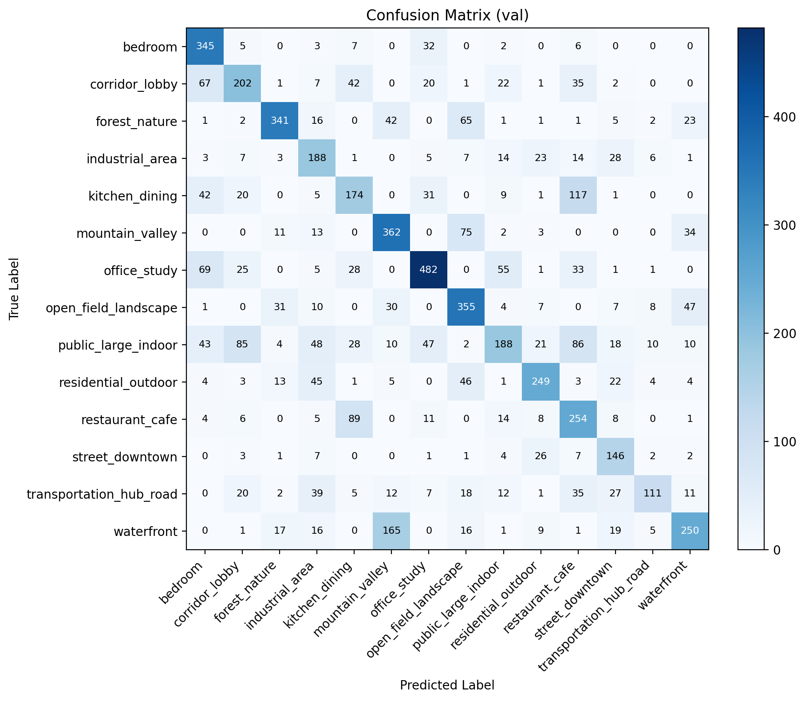

Text-guided cross-attention confusion matrix:

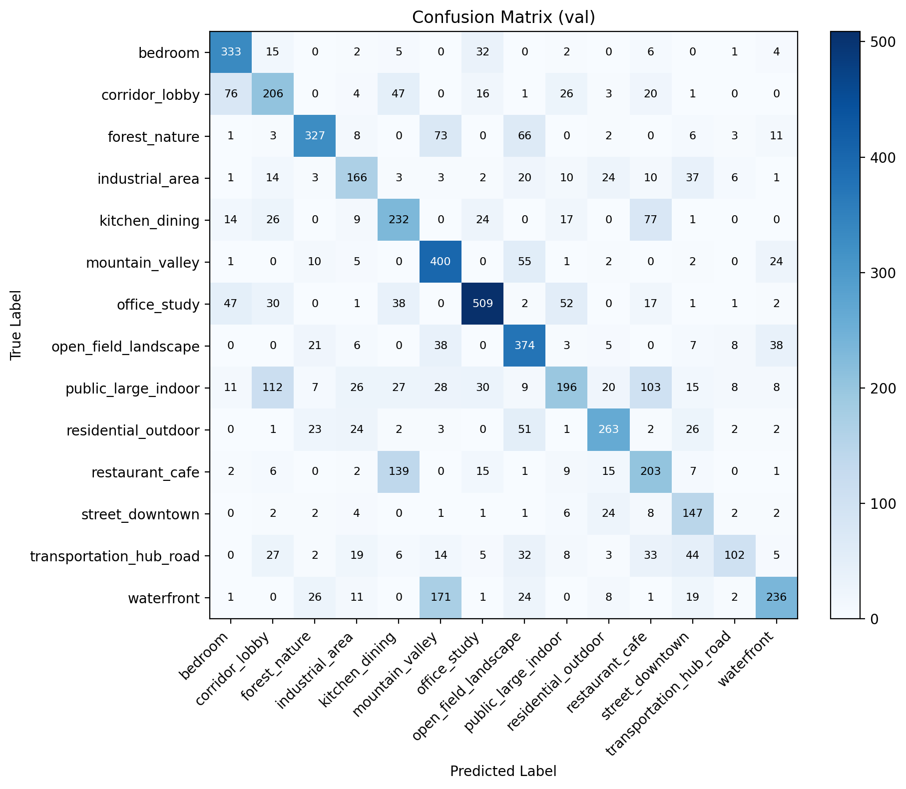

Text-guided cross-attention + InfoNCE confusion matrix:

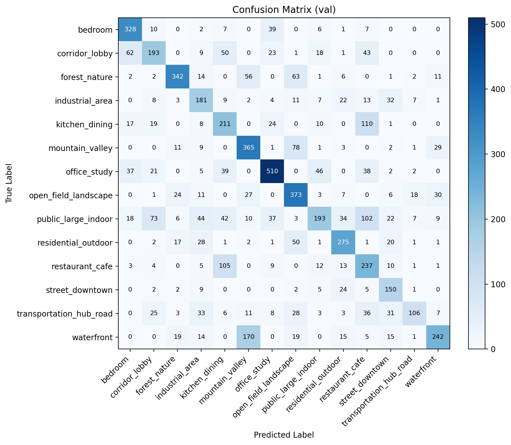

세 confusion matrix를 함께 보면, 성능 개선은 모든 클래스에서 똑같은 방식으로 나타나지 않는다. 중요한 변화는 단순히 diagonal entry가 전체적으로 커지는 것이 아니라, 서로 의미적으로 가까운 장면들 사이의 혼동 패턴이 어떻게 다시 정렬되는가에 있다. 여기서 semantic neighborhood는 단순히 색이나 질감이 비슷한 경우가 아니라, 보다 거시적인 장면 맥락을 공유하는 class pair를 가리킨다.

대표적인 예는 다음과 같다.

- `kitchen_dining` ↔ `restaurant_cafe`
- `waterfront` ↔ `mountain_valley`
- `public_large_indoor` ↔ `corridor_lobby`

Visual-only baseline에서 vanilla text cross-attention으로 가면, 일부 방향의 confusion은 오히려 증가한다.

- `restaurant_cafe -> kitchen_dining`: `89 -> 139`
- `public_large_indoor -> corridor_lobby`: `85 -> 112`
- `waterfront -> mountain_valley`: `165 -> 171`

하지만 반대 방향과 정분류 수를 함께 보면, 이 변화는 단순한 성능 저하라기보다 decision boundary의 재조정에 가깝다.

- `kitchen_dining -> restaurant_cafe`: `117 -> 77`로 감소
- `kitchen_dining` 정분류 수: `174 -> 232`로 증가
- `mountain_valley` 정분류 수: `362 -> 400`으로 증가
- `office_study` 정분류 수: `482 -> 509`로 증가

즉 vanilla text model은 모든 semantic neighbor를 강제로 떼어 놓기보다, 같은 상위 의미 공간 안에서 더 부드럽게 재배치하는 경향을 보인다.

InfoNCE를 추가하면 양상이 다시 달라진다. 최종 accuracy가 `60.75%`까지 올라갔고, confusion report에서도 일부 클래스의 정분류 수가 더 강하게 유지된다. 예를 들어:

- `bedroom` recall: `0.8200`
- `mountain_valley` recall: `0.7300`
- `office_study` recall: `0.7286`
- `open_field_landscape` recall: `0.7460`
- `street_downtown` recall: `0.7500`

반면 여전히 어려운 클래스도 남아 있다.

- `public_large_indoor` recall: `0.3217`
- `transportation_hub_road` recall: `0.3533`
- `corridor_lobby` recall: `0.4825`
- `waterfront` recall: `0.4840`

따라서 confusion matrix 관점에서 보면, vanilla text cross-attention은 semantic smoothing 쪽에 가깝고, InfoNCE는 그 위에서 class-aware separation을 일부 회복하면서 최종 accuracy까지 끌어올린 variant로 해석할 수 있다.

### 7.3 UMAP Visualization

Triplet UMAP comparison:

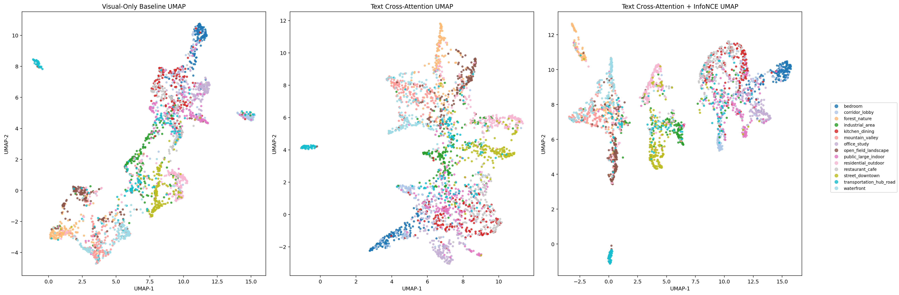

UMAP은 전체 latent space의 global arrangement를 가장 직관적으로 보여주는 시각화이다. Visual-only baseline에서는 일부 클래스가 국소적으로 모여 있지만, 전체적으로는 중앙 영역에 여러 클래스가 넓게 섞여 있으며 class boundary가 불규칙하게 얽혀 있다. 특히 `kitchen_dining`, `restaurant_cafe`, `public_large_indoor`, `residential_outdoor`, `transportation_hub_road` 같은 클래스들이 넓은 중심부에서 뒤섞이는 경향이 보인다.

Vanilla text cross-attention으로 가면 latent는 단순한 점 구름(cloud)보다 더 길게 이어진 semantic manifold 형태로 재배치된다. 같은 클래스 샘플들이 baseline보다 더 coherent한 작은 덩어리나 branch로 정돈되는 경향이 보이지만, 동시에 semantically 가까운 클래스들은 서로 더 가까운 공통 공간 안으로 끌려 들어간다. 이것이 바로 앞 절 confusion matrix에서 관찰된 `semantic smoothing`의 기하학적 표현이라고 볼 수 있다.

InfoNCE를 추가하면 이 구조가 다시 한 단계 바뀐다. semantic manifold 자체는 유지되지만, 클래스 경계가 더 또렷해지고 중심부의 과도한 혼합이 줄어든다. 즉 InfoNCE는 vanilla text model이 만든 semantic prior를 유지하면서, 그 위에 class-aware separation을 다시 강화하는 역할을 한다.

### 7.4 t-SNE Visualization

Triplet t-SNE comparison:

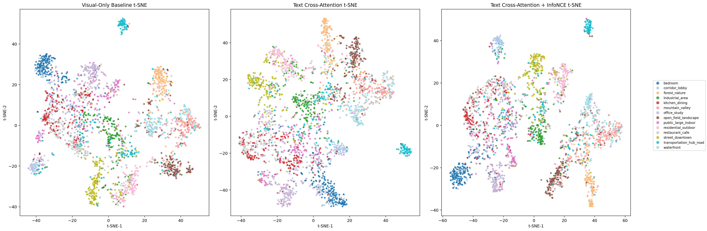

t-SNE는 UMAP보다 더 local structure와 neighborhood 관계를 강조하는 시각화다. Baseline에서는 클래스별로 국소 군집이 존재하더라도 전체적으로 많은 샘플이 중앙 대역과 인접 영역에 섞여 있으며, 특히 ambiguity가 큰 클래스들이 하나의 넓은 띠 안에서 얽혀 있다.

Vanilla text cross-attention에서는 이 구조가 더 길고 일관된 방향성을 가진 띠 형태 또는 곡선형 군집으로 바뀐다. 이는 latent가 단순히 압축되는 것이 아니라 class-specific semantic axis 위에 배치되고 있음을 뜻한다. 다만 이 단계에서는 semantic neighbor끼리의 간격이 줄어드는 구간도 함께 생긴다.

InfoNCE를 추가하면 semantic grouping은 유지되면서도 class별 band가 baseline과 vanilla text보다 더 분명하게 나뉘는 경향이 나타난다. 따라서 t-SNE 관점에서도 `baseline -> semantic smoothing -> class-aware re-separation`이라는 3단계 변화가 비교적 선명하게 관찰된다.

### 7.5 Quantitative Latent Metrics

이 절의 수치들은 "같은 클래스 샘플은 서로 가깝고, 다른 클래스 샘플은 서로 멀어야 좋은 표현"이라는 아주 직관적인 기준을 숫자로 바꾼 것이다. 여기서 cosine similarity는 두 feature vector의 방향이 얼마나 비슷한지를 나타내며, 값이 클수록 두 샘플이 latent space에서 더 비슷하게 배치되어 있음을 뜻한다.

`same-vs-different cosine margin`은 같은 클래스끼리의 평균 유사도에서 다른 클래스끼리의 평균 유사도를 뺀 값이다. 따라서 이 값이 클수록 "같은 클래스는 더 모이고, 다른 클래스는 더 분리되는" 구조가 강하다고 해석할 수 있다. `silhouette score`는 각 샘플이 자기 군집 안에는 잘 속하고 다른 군집과는 잘 떨어져 있는지를 보는 지표로, 값이 높을수록 전체 군집 구조가 더 뚜렷하다는 뜻이다.

Full `2520`-sample latent comparison 결과는 다음과 같다.

| Metric | Baseline | Text Cross-Attention | Text Cross-Attention + InfoNCE |
|---|---:|---:|---:|
| same-vs-different cosine margin | 0.1833 | 0.1886 | 0.3663 |
| silhouette score | 0.07863 | 0.07892 | 0.11291 |

이 수치들은 UMAP과 t-SNE에서 관찰한 시각적 인상을 정량적으로 뒷받침한다. Vanilla text model은 latent geometry를 조금 더 semantic하게 정돈하지만, 그 개선 폭은 비교적 완만하다.

반면 InfoNCE는 두 지표를 모두 크게 끌어올린다. `same-vs-different cosine margin`이 거의 두 배 수준으로 증가했고, `silhouette score` 역시 눈에 띄게 상승했다. 이는 이번 최종 InfoNCE가 단순히 accuracy만 좋아진 것이 아니라, latent space 전체를 더 class-aware하고 더 구조화된 geometry로 재편했다는 강한 근거가 된다.

### 7.6 Intra-Class and Inter-Class Similarity

이 절의 두 그림은 "클래스 내부 응집도"와 "클래스 사이 분리도"를 서로 다른 관점에서 보여준다. 먼저 boxplot은 많은 샘플쌍의 분포를 요약한 그림이다. 가운데 선은 대표값(중앙값), 상자의 높이는 값들이 주로 몰려 있는 범위, 바깥으로 뻗는 선은 더 넓은 분포 범위를 뜻한다. 즉 boxplot은 "대체로 어디에 값이 모여 있는가"를 빠르게 읽게 해준다.

여기서 `same-class cosine`은 같은 클래스 샘플끼리의 유사도이고, `different-class cosine`은 서로 다른 클래스 샘플끼리의 유사도이다. 좋은 표현이라면 보통 same-class cosine은 높고, different-class cosine은 낮게 나오는 것이 바람직하다. Heatmap은 클래스 전체를 대표하는 centroid끼리의 거리를 색으로 보여주는 그림이다. 밝을수록 두 클래스 중심이 더 멀고, 어두울수록 더 가깝다. 따라서 heatmap은 샘플 하나하나가 아니라 "클래스 전체 구조"가 어떻게 배치되는지를 보여준다.

Triplet intra/inter-class cosine similarity boxplot:

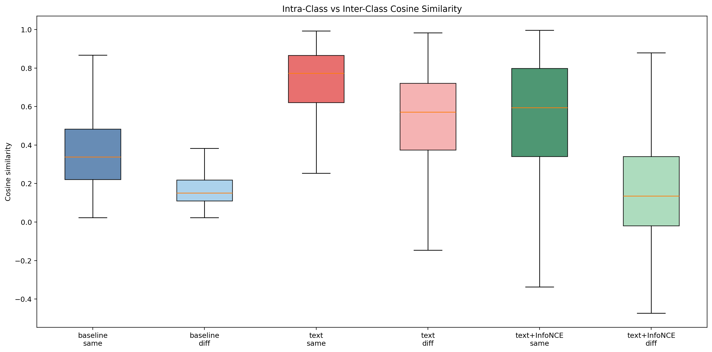

Triplet centroid cosine distance heatmap:

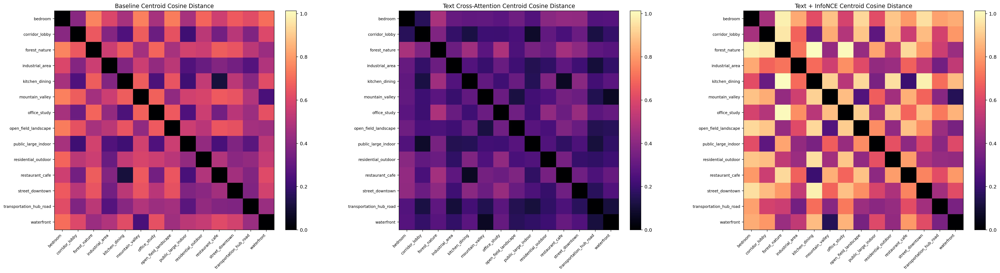

Boxplot을 보면 baseline에서는 same-class cosine과 different-class cosine이 비교적 낮은 영역에 분포한다. Vanilla text cross-attention에서는 same-class cosine이 크게 상승하지만, different-class cosine 역시 함께 상승한다. 이는 text 주입이 같은 class sample만 더 가깝게 만든 것이 아니라, latent space 전체를 더 높은 cosine similarity 영역으로 이동시키는 효과를 만든다는 뜻이다. 즉 class 내부 응집과 함께 전역적인 semantic smoothing도 동시에 일어난다.

하지만 InfoNCE를 추가하면 양상이 다시 달라진다. same-class cosine은 높은 수준을 유지하면서도, different-class cosine이 vanilla text에 비해 더 분리된 형태를 보인다. 즉 InfoNCE는 단순 smoothing 상태에서 끝나는 것이 아니라, 그 위에 class-aware separation을 다시 복원하는 방향으로 작동한다.

Heatmap은 이 해석을 더 구체적으로 뒷받침한다. Baseline centroid cosine distance는 비교적 넓게 퍼져 있지만, vanilla text cross-attention heatmap은 전체적으로 더 어두워진다. 이는 centroid들이 공통 semantic manifold 안으로 더 가까이 모인다는 뜻이며, 앞서 본 semantic smoothing 해석과 일치한다.

반면 InfoNCE heatmap은 다시 훨씬 밝아진다. 이는 centroid distance가 다시 커졌다는 뜻이고, 단순한 smoothing이 아니라 `semantic prior 위에서 class separation을 더 강하게 회복했다`는 점을 보여준다. 따라서 이 시각화는 세 모델의 차이를 매우 선명하게 정리해 준다.

- Baseline: visual cue 기반 분리
- Vanilla text: semantic smoothing
- InfoNCE: smoothing 위의 class-aware re-separation

### 7.7 Text Prototype Alignment

이 절을 이해하려면 먼저 `text prototype` 개념이 필요하다. 여기서 text prototype은 각 장면 클래스에 대해 준비한 텍스트 설명을 CLIP text encoder로 임베딩한 "클래스의 언어적 기준점"이다. 예를 들어 `waterfront`나 `restaurant_cafe`에는 각각 그 장면을 설명하는 텍스트 벡터가 하나씩 대응된다. 모델이 어떤 이미지를 볼 때, 그 이미지의 latent representation이 자기 정답 클래스의 text prototype에 더 가까워지면 "언어적으로도 그 장면 의미와 잘 맞는다"고 해석할 수 있다.

그림 속 `correct-class cosine`은 샘플이 자기 정답 클래스 prototype과 얼마나 비슷한지를 뜻하고, `correct-vs-rival margin`은 정답 prototype과의 유사도가 가장 가까운 경쟁 클래스 prototype보다 얼마나 더 큰지를 뜻한다. margin이 양수이면 정답 prototype 쪽이 더 가깝다는 뜻이고, 음수이면 오히려 경쟁 클래스 prototype 쪽이 더 가깝다는 뜻이다. 따라서 이 그림은 "모델이 텍스트를 단순 참고 정보로 쓰는가, 아니면 실제로 정답 의미 방향으로 latent를 정렬하는가"를 직접 보여준다.

Triplet prototype alignment overview:

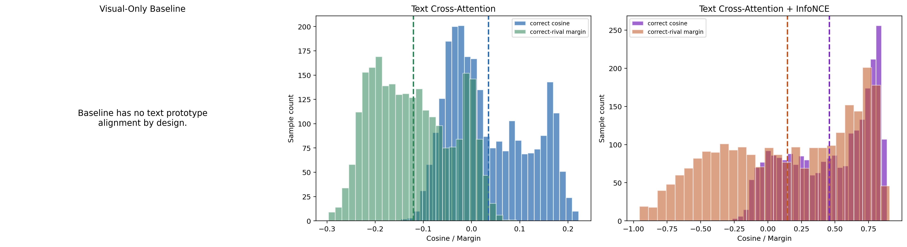


Vanilla text cross-attention을 보면, correct-class cosine 분포가 0 부근에 머물고 correct-vs-rival margin도 상당 부분 음수 쪽에 분포한다. 실제 full180 report 기준으로:

- `mean_correct_class_cosine`: `0.0351`
- `mean_correct_vs_rival_margin`: `-0.1204`
- `prototype_retrieval_accuracy`: `0.0972`

즉 vanilla text model은 text를 쓰기는 하지만, 많은 샘플이 여전히 정답 prototype보다 rival prototype에 더 가깝다. 그럼에도 accuracy가 baseline보다 좋아진다는 점은, 이 모델이 text를 `strict nearest-prototype decision rule`로 사용한다기보다 latent geometry를 semantic하게 재배치하는 anchor로 사용하고 있음을 뜻한다.

반면 InfoNCE를 추가하면 분포가 질적으로 달라진다.

- `mean_correct_class_cosine`: `0.4575`
- `mean_correct_vs_rival_margin`: `0.1465`
- `prototype_retrieval_accuracy`: `0.6016`

즉 InfoNCE는 단순히 text feature를 섞는 수준을 넘어, fused latent가 자신의 정답 class text prototype을 rival prototype보다 더 가깝게 보도록 loss 차원에서 직접 압박한다. 이 그림은 `InfoNCE가 정말로 의도한 일을 했다`는 가장 직접적인 근거 중 하나다.

### 7.8 Confusion Pair Analysis

Triplet confusion-pair UMAP comparison:

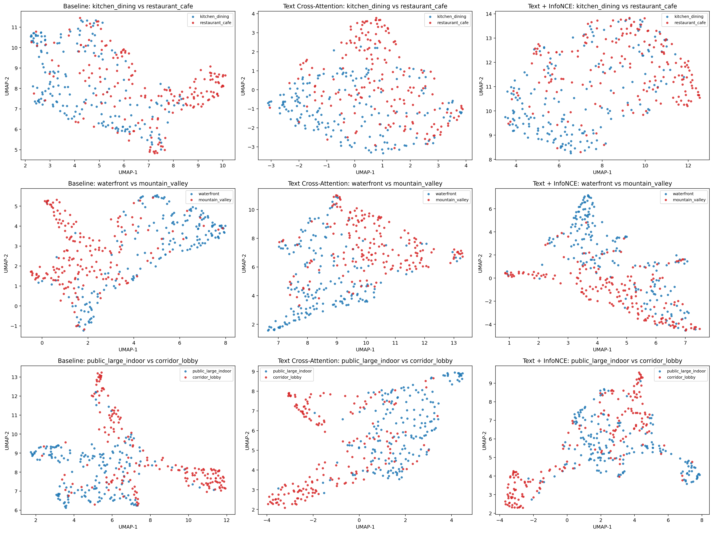

이 그림은 전체 latent space보다 더 직접적으로, 실제로 자주 혼동되는 class pair에서 세 모델이 class boundary를 어떻게 다르게 형성하는지를 보여준다.

`kitchen_dining` vs `restaurant_cafe`에서는 baseline이 넓은 혼합 영역을 보이고, vanilla text에서는 semantic neighbor 내부의 branch가 좀 더 정리된다. InfoNCE에서는 이 위에 추가적인 분리가 생기며, 두 클래스가 점유하는 영역의 경계가 더 분명해지는 경향이 나타난다.

`waterfront` vs `mountain_valley`에서도 세 단계가 비교적 명확하다. baseline에서는 자연 scene 계열 두 클래스가 중앙 연결부를 공유하며 섞이고, vanilla text에서는 같은 자연 manifold 안에서 semantic organization이 더 정돈된다. InfoNCE에서는 이 manifold를 유지하면서도 class별 sub-region 경계가 더 또렷해진다.

`public_large_indoor` vs `corridor_lobby`는 semantic overlap이 큰 실내 계열 쌍인데, baseline에서는 두 클래스가 길게 뒤섞이고, vanilla text에서는 branch 기반 재배치가 나타난다. InfoNCE에서는 여전히 어려운 쌍으로 남지만, class가 머무는 영역의 윤곽은 baseline과 vanilla text보다 더 분명하다.

종합하면 pairwise UMAP은 세 모델의 차이를 잘 보여준다.

- Baseline: 혼합 구조가 큼
- Vanilla text: semantic neighbor 내부 재배치
- InfoNCE: 재배치 위에 class boundary 강화

### 7.9 Attention Map Interpretation

Attention map은 모델이 이미지를 볼 때 어느 위치를 상대적으로 더 중요하게 참고하는지를 밝기나 색으로 나타낸 시각화다. 일반적으로 더 강하게 표시된 영역은 그 장면을 판단하는 데 더 많이 사용된 부분으로 해석한다. 다만 attention map은 "모델이 정확히 왜 그렇게 판단했는지"를 완벽하게 증명하는 도구는 아니며, 어디에 주의를 두는 경향이 있는지를 보여주는 정성적 보조 자료에 가깝다.

즉 이 절의 Visualization은 성능 수치를 직접 설명하는 지표라기보다, 앞선 confusion matrix나 latent visualization에서 나타난 차이가 실제 이미지 공간에서는 어떤 식의 주의 패턴으로 나타나는지를 보여준다. 따라서 attention map은 정량 결과를 대체하기보다는, 모델이 읽고 있는 공간적 단서를 직관적으로 이해하도록 돕는 역할로 보는 것이 적절하다.

Vanilla text cross-attention examples:

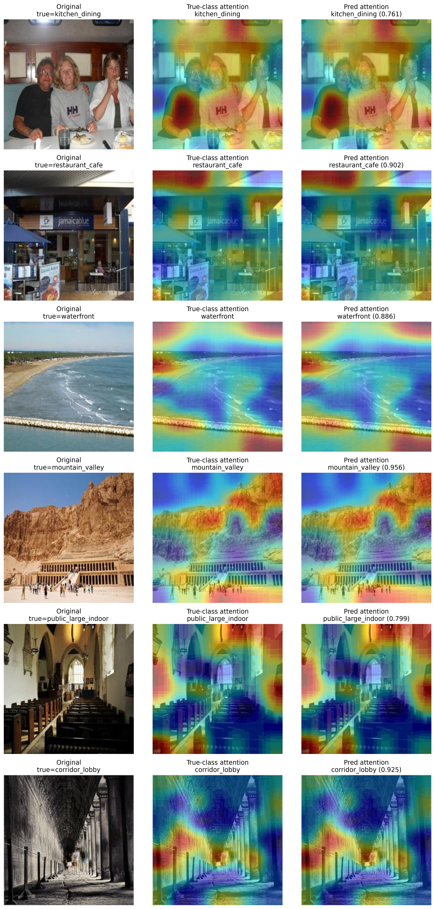

InfoNCE attention examples:

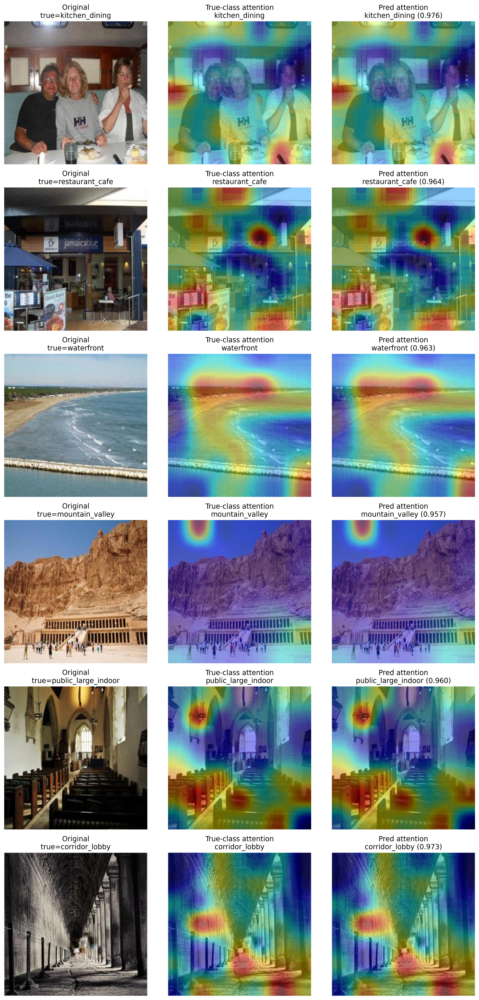

각 행의 첫 번째 열은 원본 이미지이고, 두 번째 열의 `True-class attention`은 정답 클래스 logit을 기준으로 역추적한 attention map이다. 이는 "이 이미지가 실제 정답 클래스라고 가정할 때 모델이 어느 영역을 근거로 보는가"를 보여준다. 세 번째 열의 `Pred attention`은 모델이 실제로 가장 높게 예측한 클래스 logit을 기준으로 계산한 attention map이다. 따라서 이 열은 "모델이 최종 예측을 내릴 때 실제로 어디를 보고 있었는가"에 더 가깝다.

이번 비교에서는 여섯 개의 동일한 입력 이미지에 대해 vanilla text cross-attention과 InfoNCE attention을 나란히 놓고 볼 수 있다. 흥미로운 점은 두 모델 모두 대부분의 샘플에서 `True-class attention`과 `Pred attention`이 거의 같은 위치를 가리킨다는 것이다. 이는 모델이 높은 confidence로 정답을 맞힐 때, 최종 예측 또한 실제 정답 클래스와 거의 같은 공간 단서를 기반으로 형성되고 있음을 뜻한다. 특히 InfoNCE 쪽 confidence는 `0.960 ~ 0.976` 수준으로, 같은 샘플에서 vanilla 모델의 `0.761 ~ 0.956`보다 전반적으로 더 높게 나타난다.

Vanilla text cross-attention에서는 attention이 비교적 넓은 semantic region 위에 퍼지는 경향이 보인다. `kitchen_dining`에서는 인물, 식탁, 상부 실내 구조가 함께 넓게 덮이며, `restaurant_cafe`에서는 간판과 천장선, 전면 유리 구조 전반이 활성화된다. `waterfront`에서는 수평선, 수면, 해안선이 하나의 큰 장면 단위로 읽히고, `mountain_valley`에서는 암석 절벽과 하단 건축 구조가 동시에 반응한다. `public_large_indoor`와 `corridor_lobby`에서도 각각 천장-아치-통로, 벽면-기둥-소실점이 모두 넓은 범위에서 활성화된다. 이는 vanilla text model이 개별 object 하나를 날카롭게 집기보다, 장면을 규정하는 넓은 context를 semantic anchor와 함께 읽고 있음을 보여준다.

반면 InfoNCE attention에서는 같은 장면 의미를 유지하면서도, 더 압축되고 class-aware한 반응 패턴이 나타난다. `restaurant_cafe`에서는 broad storefront 전체보다 중심 간판과 입면 구조 쪽 hotspot이 더 강해지고, `waterfront`에서는 바다 전체보다 해안선의 곡선과 수평 경계가 더 분명하게 강조된다. `corridor_lobby`에서는 단순히 복도 전체를 보는 것이 아니라, 좌측 기둥열과 중앙 소실 방향이 더 선명하게 부각된다. `public_large_indoor` 역시 실내 전체를 고르게 덮기보다 아치, 조명, 중앙 통로처럼 공간 규모와 구조를 드러내는 단서에 더 집중하는 모습이 보인다. 즉 InfoNCE는 semantic prior를 유지한 채, 장면을 구분하는 데 더 결정적인 구조적 단서를 선택적으로 강화하는 방향으로 작동한 것으로 해석할 수 있다.

물론 attention map은 본질적으로 정성적 도구이므로, 이것만으로 성능 향상의 원인을 단정할 수는 없다. 다만 이번 matched-sample 비교는 적어도 두 모델의 차이가 "같은 이미지를 볼 때 어디에 주의를 두는가" 수준에서도 드러난다는 점을 보여준다. 정리하면 vanilla text cross-attention이 넓은 semantic context를 읽는 쪽에 가깝다면, InfoNCE는 그 위에서 class discrimination에 더 직접적으로 기여하는 공간 단서를 더 응축된 형태로 강조하는 경향을 보인다.

결론적으로 Chapter 7의 시각화들을 종합하면, 세 모델의 역할은 다음과 같이 요약된다.

- `Visual-only baseline`: visual cue 중심의 분리
- `Text Cross-Attention`: semantic smoothing과 latent reorganization
- `Text Cross-Attention + InfoNCE`: semantic prior를 유지하면서 class-aware separation과 prototype alignment를 동시에 강화

---

## 8. Discussion

### 8.1 What Worked

이번 실험에서 가장 분명하게 확인된 점은, scene classification에서 text prior가 단순한 부가 정보가 아니라 latent space를 재구성하는 실제 구조적 신호로 작동한다는 것이다. Visual-only baseline은 `59.79%`의 validation accuracy를 기록했고, vanilla text cross-attention은 이를 `60.56%`까지 끌어올렸다. 이는 text 주입이 시각적 feature를 대체한다기보다, 시각적으로 유사하지만 의미적으로 다른 장면들 사이에서 더 안정적인 semantic anchor를 제공했음을 시사한다.

또한 vanilla text cross-attention과 InfoNCE variant의 차이를 비교하면, text guidance가 두 단계에 걸쳐 작동한다는 점이 보인다. 먼저 vanilla text cross-attention은 semantic smoothing과 latent reorganization에 더 가깝다. UMAP, t-SNE, pairwise UMAP에서 나타나듯이 이 모델은 서로 의미적으로 가까운 장면들을 보다 공통된 semantic manifold 안으로 재배치한다. 그 결과 일부 confusion pair에서는 혼동 방향이 바뀌지만, 그 변화는 단순한 성능 저하라기보다 decision boundary가 semantic neighborhood 내부에서 다시 정렬되는 과정으로 읽힌다.

반면 InfoNCE를 추가하면 이 semantic smoothing 위에 class-aware separation이 다시 강화된다. 최종 모델은 validation accuracy `60.75%`를 기록했을 뿐 아니라, `same-vs-different cosine margin`과 `silhouette score`를 모두 끌어올렸고, prototype alignment 지표에서도 큰 개선을 보였다. 특히 centroid heatmap과 prototype alignment histogram은 InfoNCE가 "텍스트를 참고하는 모델" 수준을 넘어, fused latent를 실제 class text prototype 방향으로 더 강하게 조직화하고 있음을 보여준다. 즉 이번 결과는 text guidance의 효과가 단순 accuracy gain이 아니라 representation geometry의 변화로도 관찰된다는 점에서 의미가 있다.

Application 관점에서도 이 연구는 별개의 실험에 머무르지 않는다. Scene classifier는 VisionCraft의 enhancement pipeline 안에서 장면 identity를 제공하고, quality summary와 heuristic-based reasoning이 장면 단위 맥락을 반영하도록 돕는다. 따라서 연구 파이프라인에서 얻은 multimodal representation learning의 통찰은 단순 benchmark 성능 경쟁이 아니라, 실제 scene-aware image understanding 시스템의 해석 가능성과 안정성을 높이는 방향으로 연결된다.

### 8.2 Limitations

첫째, accuracy 개선 폭 자체는 유의미하지만 절대적으로 매우 큰 수준은 아니다. `59.79% -> 60.56% -> 60.75%`의 상승은 일관된 추세를 보여주지만, 모든 클래스에서 동일하게 강한 개선이 나타난 것은 아니다. 실제 confusion matrix를 보면 `public_large_indoor`, `corridor_lobby`, `transportation_hub_road`, `waterfront` 같은 클래스는 여전히 어려운 범주로 남아 있으며, semantic overlap이 큰 pair에서는 trade-off가 계속 관찰된다. 즉 text prior가 항상 fine-grained discrimination을 자동으로 해결해 주는 것은 아니다.

둘째, vanilla text cross-attention은 semantic smoothing에는 효과적이지만, 그 자체만으로는 class prototype과의 직접적 정렬이 충분히 강하지 않았다. Prototype histogram에서 보였듯이 vanilla 모델은 text를 유용한 semantic anchor로 사용하지만, 많은 샘플이 여전히 rival prototype과 더 가까운 위치에 머문다. 이는 text를 latent space에 주입하는 것만으로는 semantic organization과 explicit class separation을 동시에 만족시키기 어렵다는 점을 보여준다.


### 8.3 Future Improvements

가장 직접적인 다음 단계는 text prototype 자체를 더 정교하게 설계하는 것이다. 현재는 class별 prompt를 기반으로 CLIP text embedding을 만들었지만, 보다 풍부한 scene description, attribute-level prompt, hard negative를 고려한 contrastive text design을 적용하면 prototype quality를 더 높일 수 있다. 특히 `restaurant_cafe`와 `kitchen_dining`, `public_large_indoor`와 `corridor_lobby`처럼 혼동이 잦은 pair에 대해서는 class-specific prompt engineering이 추가적인 이득을 줄 가능성이 있다.

학습 구조 측면에서는 text guidance의 강도를 입력별로 조절하는 learnable gating 또는 adaptive fusion도 유망하다. 현재 구조는 모든 샘플에 대해 text branch를 비슷한 방식으로 주입하지만, 실제로는 visual evidence가 충분한 샘플과 semantic ambiguity가 큰 샘플의 최적 전략이 다를 수 있다. 따라서 sample-wise confidence나 ambiguity를 반영해 text influence를 동적으로 조절하면, semantic smoothing의 이점은 유지하면서 과도한 overlap은 줄일 수 있을 것이다.

Loss 설계도 더 확장할 수 있다. 이번 InfoNCE는 prototype-aware alignment에 분명한 효과를 보였지만, 앞으로는 hard confusion pair 중심의 contrastive objective, class-conditional margin loss, 혹은 hierarchical semantic regularization을 결합하는 방향도 고려할 수 있다. 이는 단순히 정답 prototype과의 정렬만이 아니라, "어떤 클래스들과는 가까워도 되고 어떤 클래스들과는 반드시 분리되어야 하는가"를 더 명시적으로 반영하는 방식이 될 수 있다.

마지막으로 application pipeline과 research pipeline의 연결을 더 강하게 만드는 것도 중요한 과제다. 현재는 scene classification 결과가 analysis summary와 일부 enhancement heuristic에 보조적으로 활용되지만, 장기적으로는 scene representation 자체가 crop recommendation, region weighting, enhancement policy selection에 더 직접적으로 반영되는 구조를 설계할 수 있다. 그렇게 된다면 VisionCraft는 단순히 "장면을 이해하는 보정 시스템"을 넘어, 장면 이해와 시각적 개선이 하나의 learned policy 안에서 더 긴밀하게 결합된 framework로 발전할 수 있을 것이다.

---

## 9. Repository Structure

VisionCraft 저장소는 하나의 프로젝트 안에 application pipeline과 research pipeline을 함께 담고 있다. 따라서 폴더 구조도 데모 시스템을 위한 코드와 representation learning 실험을 위한 코드가 공존하는 형태를 가진다.

```text
VisionCraft/
├── app.py
├── requirements.txt
├── checkpoint/
├── data/
├── examples/
├── logs/
├── src/
│   ├── analyzer/
│   ├── enhancer/
│   ├── models/
│   └── utils/
└── README_final.md
```

`app.py`는 Gradio 기반 VisionCraft application의 진입점이다. 입력 이미지 업로드부터 quality analysis, scene classification, detection, segmentation, OCR, enhancement, visualization 출력까지 하나의 인터페이스 안에서 orchestration한다.

`src/analyzer/`는 brightness, contrast, blur, edge density, exposure, color balance, crop suggestion, OCR rectification, ORB matching, difference heatmap 등 low-level 분석 및 보조 시각화 모듈을 포함한다.

`src/enhancer/`는 전통적 image enhancement 파이프라인을 담당한다. Gamma correction, CLAHE, white balance, sharpening, denoise, region-aware adjustment와 같은 실제 보정 로직이 이 디렉토리에 들어 있다.

`src/models/`는 연구 파이프라인의 핵심 디렉토리다. Scene classifier 학습과 평가, text cross-attention / InfoNCE 모델, Places365 subset 구축, scene text embedding 생성, latent space visualization 스크립트가 모두 여기에 포함된다.

`src/utils/`는 애플리케이션과 실험 결과를 정리하는 markdown / visualization helper와 공통 유틸리티를 담고 있다.

`data/`는 Places365 원본 데이터 또는 VisionCraft용 subset, scene text embedding cache, object token / segmentation feature 전처리 산출물 등을 저장한다. `checkpoint/`는 학습된 visual-only baseline, text cross-attention, InfoNCE variant의 모델 가중치를 보관한다. `logs/`는 confusion matrix, UMAP, t-SNE, centroid heatmap, prototype histogram, attention example, 학습 로그 등 실험 산출물을 저장하는 디렉토리다.

실무적으로는 `logs/latent_comparison_*` 아래의 latent cache와 visualization 결과가 매우 중요하다. 이 파일들은 단순 출력 이미지가 아니라, 후속 triplet visualization이나 README figure를 재생성할 때 재사용되는 중간 산출물 역할도 한다.

---

## 10. How to Run

### 10.1 Environment Setup

먼저 Python 가상환경을 만들고 필요한 패키지를 설치한다.

```bash
python -m venv .venv
source .venv/bin/activate
pip install -r requirements.txt
```

OCR fallback을 완전히 사용하려면 Python 패키지 외에도 몇 가지 추가 조건이 필요할 수 있다. `pytesseract`를 사용하려면 시스템에 `Tesseract OCR` 바이너리가 별도로 설치되어 있어야 하며, `paddleocr`는 환경에 따라 추가 runtime dependency가 요구될 수 있다. 또한 macOS 환경에서는 시각화 스크립트 실행 시 `MPLCONFIGDIR=/private/tmp/mpl`를 설정하면 Matplotlib cache 관련 문제를 줄이는 데 도움이 된다.

### 10.2 Run Application

VisionCraft application은 아래 명령으로 실행할 수 있다.

```bash
python app.py
```

실행 후 로컬 Gradio 주소를 브라우저에서 열면 된다. 애플리케이션 안에서는 다음 흐름을 확인할 수 있다.

- 입력 이미지 업로드
- low-level quality analysis
- scene classification / object detection / semantic segmentation
- auto straighten / crop preview / OCR
- traditional enhancement 결과와 difference heatmap

OCR 결과를 보려면 `Enable Text Processing (OCR)`를 켜고, `Manual 4-Point Rectification` 탭에서 네 꼭짓점을 지정한 뒤 다시 분석을 실행해야 한다.

### 10.3 Train Scene Classifier

Visual-only baseline 학습 예시는 다음과 같다.

```bash
python src/models/train_scene_classifier.py \
  --data-root data/visioncraft_subset_small_v11 \
  --output checkpoint/scene_classifier_resnet50_v11_visual_only_e20.pt \
  --epochs 20 \
  --batch-size 16 \
  --image-size 224 \
  --backbone resnet50 \
  --fusion-mode visual-only \
  --optimizer adamw \
  --lr 1e-4 \
  --weight-decay 1e-5 \
  --label-smoothing 0.1 \
  --freeze-backbone-epochs 2 \
  --num-workers 0
```

Vanilla text cross-attention 학습 예시는 다음과 같다.

```bash
python src/models/train_scene_classifier.py \
  --data-root data/visioncraft_subset_small_v11 \
  --output checkpoint/scene_classifier_resnet50_v11_text_crossattn_e20.pt \
  --epochs 20 \
  --batch-size 16 \
  --image-size 224 \
  --backbone resnet50 \
  --fusion-mode text-cross-attention \
  --scene-text-embeddings-path data/scene_text_embeddings_clip_sentence_v1.npz \
  --optimizer adamw \
  --lr 1e-4 \
  --weight-decay 1e-5 \
  --label-smoothing 0.1 \
  --freeze-backbone-epochs 2 \
  --cross-attention-dropout 0.1 \
  --num-workers 0
```

Text Cross-Attention + InfoNCE 학습 예시는 다음과 같다.

```bash
python src/models/train_scene_classifier.py \
  --data-root data/visioncraft_subset_small_v11 \
  --output checkpoint/scene_classifier_resnet50_v11_text_crossattn_infonce_A.pt \
  --epochs 20 \
  --batch-size 16 \
  --image-size 224 \
  --backbone resnet50 \
  --fusion-mode text-cross-attention \
  --scene-text-embeddings-path data/scene_text_embeddings_clip_sentence_v1.npz \
  --optimizer adamw \
  --lr 1e-4 \
  --weight-decay 1e-5 \
  --label-smoothing 0.1 \
  --freeze-backbone-epochs 2 \
  --cross-attention-dropout 0.1 \
  --text-contrastive-weight 0.05 \
  --text-contrastive-temperature 0.10 \
  --num-workers 0
```

학습을 백그라운드에서 로그와 함께 실행하려면 `nohup`을 사용할 수 있다.

```bash
nohup python -u src/models/train_scene_classifier.py ... > logs/train.log 2>&1 &
```

### 10.4 Evaluate Scene Classifier

학습된 체크포인트의 confusion matrix와 classification report는 다음 명령으로 생성할 수 있다.

```bash
python src/models/evaluate_scene_classifier.py \
  --data-root data/visioncraft_subset_small_v11 \
  --checkpoint checkpoint/scene_classifier_resnet50_v11_text_crossattn_infonce_A.pt \
  --split val \
  --batch-size 32 \
  --num-workers 0 \
  --report-path logs/eval_resnet50_v11_text_crossattn_infonce_A_report.txt \
  --figure-path logs/eval_resnet50_v11_text_crossattn_infonce_A_confusion.png
```

동일한 방식으로 baseline 또는 vanilla text cross-attention checkpoint를 넣으면 각 모델의 confusion matrix를 별도로 재생성할 수 있다.

### 10.5 Latent Space Analysis

Latent comparison은 먼저 cache를 만든 뒤, UMAP / t-SNE / similarity / prototype / attention visualization을 생성하는 방식으로 진행한다.

Baseline vs vanilla text cache 생성:

```bash
MPLCONFIGDIR=/private/tmp/mpl \
python src/models/analyze_latent_comparison.py \
  --data-root data/visioncraft_subset_small_v11 \
  --baseline-checkpoint checkpoint/scene_classifier_resnet50_v11_visual_only_e20.pt \
  --text-checkpoint checkpoint/scene_classifier_resnet50_v11_text_crossattn_e20.pt \
  --split val \
  --samples-per-class 180 \
  --seed 42 \
  --num-workers 0 \
  --output-dir logs/latent_comparison_v11_full180 \
  --cache-only
```

InfoNCE rerun cache 생성:

```bash
MPLCONFIGDIR=/private/tmp/mpl \
python src/models/build_infonce_rerun_latent_cache.py
```

Triplet visualization 생성:

```bash
MPLCONFIGDIR=/private/tmp/mpl \
python src/models/build_triplet_latent_visualizations.py
```

Vanilla attention example을 InfoNCE와 동일한 샘플에 맞춰 다시 생성하려면 다음 명령을 사용할 수 있다.

```bash
MPLCONFIGDIR=/private/tmp/mpl \
python src/models/plot_vanilla_attention_examples_matched_to_infonce.py
```

Scene text embedding cache가 아직 없다면 먼저 다음 명령을 실행해야 한다.

```bash
python src/models/precompute_scene_text_embeddings.py \
  --output data/scene_text_embeddings_clip_sentence_v1.npz
```

---

## 11. Conclusion

VisionCraft는 단순한 low-level image enhancement를 넘어, scene understanding을 분석과 보정 과정에 연결하려는 시도에서 출발한 프로젝트이다. Application 관점에서 본 시스템은 brightness, contrast, blur, exposure와 같은 품질 지표를 진단하고, scene classification, object detection, semantic segmentation, OCR, crop suggestion, traditional enhancement를 하나의 통합형 파이프라인 안에서 결합한다. 그 결과 VisionCraft는 단순히 "보정된 이미지"만을 반환하는 것이 아니라, 왜 이러한 보정이 필요했는지에 대한 시각적·정량적 근거까지 함께 제공하는 scene-aware image understanding system으로 동작한다.

Research 관점에서는 visual-only baseline, vanilla text cross-attention, text cross-attention + InfoNCE를 단계적으로 비교함으로써, text prior가 scene classification의 latent representation에 어떤 구조적 변화를 일으키는지를 분석했다. 실험 결과, visual-only baseline은 `59.79%`, vanilla text cross-attention은 `60.56%`, 최종 InfoNCE variant는 `60.75%`의 validation accuracy를 기록하였다. 더 중요한 점은 이 성능 차이가 단순 accuracy 숫자에 그치지 않았다는 것이다. UMAP, t-SNE, confusion matrix, centroid heatmap, prototype histogram, attention visualization을 종합하면, vanilla text cross-attention은 semantic smoothing과 latent reorganization에 기여했고, InfoNCE는 그 위에 class-aware separation과 prototype alignment를 추가로 강화하는 방향으로 작동했음을 확인할 수 있었다.

즉 VisionCraft의 핵심 기여는 두 가지로 요약할 수 있다. 첫째, scene context를 실제 enhancement pipeline 안에 연결한 practical computer vision system을 구현했다는 점이다. 둘째, text-guided multimodal learning이 scene classification에서 단순한 보조 정보가 아니라 latent geometry를 재구성하는 구조적 신호로 작동할 수 있음을 정량적·정성적으로 보여주었다는 점이다.

향후에는 더 정교한 text prototype 설계, adaptive fusion, confusion-pair 중심 contrastive objective, 그리고 scene representation과 enhancement policy의 더 긴밀한 결합을 통해 VisionCraft를 확장할 수 있다. 그럼에도 현재 결과만으로도, 본 프로젝트는 scene-aware image understanding과 multimodal representation learning을 하나의 일관된 프레임워크 안에서 연결한 의미 있는 출발점이라고 볼 수 있다.

---

## 12. References

1. B. Zhou, A. Lapedriza, A. Khosla, A. Oliva, and A. Torralba, "Places: A 10 million Image Database for Scene Recognition," *IEEE Transactions on Pattern Analysis and Machine Intelligence (TPAMI)*, 2017.  
   Dataset / project page: https://places2.csail.mit.edu/

2. E. Xie, W. Wang, Z. Yu, A. Anandkumar, J. M. Alvarez, and P. Luo, "SegFormer: Simple and Efficient Design for Semantic Segmentation with Transformers," *Advances in Neural Information Processing Systems (NeurIPS)*, 2021.

3. A. Radford, J. W. Kim, C. Hallacy, et al., "Learning Transferable Visual Models From Natural Language Supervision," *Proceedings of ICML*, 2021.  
   CLIP text embedding과 text prototype 설계의 기반이 되는 논문

4. G. Jocher, A. Chaurasia, and J. Qiu, "YOLO by Ultralytics," 2023.  
   Documentation: https://docs.ultralytics.com/
